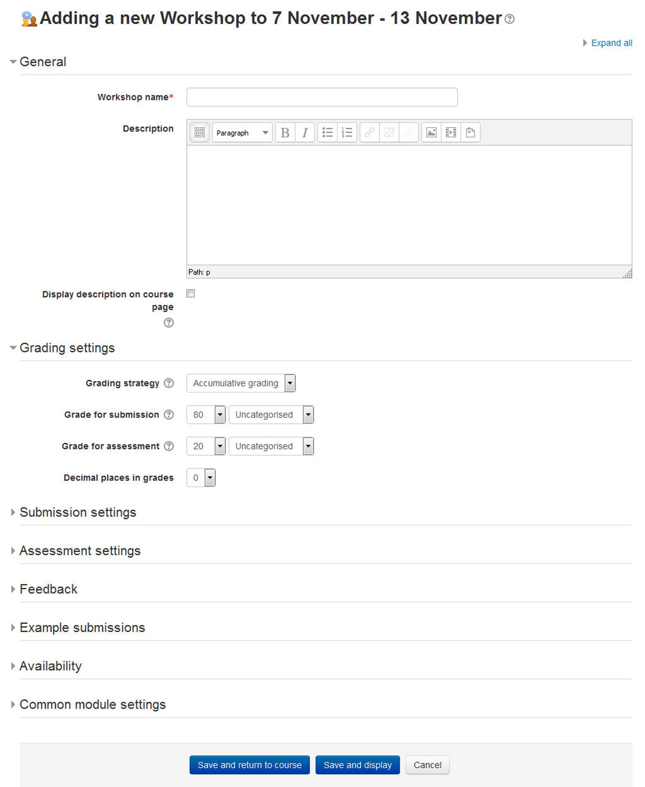
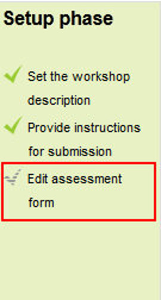
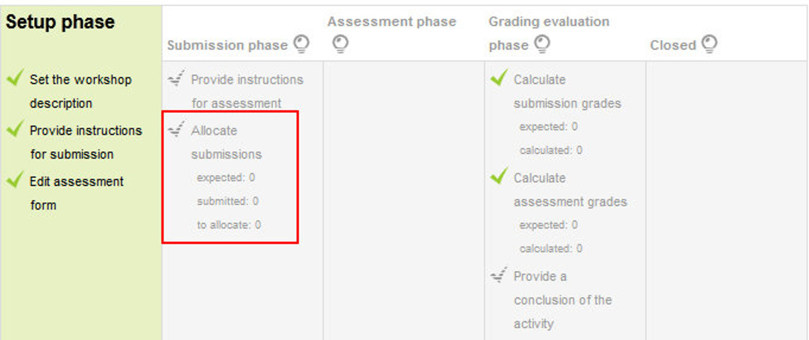
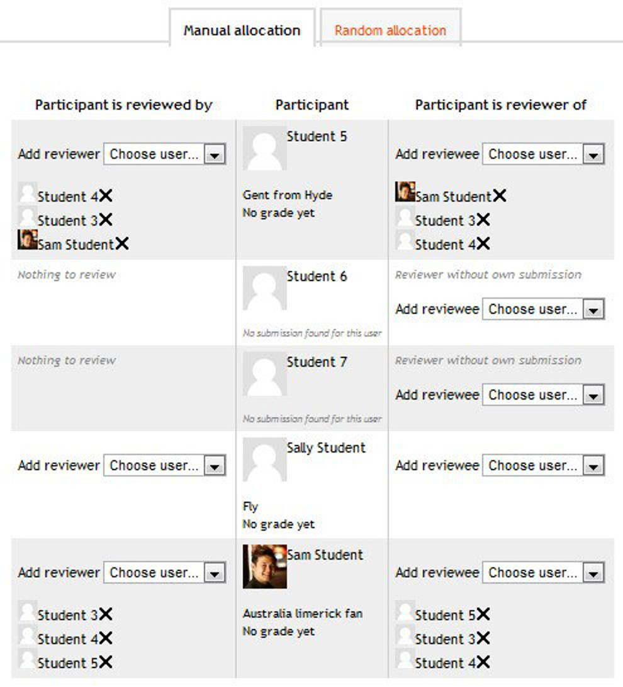
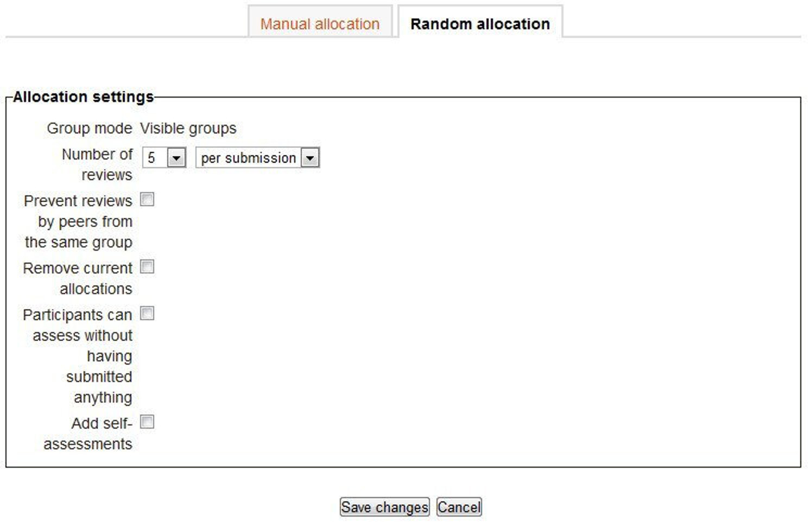
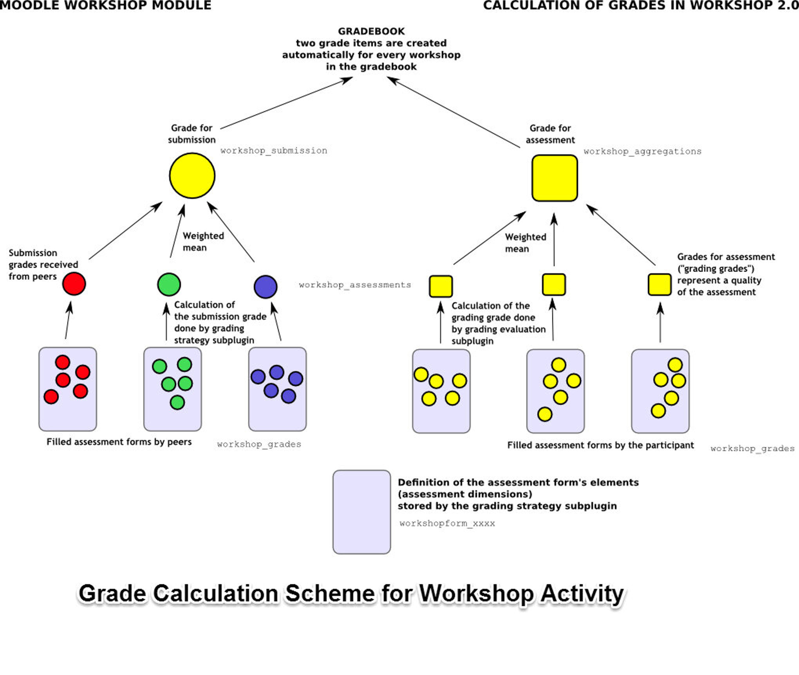

Workshop is a peer assessment activity with many options. Students submit their work via an online text tool and attachments. There are two grades for a student: their own work and their peer assessments of other students' work.
 
Workshop is similar to the Assignment module which we covered in chapter 8 and extends its functionality in many ways. However, it is recommended that both you (teacher) and your course participants (students) have at least some experience with the Assignment module before the Workshop is used in the course.

- As in the Assignment, course participants submit their work during the Workshop activity. Every course participant submits their own work. The submission may consist of a text and attachments. Therefore, Workshop submission merges both Online text and Upload file types of the Assignment module. Support for team work (in the sense of one submission per group of participants) is out of scope of Workshop module.
- The submissions are assessed using a structured assessment form defined by the course facilitator (teacher). Workshop supports several types of assessment forms. All of them allows multi-criteria assessment in comparison to the Assignment module where only one grade is given to a submission.
- Workshop supports peer assessment process. Course participants may be asked to assess selected set of their peers' submissions. The module coordinates the collection and distribution of these assessments.
- Course participants get actually two grades in a single Workshop activity - grade for their submission (that is how good their submitted work is) and grade for assessment (that is how well they assessed their peers). Workshop activity creates two grade items in the course Gradebook and they can be aggregated there as needed.
- The process of peer assessment and understanding the assessment form can be practiced in advance on so called example submissions. These examples are provided by the facilitator together with a reference assessment. Workshop participants can assess these examples and compare their assessment with the reference one.
- The course facilitator can select some submissions and publish them so they are available to the others at the end of Workshop activity (in comparison to the Assignment module where submitted work is available only to the author and the facilitator).

## Workshop phases
The work flow for the Workshop module can be viewed as having five phases. The typical workshop activity can cover days or even weeks. The teacher switches the activity from one phase to another.

The typical workshop follows a straight path from Setup to, Submission, Assessment, Grading/Evaluation, and ending with the Closed phased. However, an advanced recursive path is also possible.

The progress of the activity is visualized in so called Workshop planner tool. It displays all Workshop phases and highlights the current one. It also lists all the tasks the user has in the current phase with the information of whether the task is finished or not yet finished or even failed.

Before creating a workshop activity in your course, let’s take an overview on the different phases within the workshop activity. 

### Setup phase
In this initial phase, Workshop participants cannot do anything (neither modifies their submissions nor their assessments). Course facilitators use this phase to change workshop settings, modify the grading strategy of tweak assessment forms. You can switch to this phase any time you need to change the Workshop setting and prevent users from modifying their work.

 

### Submission phase
In the submission phase, Workshop participants submit their work. Access control dates can be set so that even if the Workshop is in this phase, submitting is restricted to the given time frame only. Submission start date (and time), submission end date (and time) or both can be specified.

### Assessment phase
If the Workshop uses peer assessment feature, this is the phase when Workshop participants assess the submissions allocated to them for the review. As in the submission phase, access can be controlled by specified date and time since when and/or until when the assessment is allowed.

### Grading evaluation phase
The major task during this phase is to calculate the final grades for submissions and for assessments and provide feedback for authors and reviewers. Workshop participants cannot modify their submissions or their assessments in this phase any more. Course facilitators can manually override the calculated grades. Also, selected submissions can be set as published so they become available to all Workshop participants in the next phase.

### Closed
Whenever the Workshop is being switched into this phase, the final grades calculated in the previous phase are pushed into the course Gradebook. This will result in the Workshop grades appearing in the Gradebook and in the workshop. Participants may view their submissions, their submission assessments and eventually other published submissions in this phase.

Now let’s add a workshop activity in your course:

 
## Adding a new workshop activity 

- With the editing turned on, in the section you wish to add your workshop, click the "Add an activity or resource" link.
- The "Adding a new workshop" screen will be displayed
- In the General Section:
	- Name:  Whatever you type here will form the link learner’s click on to view the workshop, so it is helpful to give it a name that suggests its purpose.
	- Description:  Add a description of your workshop here. Click "Show editing tools" to display the rich text editor, and drag the bottom right of the text box out to expand it.
	- If “Display description on the course page box” is ticked, the description will appear on the course page just below the name of the workshop.
- In the Grading Settings Section:
	- Grading strategy:  What you choose here determines the assessment form students will use and also the strategy for grading submissions.

		- Accumulative grading: Comments and a grade are given regarding the aspects of the workshop specified.
		- Comments: Comments are given but no grade can be given to the specified aspects
		- Number of Errors: A yes/no assessment is used and comments are given for specified assertions
		- Rubric: A level assessment is given regarding specified criteria.

		T> *Grading strategies can't be changed once we have entered the submission phase of a workshop.*
	- Grade for submission:   This setting specifies the maximum grade that may be obtained for submitted work. It is scaled between 0-100.
	- Grade for assessment:  This setting specifies the maximum grade that may be obtained for submission assessment. It is also scaled between 0-100.
	- Decimal places in grade:  Decide here how many decimal places are allowed in the grade.
- In the Submission Settings Section:
	- Instructions for submission:  Explain here what students must submit and related instructions.
	- Maximum number of submission attachments:  If you wish students to attach files, select how many here, up to a maximum of 7. If you leave it at 0 then they can only enter text.
	- Maximum File Size: Decide here how large file students can upload. The size will depend on the course upload limit.
	- Late Submissions:  If enabled, students may submit their work after the submissions deadline or during the assessment phase. Late submissions cannot be edited though.

	

- In the Assessment Settings Section:
	- Instructions for assessment: Here you can write instructions for assessments online. This is very useful to help students have a better understanding about the important points of a task before assessing their classmates’ submissions.
	- Use Self-Assessment:  If enabled, a user may be allocated their own submission to assess and will receive a grade for assessment in addition to a grade for their submission.

- In the Feedback Section: 
	- Overall feedback mode: If enabled, a text field is displayed at the bottom of the assessment form. Reviewers can put the overall assessment of the submission there, or provide additional explanation of their assessment.

	- Maximum number of overall feedback attachments:  Choose here how many (if any) files you wish reviewers to attach to their overall feedback, up to a maximum of 7.
	- Maximum overall feedback attachment size:  Decide here how large a feedback file students can upload. The size will depend on the course upload limit.
	- Conclusion:  It is possible to add some custom text which the students will see once they reach the end of the workshop process. This might be a general summary or suggestions on what should be done next, such as writing a blog post to reflect on the experience.
- In the Example Submission Section:
	- Use examples:  If enabled, users can try assessing one or more example submissions and compare their assessment with a reference assessment. The grade is not counted in the grade for assessment.
	- Mode of examples assessment: If you check the box above then you will find three options in this drop down menu: The first option means that the assessment of the example submission is voluntary, while the second and the third ones make it mandatory, which either requires students to assess example submissions before submitting their own work or after their own submission but before peer-assessment.

	T> *Assessments of the example submission are not counted when calculating the grade for assessment.*

- In the Availability section:  This section deals with setting submission times and assessment times for the workshop. That is the time when students can start submitting as well as the deadline for submitting, and similarly the time assessments for other students’ work start and when they must finish assessing other students work. You can choose your settings accordingly to facilitate the students within your class.
- In the Common Module Section:
	- Visible: Select Show/Hide to display or hide the activity to your students.
	- ID Number: Provide an ID number for the activity to be shown in the Gradebook.
	- Group Mode: Select the group mode for the workshop activity. There are three options:
		- No Groups:  There are no sub groups, everyone is part of one big community
		- Separate Groups:  Each group member can only see their own group, others are invisible
		- Visible Groups:  Each group member works in their own group, but can also see other groups.
	- Grouping: Select grouping type if you want to make an activity (such as an assignment or a quiz) visible to only one set of users within a course.
	- Click "Save and Return to the course" to save the workshop activity.

## Using Workshop Activity

When you click on the workshop activity in the course main page it will take you to the Setup phase of the workshop activity. 

###Setup Phase
In order to set the criteria for an assignment, you as a teacher need to fill out an assessment form during the setup phase. Students can view this assessment form in the submission phase and focus on what is important about the task when working on their assignment. In the next phase-the assessment phase, students will assess their peers’ work based on this assessment form.

 

According to the grading strategy chosen in the grading settings while setting up the activity, you will get corresponding original assessment form to edit by clicking ‘Edit assessment form’ button in the first page of the workshop setup for the assignment. The grading strategy can be one of Accumulative grading, Comments, Number of errors or Rubrics. Teachers can set each criterion in detail in the assessment form.

###Submission phase
Once the workshop has been made we can then set more settings relating to submissions. This is done through clicking on the menu highlighted below which is found when you click on the workshop’s link or after clicking “Save and Display” on completion of the workshop. To access the menu simply click on “Allocate Submissions”. It is highlighted in the picture by the red box. 

When you click on the "Allocate Submissions" link Moodle will take you to the submission allocation page where you can allocate the submissions to different students. There are 3 tabs on the page: 

- Manual Allocation:  Here, a teacher can manually choose which students review whose work. A student can review work even if they have not submitted anything themselves.

 

- Random Allocation: The teacher is given 5 settings that determine how the random allocation will work.
	- Number of reviews: Here the teacher picks between 0 and 30 reviews for either each submission or per reviewer. That is the teacher may choose to either set the number of reviews each submission must have or the number of reviews each student has to carry out.
	- Prevent Reviews: If the teacher wishes for students of the same group to never review each other’s work, as most likely it is their work too in a group submission, then they can check this box and moodle will ensure that they are only allocated other students out of their group’s work to access.
	- Remove current allocations: Checking this box means that any manual allocations that have been set in the Manual Allocation menu will be removed
	- Can access with no submission: Having this box checked allows students to assess other students’ work without having already submitted their own work.
	- Add self-assessments: This options when checked make sure that as well as assessing other students’ work they must also assess their own. This is a good option to teach students how to be objective to their own work.
- Scheduled Allocation: If enabled, the scheduled allocation method will automatically allocate submissions for the assessment at the end of the submission phase. The end of the phase can be defined in the workshop setting 'Submissions deadline'.

Internally, the random allocation method is executed with the parameters pre-defined in this form. It means that the scheduled allocation works as if the teacher executed the random allocation themselves at the end of the submission phase using the allocation settings below.

### Assessment phase

**Examples** 
Students can assess example submissions for practice before assessing their peers' work if this feature is enabled. They can compare their assessments with reference assessments made by the teacher. The grade will not be counted in the grade for assessment.

You need to upload one or more example submissions and the corresponding reference assessment to support this function. You can also edit the reference assessment later by clicking the ‘reassess’ button in the first page.

**Peer Assessment**: 
If this feature is enabled, a student will be allocated a certain amount of submissions from his peers to assess. He will receive a grade for each assessment, which will be added together with the grade for his own submission and this will be used as his final grade for this assignment.

This is the key feature of workshop: To encourage students to assess the work of their peers and learn from each other. Through this, they will see the strengths of their classmates’ submissions and have a better understanding about how to do a good job. In addition, the advices they get from their peers will give them a more comprehensive view of their own work: The comments from their peers will point out the weakness of their work, which is generally difficult to find out by themselves.

**Self-Assessment**:
If this option is turned on, a student may be allocated his own work to assess. The grade he receives from assessment of his own work will be counted into the grade for assessment, which will be added together with the grade for submission and used to calculate his final grade for this assignment.

This setting enables teachers to see whether students can find out the strength and weakness of their own submissions and judge them objectively. It is a good way to help students think more comprehensively.

### Grading evaluation phase
- Grading evaluation settings - Here you can choose your settings for calculation of the grade for assessments.
- Grade calculation method - This setting determines how to calculate grade for assessments. Currently there is only one option- comparison with the best assessment.

The Comparison with the best assessment tries to imagine what a hypothetical absolutely fair assessment would look like.

#### Comparison of assessments

This setting determines how quickly the grades fall down when the assessments differ from the best assessment. This setting has 5 options: very lax, lax, fair, strict and very strict. It specifies how strict the comparison of assessment should be. By using comparison with the best assessment method, all assessments will be compared with the best assessment picked up by workshop. The more similar one assessment is with the best assessment, the higher grade this assessment will get, and vice versa.

#### Workshop toolbox

- Clear all aggregated grades: Clicking this button will reset aggregated grades for submission and grades for assessment. Teachers can re-calculate these grades from scratch in Grade evaluation phase.
- Clear assessments:  By clicking this button, grades for assessments along with grades for submission will be reset. The assessment form will remain the same but all the reviewers need to open the assessment form again and re-save it to get the given grades calculated again.

### Closed Phase
Whenever the Workshop is being switched into this phase, the final grades calculated in the previous phase are pushed into the course Gradebook. This will result in the Workshop grades appearing in the Gradebook and in the workshop (new in Moodle 2.4 onwards). Participants may view their submissions, their submission assessments and eventually other published submissions in this phase.

## Grading a Workshop Activity
The grades for a Workshop activity are obtained gradually at several stages and then they are finalized. 

 

### Grade for submission:
The final grade for every submission is calculated as weighted mean of particular assessment grades given by all reviewers of this submission. The value is rounded to a number of decimal places set in the Workshop settings form.

You can influence the grade for a given submission in two ways:

- by providing their own assessment, possibly with a higher weight than usual peer reviewers have
- by overriding the grade to a fixed value

### Grade for assessment:
Grade for assessment tries to estimate the quality of assessments that the participant gave to the peers.  Grades for assessment are displayed in the brackets () in the Workshop grades report. The final grade for assessment is calculated as the average of particular grading grades.

## Workshop Capabilities
The capabilities for the workshop activities are:

- Allocate submissions for review:  This allows a user to allocate a submission for assessment and set the weight of the assessment for a workshop activity.  This capability is allowed for the default roles of manager, teacher and non-editing teacher.
- Edit assessment forms: This allows a user to define and modify assessment forms. This capability is allowed for the default roles of manager, teacher and non-editing teacher.
- Ignore time restrictions: This capability allows a user to submit or assess without any time restrictions i.e. he is not bound to follow the deadlines.
- Manage example submissions:  This allows a user to submit example submissions. This capability is allowed for the default roles of manager, teacher and non-editing teacher.
- Override calculated grades:  This capability allows a user to override calculated grades for submission and assessment.
- Peer assess:  All users with this capability are considered as potential reviewers during the allocation. Submissions can be allocated to these users for assessment.
- Publish submissions: This allows a user to publish submissions that is to make them available when workshop is closed.
- Submit:  This allows a user to submit own work.  All users with this capability are expected to participate in the workshop as authors.
- Switch phase: This allows a user to change the current phase of the workshop.
- View workshop: This allows a user to see workshop title and introduction during the setup phase.
- View all assessments: This allows a user to view all assessments in the workshop.
- View all submissions: This allows a user to view all submissions in the workshop.
- View author names:  This allows a user to see the name of submission author. This is typically used to control whether reviewers should know who they are assessing or whether the assessment is anonymous.
- View authors of published submissions:  This capability allows a user to see the names of authors of published submissions.
- View published submissions: This allows a user to view published submissions when the workshop is closed.
- View reviewer names:  This allows a user to see the name of reviewer. This is typically used to control whether submission authors should know who they are assessed by or whether the reviewers are anonymous.

## Summary
Workshop activity is an activity which is quite similar in nature to assignment but takes the functionality to a much more extended level. Some of the extended facilities provided by the workshop activity are:

- Workshop coordinates the collection of assignments and the distribution of these assignments to peer reviewers.
- Peer markers assess the submissions using a structured assessment form defined by the teacher, which permits multiple criteria to be used.
- Workshop supports several types of assessment forms (e.g. full rubric, commenting only).
- Course participants are graded on their own submission and on how well they assessed their peers. These 2 grade items are created in the course Gradebook and can be aggregated there as needed.
- Students can practice peer assessment and the use of rubrics in advance using example submissions and a reference assessment provided by the teacher.

