The lesson module presents a series of HTML pages to the student who is usually asked to make some sort of choice underneath the content area. The choice will send them to a specific page in the Lesson. In a Lesson page's simplest form, the student can select a continue button at the bottom of the page, which will send them to the next page in the Lesson. 

There are 2 basic Lesson page types that the student will see: question pages and content pages. There are also several advanced navigational pages which can meet more specialized needs of the Teacher. The Lesson module is designed to be adaptive and to use a student's choices to create a self-directed lesson.

The main difference between a Lesson and other activity modules available in Moodle comes from its adaptive ability. With this tool, each choice the students make can show a different teacher response/comment and send the student to a different page in the lesson. Thus with planning, the Lesson module can customize the presentation of content and questions to each student with no further action required by the teacher. 

The question page presents the student with a question, and the student has to enter a correct answer. After a student submits his answer, he will see the response you’ve created and will be taken to another page or looped back. Question pages are scored and added to the student’s cumulative grade.

A branch table’s page presents the user only with the option to select a branch. There is no correct or incorrect answer for each response, and the student’s selections do not impact his grade.

The authors of the lesson tool envision branches as tables of contents giving students access to chains of questions. At the end of a chain, the user will return to the branch table, access another one, or end the lesson. Of course, you don’t have to create a lesson this way. You can use the branch table to create a simulation in which the student’s choices present him with consequences and new decisions.

Creating a lesson isn’t complex, but the math of branching lessons means you have to plan carefully. Unless you prune your branching lesson, you will end up with a huge number of options for students and a large number of pages to write.

## Creating a Lesson Activity  
Before you begin creating a lesson, it’s a good idea to draw a flowchart. Lessons require more advanced planning than many of the other tools. They have the potential for branching on each page, so advanced planning is critical before you begin to develop your lesson. Even with two choices per page, if every choice results in a new page, you will quickly need a very large number of pages. The first page will require two additional results pages, and each of these will require two more for a total of seven pages from an initial two choices. The key to minimizing the number of pages is to reuse as many as possible.

Take a few minutes to draw a flowchart for your lesson. What will the first page display? What are the options? Where will the options take the student? It’s important to answer these questions for each page of the lesson to avoid getting lost while you are actually creating the content.

Once you have your flowchart, it’s time to start creating a lesson.

To create a lesson:

- Click the “Turn editing on” button.
- In the section you wish to add your lesson, click the "Add an activity or resource" link and Select "Lesson".
- On the "Adding a new Lesson" page give a descriptive name to your lesson in the Name field.
- In the Appearance Section:
	- File pop: If you want to include a link to a file on the lesson page for students to refer to, upload it here.
	- Progress bar:  Choose this to show a bar at the bottom of the page showing how far into the lesson the student has got.
	
	T> *Lesson Progress bar only works correctly for lessons with a "straightforward" navigation, such as page 1 -> page 2 -> page n -> end of lesson.*

	- Display ongoing score: Choose this to let students see their score as they work through the lesson.
	- Display left menu: Choose this if you want to show a list of the pages in the Lesson so a student can see what is coming up.
	- Minimum grade to display menu: Choose this if you want the student to go through the lesson once and get a grade before they can (on review) see and navigate through all the different pages.
	- Slideshow:  If enabled, the lesson is displayed as a slideshow, with a fixed width and height.
	- Maximum Number of Answers:  This setting specifies the maximum number of answers that may be used in the lesson.
	- Use default feedback:  If enabled, when a response is not found for a particular question, the default response of "That's the correct answer" or "That's the wrong answer" will be shown.
	- Link to next activity:  To provide a link at the end of the lesson to another activity in the course, select the activity from the dropdown list.

 

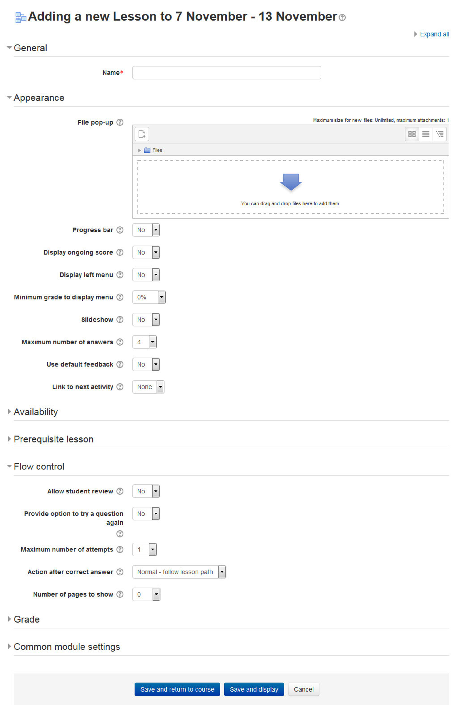

- In the Availability Section:
	- Available from/Deadline:  Here you can set a start and end date and time for your Lesson.
	- Time limit: This allows you to set a time limit on the lesson. Students will see a countdown counter as they work. 

	T> *The timer does not stop them doing the lesson when the time is up, but correct answers are no longer scored.*

	- Password protected lesson:  Change to "Yes" and enter the password if you want students only to access it when they know the password.
- In the Prerequisite Lesson Section:
	- Dependent on:  This allows access to the lesson to be dependent on students' performance in another lesson in the same course.

	T> *You can also do the same thing by using the Conditional Activities.*
	- Time spent:  Decide here how long you want the student to have spent in the chosen previous lesson.
	- Completed:  Check this box if you want the student to have completed a previous lesson.
	- Grade better than:  Enter the grade from the previous lesson which you want the student to have exceeded before they can attempt the current lesson.
- In the Flow Control Section:
	- Allow student review:  If enabled, students can navigate through the lesson again from the start.  This puts a "Review Lesson" button on the last screen of the lesson to encourage the students to navigate through the lesson again from the start.

	T> *The students will not be able to change their answers, only view them.*

	- Provide option to try a question again:  If enabled, when a question is answered incorrectly, the student is given the option to try it again for no point credit, or continue with the lesson.
	- Maximum Number of Attempts:  This setting specifies the maximum number of attempts allowed for each question. If answered incorrectly repeatedly, when the maximum is reached, the next page of the lesson is displayed.
	- Action after correct answer:  Choose here where you want a student to be sent to if they get a question right,  there are 3 options for the following page:
		- Normal - Follow lesson path
		- Show an unseen page - Pages are shown in a random order with no page shown twice
		- Show an unanswered page - Pages are shown in a random order, with pages containing unanswered questions shown again.
		- Number of pages to show:  This setting specifies the number of pages shown in a lesson. It is only applicable for lessons with pages shown in a random order.  If set to zero, then all pages are shown.
- In the Grade Section:
	- Grade:  Select the type of grading used for this activity. If "scale" is chosen, you can then choose the scale from the "scale" dropdown. If using "point" grading, you can then enter the maximum grade available for this activity.
	- Grade category: This setting controls the category in which this activity's grades are placed in the gradebook.
	- Practice lesson: A practice lesson does not appear in the gradebook. Use this if you don't need the lesson to be scored/graded but just need students to work through some pages.
	- Custom Scoring: If enabled, then each answer may be given a numerical point value (positive or negative).
	- Re-takes allowed: If enabled, students can attempt the lesson more than once.

	T> *Note that this setting only applies to lessons containing Question pages. Lessons consisting only of Content pages can be re-taken even if 'Re-takes allowed' is set to No.*

	- Handling of re-take: If you allow your students to re-take the lesson, then decide here if the grade for all lesson attempts is the mean or the maximum.
	- Minimum number of questions: This setting specifies the minimum number of questions that will be used to calculate a grade for the activity. Students will be told how many they have answered and how many more they need to answer.
		- If you are using Content pages, then set this to 0.
		- If you use this setting, then add some explanatory text at the start of the lesson so the student knows how many questions they must answer as a minimum.
- In the Common module settings section:
	- Visible: Make the lesson activity Visible/Hidden from the students.
	- ID number: Provide an ID number for the lesson for grade calculation purposes.
- Click "Save and return to course".

## Building Lesson
Once you click the Lesson name on the course page then Moodle will take you to the edit lesson page as shown in the following screenshot.

 

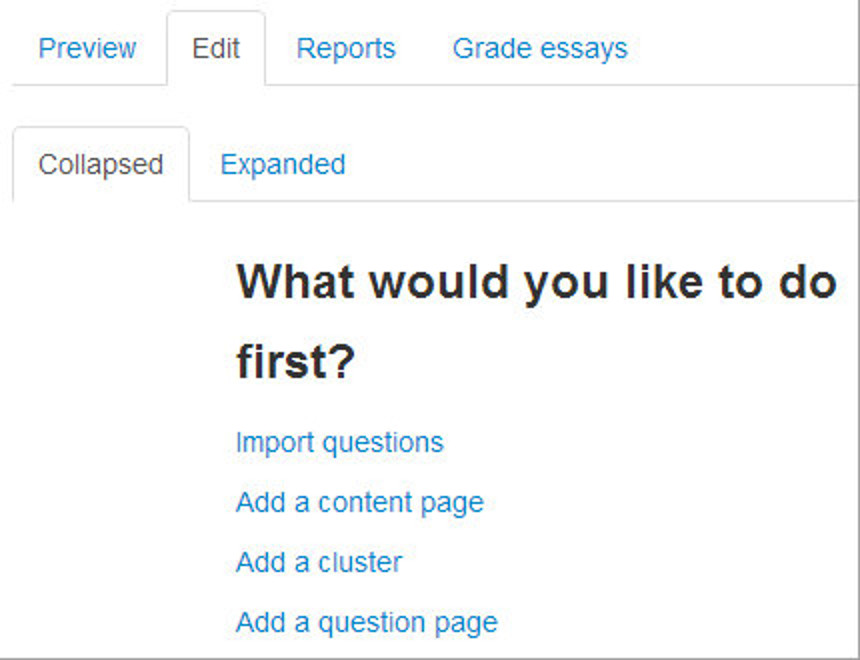

But Before proceeding to the edit lesson page and adding content and questions to the lesson, we must first plan about the lesson.

## Planning your lesson

- A lesson is made up of pages which may have content for the student to read or questions for them to answer. The questions can be created by the teacher or imported. The teacher decides the order in which these pages appear.
- You need to have a clear idea beforehand of what you want to do with this lesson. Is it to be a graded, linear learning experience? Or an ungraded, non-linear practice session? Will students be able to go back and revisit areas or is it just a once-only opportunity?
- Even those who are very comfortable working directly online might find it useful to note down on paper the direction they want their lesson pages to go in, rather than having to remember and visualize the navigation in their head.

## Adding content and questions to your lesson

### Import questions

If you have some questions in the following formats, you can import them to use in your lesson by clicking the Import questions link.

 

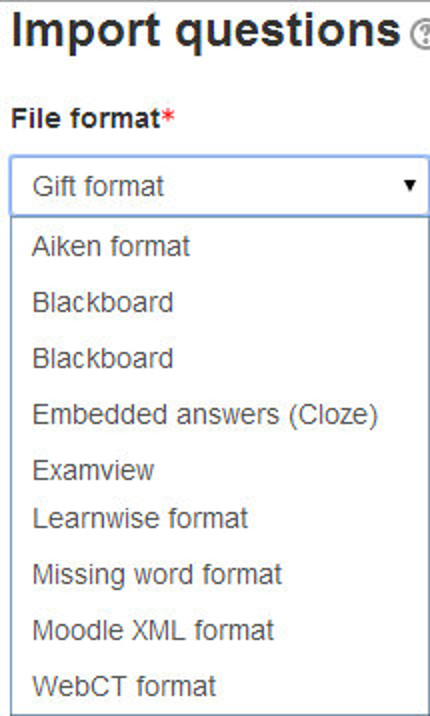

### Add a content page

- This is a page where a teacher can provide information to move the lesson forward but without requiring the student to answer specific questions.
- The student sees the page's title, some information and then one or more buttons at the bottom to select.
- When the student clicks on a button, they go to the next page but their choice is not scored.

#### Title

- The title of a content page appears to the student at the top of the page.
- A teacher will also see the title in the collapsed edit mode when they are working on the Lesson, and they will also be able to choose the title (and hence this page) from the drop down "jump" lists.
- The title in a content page is also used with the "display left menu" setting.

#### Page contents
This is where the teacher can add information for the student, making use of the Text editor and its multimedia features.

#### Content

- Here the teacher writes the words they want the student to click on to get to the next part of the lesson.
- These words will appear to the student as a button.
- The teacher can check the box to have the buttons appear horizontally, or uncheck it for them to appear centered vertically.

#### Format

There are 4 format types to choose from when editing text in the content description box. If you wish to have the usual rich text editing icons, choose HTML format. (Note - once you have selected an option, you cannot then go back and change your mind!) However, if you DO choose HTML format, be warned that the student will not see the changes (such as bold or different colors) in the button.
 

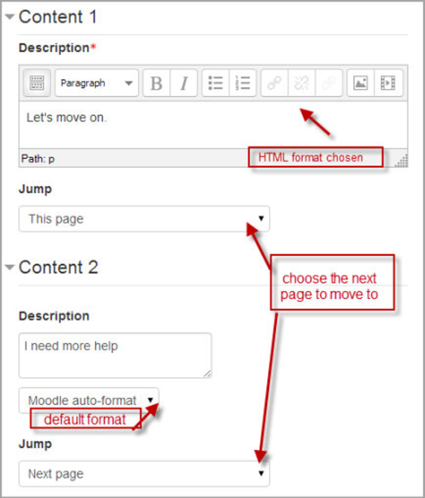

#### Number of options available
How many of these you have depend on your choice in the Maximum Number of Answers setting in Lesson settings

#### The Jump

- Each Description in a Content page has a Jumps menu. "Jumps" take a student from one page to another.
- A "relative jump" is "next page" or "end of lesson" whereas an "absolute jump" gives the actual name of a page.
- The teacher chooses from the dropdown the correct page to send the student to if they click on the button that will be made from this particular description. Any pages created by the teacher will have their titles appear in this dropdown, allowing them to be selected.
- When a student clicks on a description button, they are sent to the page defined in the Jump associated with the button.

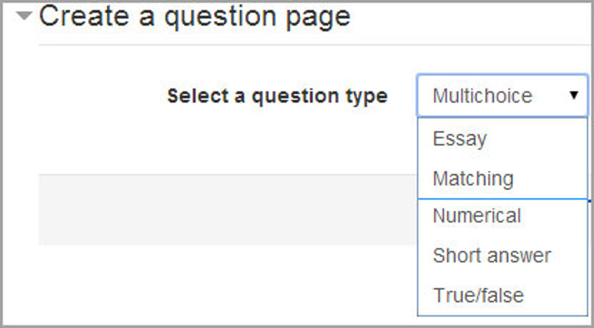

### Add a cluster
A cluster is a group of question pages which will be offered randomly to a student as they work through the lesson. It is best if you have made the question pages beforehand and can then decide where to mark the start and end of the cluster. The start is marked by a "cluster" page and the end by an "end of cluster" page.

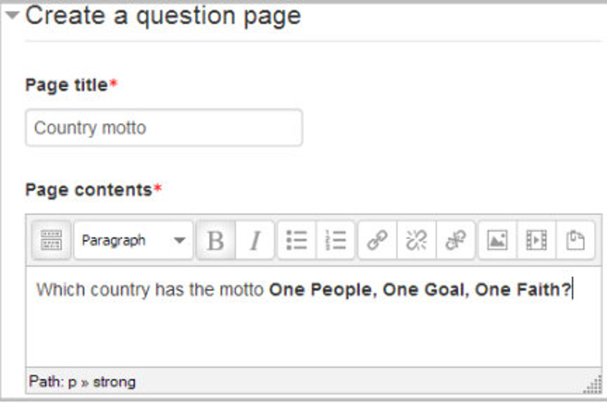

### Add a question page

- From this link you can choose from a variety of question types which will then be added as pages to your lesson:
	- The format of question pages is similar to content pages.
	- A typical question page could include:
		- Title - the name the student sees at the top of the question page.
		- Page contents - the actual question
		- Answer/Response/Format/Jump/Score as in the screenshot below 

 

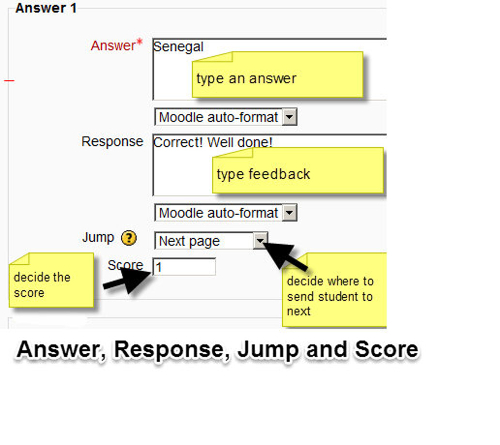

### Question types:

#### Multichoice
The student is given a question and a list of answers. The answer list will be shuffled every time the question is view by a student. By default they choose one answer but you can check the box "multiple answers" to allow them to choose more than one answer.

#### Essay 
Students can write a longer answer as part of the lesson and this can be graded manually by the teacher.

#### Matching
This allows you to set up lists which must be matched against other lists, for instance, words, pictures, numbers etc. The student must match all correctly to receive the score.

 

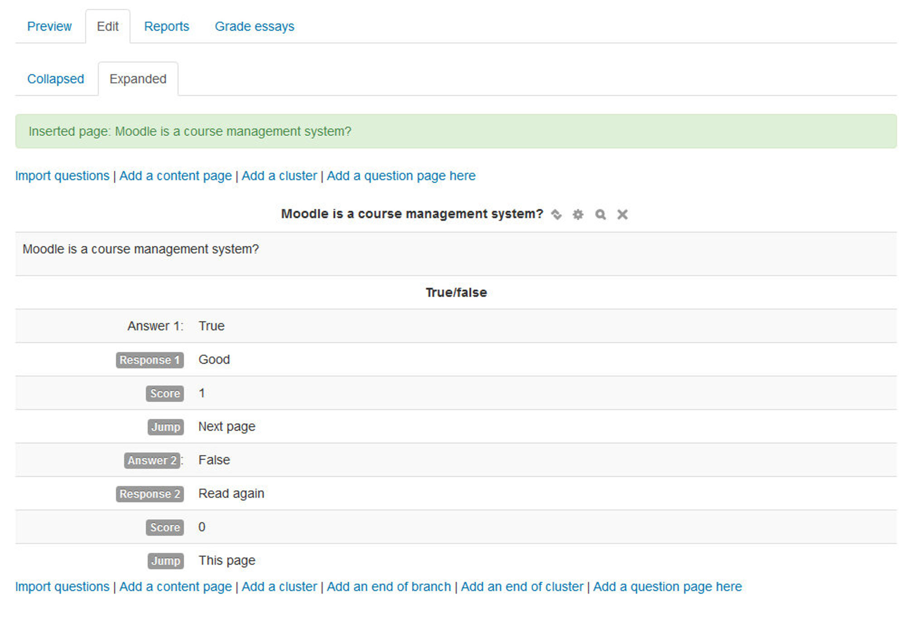

#### Numerical
This requires a number as an answer. A number within a range may also be accepted as correct. The range separator to be used is the colon ( : ).

#### Short answer
A student must provide a single word or short phrase answer. The teacher must anticipate the possible answers and enter them in the Jump dropdown boxes, using ** wild cards if appropriate.

#### True/false
The student is given a sentence and must decide if it is true or false.
 

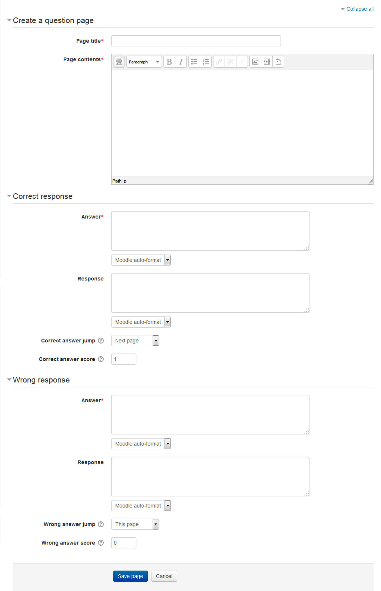

## Moving your lesson forward

- Once you have added your first content or question page, you reach the next screen which displays your page title/type/jumps (i.e. where the responses take the student to) and actions you can take next.
- The Actions icons allow you to move (if you have more than one), edit, and preview or delete your pages.
- The drop down allows you to create another page of your choice:
  

- Note the different view options:
	- Collapsed view:  This gives a brief outline of the lesson structure.
	- Expanded view: This shows more detail as in the screenshot below:
 
 

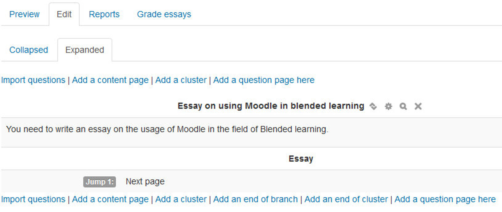

## Ending your lesson

- To bring the lesson to a close, select the "End of Lesson" option from the Jump menu on any relevant pages.
- The student will then see a generic message as in the next screenshot, with a direction back to the main course page or to view their grades:
 

## Managing Lessons
When you click on the lesson then you will see tabs at the top offering the chance to preview, edit, view reports or grade essays in the lesson.

- Preview Tab:  The lesson opens up in preview mode for the teacher. However, it will not show the score unless the teacher switches their role to a student.
- Edit Tab: The Edit tab allows teachers to alter the lesson once it has been set up. There are two views - Collapsed and Expanded.
- Reports Tab: The reports tab shows the performance of students taking the lesson. There is a general "Overview" and a "Detailed Statistics" tab.
	- Overview Tab:  By clicking on the specific attempt, the teacher can view the student's answers to specific questions. It is also possible to delete a student attempt by checking the attempt and using the pull down menu to change "Choose" to "Delete". Below the "Overview" can also be seen general statistics: Average score, Average time, High score, Low score, High time, Low time.
	- Detailed Statistics: More detailed reports on individual questions are available from this tab.
- Grade essays Tab:  Any essay questions which have been set in the lesson can be accessed and graded here.

As students complete the lesson, their scores will be recorded in the gradebook. If you’ve allowed students to attempt each lesson multiple times, their scores may change as they repeat the lesson.

## Lesson capabilities
The lesson module has only two capabilities:

- Edit a lesson activity - This allows a user to edit a lesson. If you create a blank lesson and allow students to edit it, they can create a new lesson for the rest of the class.
- Manage a lesson activity - This allows a user to manage a lesson and grade essay questions.

 

## Effective Lesson Practices
Lessons can be an interesting change of pace for your students. They may require more upfront development time than many other types of tools, but they do provide some benefits. The two basic lesson types, branching quizzes and flash cards, are relatively easy to set up.

### Branching Quizzes
The most basic lesson structure is a branching quiz. You use branches to organize sets of questions around different topics or concepts in your course. Each branch of the quiz leads to a linear series of pages and test questions, then returns to the main branch.

The main-branch page acts as a table of contents for the lesson, if you decide to build this type of lesson, be sure to include a link to the end on the main page. If not, the students will have no way of ending the lesson and recording their scores.

If you create a lesson with a branch table and strings of questions, be sure to set a reasonable minimum number of questions. Otherwise, students will be able to visit one branch and receive a maximum score for the lesson, even though they didn’t look at any other branches.

 

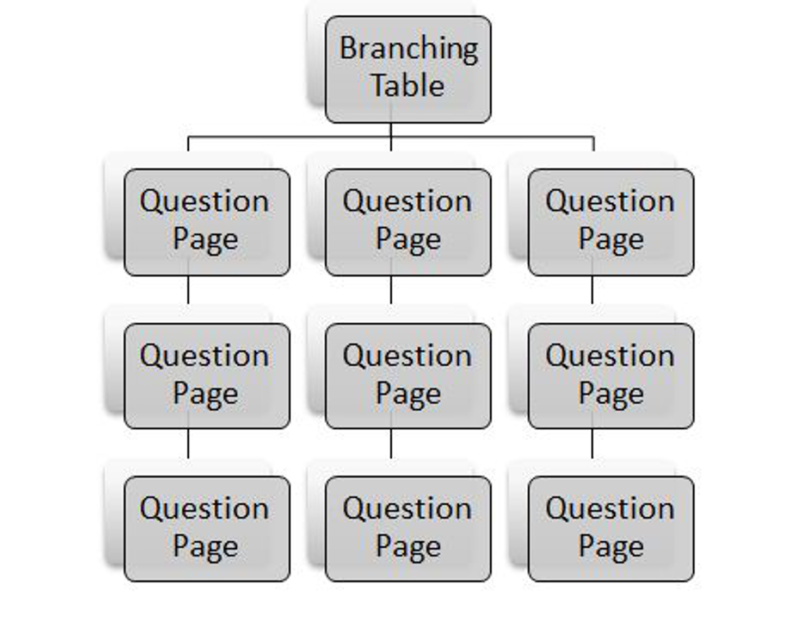

To create a branching quiz:

1. Create the lesson and the first question page by following the instructions.
2. Create a question page for the first question in each branch.
3. Create a branch table with a branch for each of the questions you just created.
4. Be sure to make the last branch a link to the end of the lesson.
5. After you’ve saved the branching table, move it to the top of the pages list.
6. Under the first question for the first branch, create the second question page for the next step in the branch.
7. Fill in the question page for the second question. Put the correct answer in the first answer slot if you are creating a true/false or multiple-choice question.
8. Continue adding questions to the branch until you are finished.
9. Add an end of branch after the last question in the branch.
10. Below the first question for the each of the remaining branches, repeat steps 6 through 9.
11. When you have added all your pages, review your lesson by clicking the Check Navigation link.

### Flash Cards
Flash cards can be a useful way to practice recalling basic facts and definitions. Flash cards allow students to practice rapidly recalling definitions as an initial step toward learning how to communicate in a new field. The lesson module can act like a deck of flash cards, presenting either the whole deck or a subset of cards to students when they want to study the new terms. Each question page is a separate card, and students can rapidly react to each one in turn. This is a very different structure than the branching quizzes. Setting up a flash-card lesson requires specifying options when you first create the lesson. 

To create a flash-card lesson:

1.	Follow steps 1 through 4 for creating a lesson in the “Creating a Lesson” section.
2.	Consider setting a low value for the maximum grade. You want to reward students for using the flash cards but also make them a valuable learning tool.
3.	Use the following options:
	1. Maximum grade: Consider setting a low value for the maximum grade. You want to reward students for using the flash cards but also make the cards a valuable learning tool.
	2. Student can re-take: Unless you have a very specific reason for limiting re-takes, it’s best to set this to yes. Flash cards are used to practice recalling information rapidly. Save the assessment of students’ recall skills for a quiz.
	3. Handling of re-takes: If you set this to use maximum, it will encourage students to reuse the flash cards to attempt to get the maximum score.
	4. Action after correct answer: Set this to unseen or unanswered. This tells the lesson module you don’t want it to present the next page in order.
	5. Minimum number of questions: Keep this at zero. The students shouldn’t have a choice about the number of cards they see.
	6. Number of pages (cards) to show: If you want to limit the number of questions students see each time they practice with the cards, set this to a nonzero number. Make it large enough to give students enough practice, but not so large that they become fatigued by the sheer volume of questions.
4.	Once you save the lesson options, simply create question pages. The order doesn’t matter. You’re basically creating a deck of questions to draw from.
Once you’ve created the deck of flash cards, you can release it to your students so they can practice answering the questions you’ve created.

## Creative Lesson uses
While branching quizzes and flash cards are interesting applications, there is a hidden potential in the lesson module that makes it much more interesting than it at first appears. If you take advantage of the ability of each answer in a question page to link to any other page, you can create branching Choose Your Own Adventure-style simulations or case studies.

### Self-directed learning of a new topic
Use the lesson to introduce a new topic. The learner starts out knowing nothing but can progress at his own pace, reviewing what he is not sure of and moving on when he feels ready. 

### Allow for different learning styles
When using the lesson to introduce a new topic, offer pages that deliver the content in different ways, according to how the students prefer to learn. For example the button "do you prefer to read?" goes to a page of text; "do you prefer to watch a video?" goes to a screencast; "do you prefer to listen to instructions?" - goes to a podcast and so on.

### Role play simulations/Decision-making exercises
Use the lesson to set up situations where the learner has to make a choice each time and the scenario changes according to their selection. This could be a medical emergency for example, deciding upon the correct treatment, or a customer relations exercise, learning how best to deal with an awkward client. In an educational establishment it could serve well in Humanities subjects considering moral/ethical issues.

### Interactive fiction
For younger (and not so younger!) students, the lesson can be used to create a "choose your own ending" type of story where the student reads a page (or even watches a video/listens to an audio file) and then decides upon the character's next move. Apart from the entertainment value of this, it could be used to help guide pre-teens to behave responsibly by taking decisions for a character that is in a potentially dangerous situation.

### Differentiated revision guides
Students can be taken to different sets of revision questions according to their answers, allowing them to progress from basic to intermediate to advance according to their prior knowledge.

## Summary
A lesson activity is self-directed learning tool.  The lesson activity’s adaptive ability is what makes it unique. Questions in a lesson can be used to create branch points where students are taken down different paths in the lesson depending on how they answer the question. When each answer to a question takes a student to a different series of pages, the lesson becomes a self-directed teaching tool.

