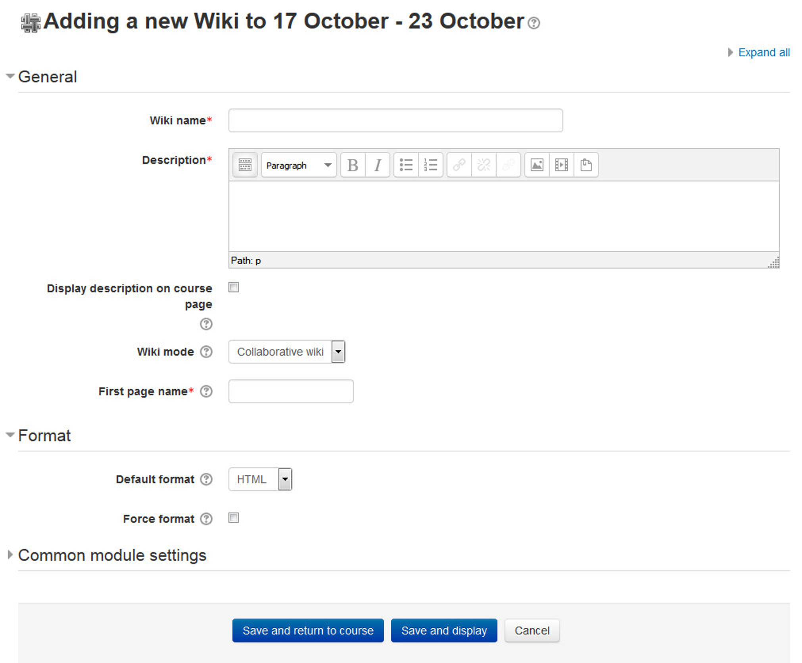
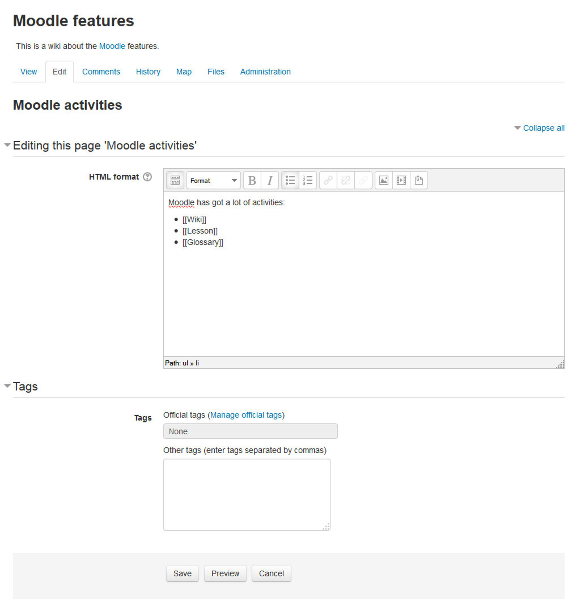
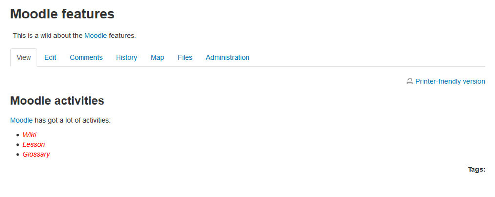
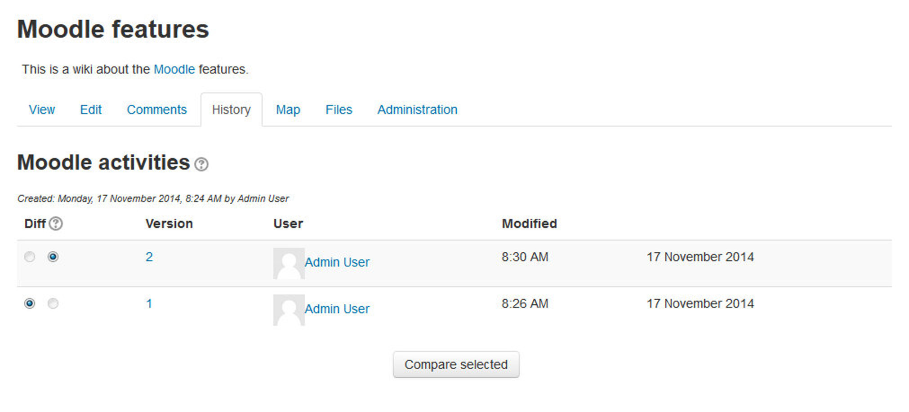
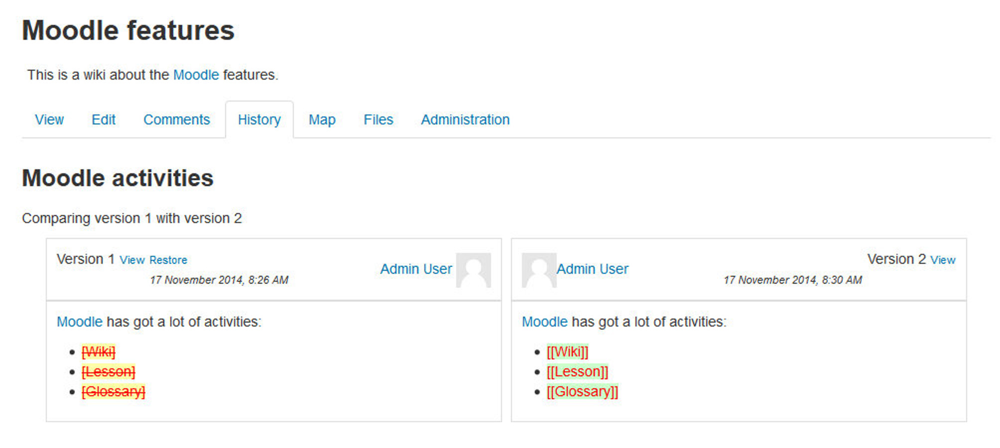

A wiki is a collection of collaboratively authored web documents. A good example of such a tool is WikiPedia which has become a knowledge encyclopedia for world information. Basically, a wiki page is a web page everyone in your class can create together, right in the browser, without needing to know HTML. A wiki starts with one front page. Each author can add other pages to the wiki by simply creating a link to a page that doesn't exist yet. 

A wiki is indeed a fast method for creating content as a group. It's a hugely popular format on the Web for creating documents as a group. There is usually no central editor of a wiki, no single person who has final editorial control. Instead, the community edits and develops its own content. Consensus views emerge from the work of many people on a document. 

In Moodle, wikis can be a powerful tool for collaborative work. The entire class can edit a document together, creating a class product, or each student can have their own wiki and work on it with you and their classmates.  You can also consider using wikis for online collaborative assignments ranging from peer reviewing of papers to group reports, to even a new Wikipedia like page based upon your course or a single assignment learning outcomes.

A history of previous versions of each page in the wiki is kept, listing the edits made by each participant.

Wikis have many uses, such as

- For group lecture notes or study guides
- For members of a faculty to plan a scheme of work or meeting agenda together
- For students to collaboratively author an online book, creating content on a topic set by their tutor
- For collaborative storytelling or poetry creation, where each participant writes a line or verse
- As a personal journal for examination notes or revision (using an individual wiki)

## Creating Wikis  
Creating a wiki is very simple and most of the work involved with creating wikis becomes easier once you start using them.

To add a wiki to your course:

- Click Turn Editing On if you are not already in the editing mode.
- Click 'Add an activity or resource' link, then in the activity chooser, select "Wiki" and click the Add button.

 

- Enter a name* and describe the purpose of the wiki and what you expect students to contribute in the description* field.
- The wiki mode determines whether everyone can edit the wiki - a collaborative wiki - or whether everyone has their own wiki which only they can edit - an individual wiki.
- Enter the first page name of the Wiki in the "First Page Name"* field.
- In the Format Section, you can set the Format of the Wiki. There are 3 options to choose from:
	- HTML-  The HTML editor is available
	- Creole -  A common wiki markup language for which a small edit toolbar is available
	- Nwiki - Mediawiki-like markup language used in the contributed Nwiki module.
- If the format is forced (checkbox ticked), there is no option to choose a format when editing a wiki page.
- In the "Common Module Settings" section, You can choose to either completely hide the Wiki from students by choosing Hide in the Visible dropdown.
	- You can also set an ID number: Setting an ID number provides a way of identifying the activity for grade calculation purposes.
	- The group mode defined at course level is the default mode for all activities within the course. Each activity that supports groups can also define its own group mode, though if the group mode is forced at course level, the group mode setting for each activity is ignored. This setting has 3 options:
		- No groups - There are no sub groups, everyone is part of one big community
		- Separate groups - Each group member can only see their own group, others are invisible
		- Visible groups - Each group member works in their own group, but can also see other groups
	- A grouping is a collection of groups within a course. If a grouping is selected, students assigned to groups within the grouping will be able to work together.
- Click Save and Display at the Bottom of the page.

There are two wiki types (modes), collaborative and individual. In addition, like any activity, the wiki has the Moodle group modes: “No Groups”, “Separate Groups” and “Visible Groups”. 

According to the wiki mode and the group options selected by you the format of wiki which will be displayed to the students and the permissions for them will be different.

- **Collaborative**

	- No Groups: There is only one wiki. The teacher and all students can view and edit this wiki.
	- Separate Groups: There is one wiki per group. Students can view and edit the wiki of their own group only.
	- Visible Groups: There is one wiki per group. Students can change the wiki of their own group only. They can view the wikis for all groups.

- **Individual**
	- No Groups: Every student has their own wiki which only they and their teacher can view and edit.
	- Separate Groups: Every student has their own wiki, which only they and their teacher can edit. Students can view the wikis of other students in their group.
	- Visible Groups: Every student has their own wiki, which only they and their teacher can edit. Students can view the wikis of all other students in the course.

## Creating first page of your wiki
After you create the wiki activity, Moodle will itself take you to the first page; there also you can change the format of the wiki. Click "Create Page" to proceed.

On the edit page screen:

- Enter the content of the first page of your wiki in the HTML format field, if you are using the HTML format.
- You can use the Moodle's native HTML editor for showcasing your content.

Adding more pages:

- Type the name of your page inside double brackets. (as shown in fig 11-2 below) You can preview it by clicking the "preview" button towards the bottom of the screen.
- Press the "save" button.
- Now click the (red) link for one of the pages (as shown in screenshot below) and you will be prompted to create it in the same way you create the first page.
- A page once created has a blue link.

T> *If you use the New option from the navigation block you will still need to copy and paste the name of the new page onto the immediate parent page and surround it with double brackets. This creates a link to your new page and makes it accessible from the main Wiki page. Otherwise nobody will recognize the so called lost new page.*

## Editing Wiki activity
Depending on the type of the wiki, there are several ways to edit your page.  The best thing of a wiki is, that nothing is lost. The old version will be there - and if someone changes your version of the page - your version will also be there. 

The options for editing, commenting viewing history, map and files may all be accessed both from tabs at the top and links in the navigation block:
 
- View: The View tab at the top or link in the navigation block allows users to display and view the wiki page.
- Edit: The Edit tab at the top or link in the navigation block allows users to edit the wiki page.
- Comments: The Comments tab at the top or link in the navigation block allows users to see and add comments about the wiki.
- History: The History tab at the top or link in the navigation block allows users to see what has been altered in the wiki. You can compare the edits by clicking the "Compare Selected" button. You can also restore by clicking the "Restore" button of the version you wish to restore if the latest edit is unsuitable as shown in the figure 11-4.
- Map: The Map tab at the top or link in the navigation block allows users to view areas of the wiki such as a list of pages (as in the following screenshot), updated or orphaned pages etc. To select what you want to see, click the Map menu dropdown box.
- Files: The Files tab at the top or link in the navigation block allows users to access any files which have been added to the wiki. By default, the Teacher role can add and manage files to the Files tab, but the Student role can only view them. You could change this though with a permissions override to the Manage wiki files capability (mod/wiki:managefiles) in any particular wiki.
- Administration: The Administration tab at the top or link in the navigation block is available to editing teachers in the course so they can delete page versions or selected pages. Clicking the "list all" button will list available pages to delete. The first page of the wiki cannot be deleted.
 

 

## Wiki capabilities

- Create new wiki pages: This allows a user to create new pages in a wiki. This capability is allowed for the default roles of manager, teacher, non-editing teacher and student
- Add comments to pages: This allows a user to add a comment to wiki pages. This capability is allowed for the default roles of manager, teacher, non-editing teacher and student.
- Save wiki pages: This allows a user to edit the wiki pages. This capability is allowed for the default roles of manager, teacher, non-editing teacher and student.
- Manage wiki comments: This allows a user to delete comments on wiki pages. This capability is allowed for the default roles of manager, teacher and non-editing teacher.
- Manage wiki files: This allows a user to manage, delete files attached to the wiki. This capability is allowed for the default roles of manager, teacher and non-editing teacher.

 

- Manage wiki settings: This allows a user to edit the wiki settings. This capability is allowed for the default roles of manager, teacher and non-editing teacher.
- Override wiki locks:  This allows a user to override locked wiki pages. This capability is allowed for the default roles of administrator, teacher and non-editing teacher.
- View page comments: This allows a user to view comments on wiki pages. This capability is allowed for the default roles of manager, teacher, non-editing teacher and student.
- View wiki pages: This allows a user to view the wiki pages. This capability is allowed for the default roles of manager, teacher, non-editing teacher and student.

T> *If you have group wiki projects, consider assigning the “Override locked pages” capability to the students so they can manage their own wikis.*

## Effective Wiki practices
Wikis are gaining popularity as a collaborative tool in many environments. There are now several commercial vendors offering wikis for group collaboration in corporate settings. Many social web sites also have wikis to allow their members to collaborate on documents. Effective management practices are the key to a wiki’s success. You’ll need to think about your wiki’s editorial policy, as well as its educational objectives.

 

### Wiki basics
Wikis are a simple, flexible tool for collaboration. They can be used for everything from simple lists of web links to building entire encyclopedias. Wikipedia is the largest wiki in the world (http://www.wikipedia.org). The entire Wikipedia site is written by volunteers from around the world. An article is started by someone with an interest in the subject, and then anyone in the community can add content, edit other people’s work, or add another page elaborating on a sub-topic. It has become so large and so frequently used that there is a lively debate about how authoritative a collaborative work without a central editor can be.

Of course, wikis in your own class won’t be that extensive. But it’s important to have a plan for your wiki before you release it to the class. Students need to know the purpose of the wiki and how it fits in with the class. If it’s a personal wiki, will they be graded? Is it simply a staging area for group work that will be submitted later? Students need to know so they can submit appropriate work. A brainstorming wiki is very different from one that will be submitted for a grade.

You’ll also need to decide on an editing policy. Will you be a central editor? Or will you let the students be completely responsible for the work? How will you deal with offensive content?

In most circumstances, you’ll find that you can trust students. But on the rare occasion a student does do something offensive, you will need to have a policy to deal with it. Will you roll back the changes by that author? Or will you create a new version by deleting her content? Creating a new version leaves a trail you can use for evidence later, but it also makes it easier for the perpetrator to restore her comments.

##Creative wiki practices
The free-form, collaborative nature of wikis makes them easy to apply in creative ways. Any sort of group process can be facilitated using a wiki.

### Group lecture notes
Creating a wiki for group lecture notes after a lecture gives students a chance to combine all their notes. Those that missed information can get it from their peers. The group can also decide what information is critical and give it proper emphasis. Group lecture notes could be done with the entire class, if it is small enough, or with small working groups. Groups can also compare notes for further discussion and refinement.

### Group Project management
A teacher assigning a group project can give students a place to work by creating a wiki with the group mode enabled. This will give each group their own space to record research, to develop outlines and to create the final product.

### Idea Generation
Idea generation is a non-judgmental group creative process in which group members are encouraged to give voice to any ideas they personally consider relevant to the group exercise. In a face-to-face meeting, a facilitator will usually stand in front of a big piece of paper and elicit ideas from the participants in the room. A teacher can create an online version of this process by setting up a wiki for the entire class or for smaller student groups and asking people to submit ideas around a topic. People can add ideas as they occur and link to other pages for elaboration.

### Contribute to other wikis
A teacher might assign his or her class the task of contributing to Wikipedia, Wikiversity, or to another wiki on the Web, on any class topic, perhaps by assigning students to groups (or making it a class project if the class is small enough and the topic broad enough) and challenging them to collaboratively create an article they would feel confident posting to a public-information space. Students will use the course wiki to create drafts of the article they will eventually publish to the community at the end of the semester.

### Collaborative story-telling
Younger students could be encouraged to work together on a wiki to build up a story -each adding a sentence following on from the previous contribution.

## Summary
Wikis can be used to help promote group-based learning by providing spaces for students to work together to create pages built on ideas, constructive feedback, and current projects. Wikis are flexible tools for collaboration that you can implement to improve your course and students’ understanding of the material. In the next chapter we will take a look on Blogs and how it inspires course participants for purposeful online writing.

