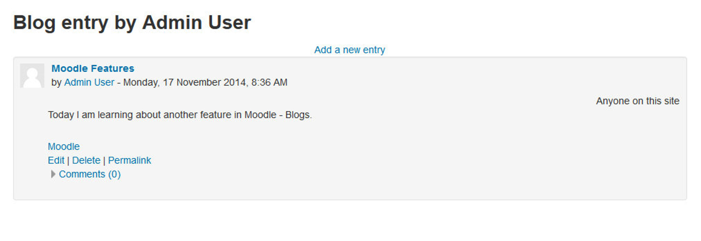
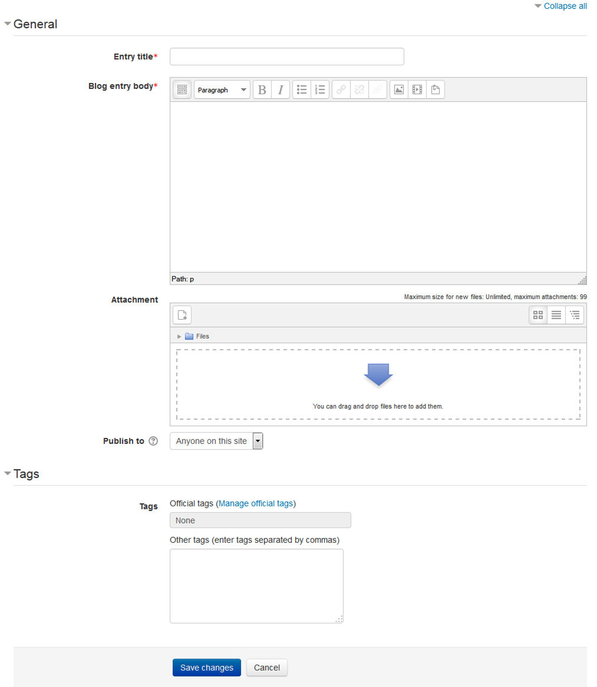
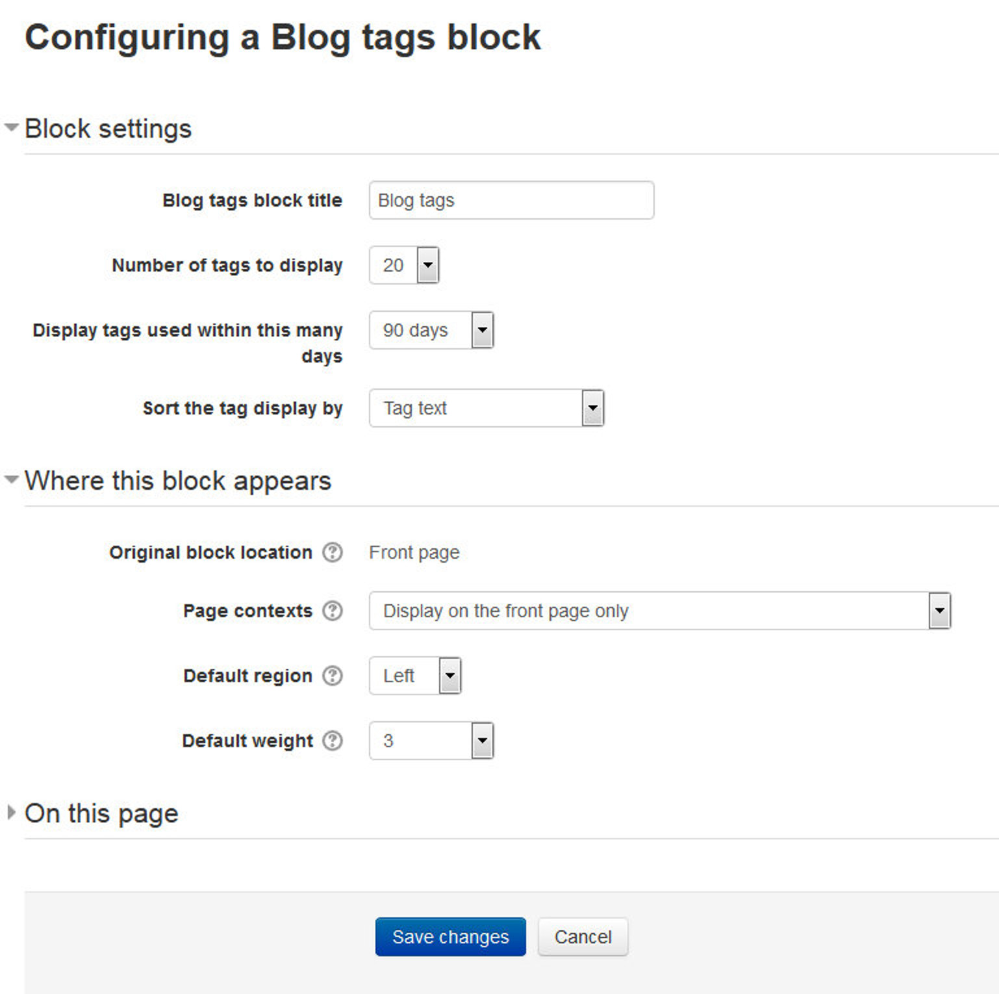

Blogs are a form of online journal used by millions of people around the world for self-expression and communicating with family and friends. Blogs are usually organized as a chronological series of postings created by the author of the blog. Blogs usually are written by one person, although some blogs can be authored by groups of people. The word 'blog' is a contraction of 'web log'.

As the role of technology in the classroom continues to grow, teachers are turning to blogging to give students a voice, inspire purposeful writing, provide an authentic audience, and publish student work. Blogging is a powerful tool that gets students excited about writing and allows them to connect with others around the world.

Blogs are growing in importance around the world. They are used by everyone from teenagers posting who they like or dislike at school to CEOs communicating directly with their customers to dissidents in oppressed populations expressing their political views. 

Blogs in Moodle are user based - each user has their own blog. Users can also register their external blogs, such as Blogger or Wordpress, so that entries are automatically included in their Moodle blog.

## Using Blogs
Blogs in Moodle are user-based—each user has his own blog, which is non-course-specific. Your profile page contains a Blog tab for accessing your blog page, as shown in Figure 14-1.

### Adding a blog entry
To add a blog entry:

- From the Navigation block, click on Blogs>Add a new entry or Alternatively, if the Blog menu block is enabled in the course, click Add a new entry there.
- Write your entry and give it a title.
- If you want to attach a file, click the Add button to access the File picker to locate a file. Be sure your document is smaller than the maximum attachment size. Alternatively, drag and drop your file into the box provided.
- Choose who you wish to publish the entry to i.e. who may see the entry. There are three options:
	- Yourself i.e. your blog entry is a draft
	- Anyone on your site
	- Anyone in the world
- Select appropriate official tags for your entry and/or add one or more user defined tags. If you add more than one, they should be comma separated.
- Click on the "Save changes" button.
 

You can edit your blog entry at any time using the Edit link at the bottom of the entry. You may want to change the publish option from yourself to anyone on the site. You can also delete the blog entry completely if you wish.

### Viewing Blog Entries
You can view all of your entries by Navigation Block >My Profile >Blogs > View all of my entries or else from Blog Menu Block > View all of my entries if the Blog Menu block is enabled.

You can also access all the entries in your course, your entries in the course and add a new entry from the Blog Menu block.

Alternatively, you can choose to view all blog entries with a particular tag via links in the Blog Tags block (which we’ll cover in the next section).

## Blog visibility
By default, all site users can view all blog entries via the Navigation Block > Site Pages > Site Blogs link in the Navigation Block if it’s enabled by your site administrator. However, your system administrator may have restricted blog visibility site-wide so that users can only see blog entries for people with whom they share a course or a group.

 

## Blog preferences
The “Blog preferences” link in the Administration > My Profile Settings > Blog > Preferences - allows you to choose how many blog entries are displayed on a page. The default number of entries is 10.

## Blog Tags

A tag is a relevant keyword or term associated with a blog entry, describing it and enabling keyword-based classification of information for the purpose of retrieval. Typically, a blog entry will have one or more tags associated with it.

You can add new blog tags when adding or editing a blog entry. There are two types of tags:

- User-defined tags : Personal tags that any user can add
- Official tags: Added by an administrator and available for any site user

### Blog Tags block
To encourage the use of blogs in your course, you may wish to add a Blog Tags block, as shown in Figure 14-3, to your course page. A Blog Tags block displays a “tag cloud,” i.e., a list of tags where more frequently used tags appear in a larger font size. Tags can be listed in alphabetical order or according to the last date used, depending on how the Blog Tags block is configured.

To add a Blog Tags block to your course page:

- Enter the Editing Mode by clicking the Turn Editing Mode On.
- Select Blog Tags from the “Add blocks” menu.
- If appropriate, move the Blog Tags block up and/or left, using the  drag and drop icon under the block title..

To configure a Blog Tags block:

- Click on the gear icon in the block header with link "Configure Blog Tags Block".
- On the Blog Tags configuration page, as shown in Figure 14-4, adjust the settings as required or leave them as default.
- Click the “Save changes” button.
 

## Blog Capabilities
Blog capabilities focus on entries and tags, as you might expect.

T> *These capabilities are set at the global level, so as a teacher you may not have the ability to change them.*

- Create new blog entries:  This allows a user to write blog entries.
- Edit and manage entries:  This allows a user to edit and delete other users' blog entries.  The default manager, teacher and non-editing teacher roles have this capability set to allow.

- Edit and manage external blogs:  This allows a user to register external blogs, such as Blogger or Wordpress so that entries are automatically included in their Moodle blog.  This capability is allowed for the default authenticated user role.
- Search blog entries:  This allows a user to search blog entries via the Blog menu block.
- View blog entries: This allows a user to view another user's blog entries.  The default authenticated user role has this capability set to allow. If you prohibit this capability, the user will not be able to read any blogs on the system.
- View draft blog entries: This allows a user to view another user's draft blog entries.  Only the default manager role has this capability set to allow.
- See all user blogs:  This allows a user to view the blogs of other users.  The capability is set to allow by default for the Manager, Teacher, Non-editing teacher and Student role. (It is not set for Guests and Course Creators.)  
- Associate blog entries with courses:  This allows a user to associate blog entries with courses. This makes it possible for a user to blog "about" a particular course. This capability is allowed for the default roles of manager, teacher, non-editing teacher, student and authenticated user.
- Associate blog entries with activity modules:  This allows a user to blog about a particular activity. This capability is allowed for the default roles of manager, teacher, non-editing teacher, student and authenticated user. 

## Effective Blog Practices
Blogs in Moodle are a relatively new feature, which many people are still learning how to use. There are currently very few examples of good usage of blogs. Most blogs are either blogging for the sake of blogging, or an ill-defined “learning journal” where students  engage  in  unstructured  reflection  on  what  they  are  learning. It’s difficult to maintain students’ motivation for either of these activities. Students who are engaging in purposeful blogging for the first time will have a difficult time successfully posting without scaffolding and some clear goals. Perhaps a weakness in blogging assignments comes from a lack of first-hand experience on the part of teachers but I am sure that my readers must be having enough experience with the blogging so that they can provide the required scaffolding and clear goals to their students.

To begin to understand blogging, we would strongly recommend starting your own blog in Moodle. This experience will help you understand blogs better, and it will also give you another channel to communicate with your students and/or colleagues. As you develop your blog, notice which posts are easy to write and which are a struggle. Do you post regularly? Or do you need to remind yourself to post? Creating interesting posts on a regular basis is not easy, nor is making time to post regularly. However, if you set a good example for your students, you will find it easier to create good blogging activities. 

The most important element of running an effective blog as part of your course is to have a clearly defined goal for student blogging.

At the beginning of a course, do a quick poll of your students. How many of them are blogging now? Why are they blogging? Many of your students will have either Twitter or Facebook accounts where they can post updates of their activities to their friends. But social blogging is different from blogging in a learning environment, and you will need to work closely with your students to create effective blogs. 

It’s recommended that you allow each student to create his own blogging goals. As David Hawkins writes in his book The Roots of Literacy, “Children can learn to read and write with commitment and quality just in proportion as they are engaged with matters of importance to them, and about which at some point they wish to read and write.”

Blogging is essentially a writing exercise but you should also keep the audience in mind. It can be a personal, reflective exercise, or it can be a forum for posting about the ideas and concepts important to the author.

Once your students have started blogging, they may respond better if they have an audience. Knowing someone is reading your posts is a great motivator to continue writing. Be sure to comment, either via messages or in class, on posts students have made public. If students want to keep their posts as private reflections, allow them to do so. Blogging is always personal, and your blogging authors need to feel a sense of control over their personal posts.

One simple way to incorporate blogging into nearly any course is to create a single class blog and post case studies, news items, or topics for commentary. Another option is to assign students to post notes on each class along with their thoughts on the material, and assign other students to comment on the postings.

## Blogging etiquette's for students:

- Be honest and fair: bloggers should avoid plagiarism, always cite (and possibly link to) their sources, never post inaccurate information, distinguish between facts and commentary, and refrain from distorting facts.
- Treat human beings with respect: bloggers should be polite and considerate when addressing other Internet users, especially in the case of children, and avoid intruding into anyone's privacy.
- Be responsible: bloggers should admit and correct their mistakes, explain the aim of each blog and invite dialogue with readers over the blog's content.
- Be polite: Write in a positive, friendly way. Do not use sarcasm or nasty language. Also, avoid using ALL CAPS, as this indicates yelling. Remember, the way you write shows your personality to everyone who reads the blog.
- Be accurate. Make sure that any information you write is correct. This includes facts, names, and web addresses. Do not exaggerate.
- Write intelligently. Make sure your message is clear and easy to understand. Remember to stick to the topic; don’t be overly humorous or creative.
- Be a conscientious student. Proofread carefully before clicking “Submit Comment”. Your writing is for school, so be sure to check spelling, punctuation and grammar, as you would for any other type of school project.

## Creative Blog Practices
As blogs are so new, there is a lot of room for new and creative applications. As the blogs continue to develop in future versions of Moodle, there will be more capabilities to apply to interesting activities. But even now, there are a few creative activities you can develop using the blog tool.

### Group work with tags
Blog tags are used to categorize and locate blog entries. Usually general categories are used, like “teaching” or “trips.” However, creating assignment-specific tags can turn the blog tool into a brainstorming tool. If you have an assignment on understanding evolution, create a set of tags for your students to tag research findings, claims, counter-claims, evidence, etc. Once students have begun to create entries, they can collate the work of the entire class by selecting the appropriate tags, and every post with that tag will be displayed.

### One-minute responses
Effective feedback is important for learning. This is true for both the teacher and the student. One-minute-response blog posts are an easy way to get informal feedback from students about a lesson or activity and keep them posting in their blogs. Usually, the instructor gives the students a few prompts to get quick feedback on the effectiveness of the lesson.

You can use three questions when asking for a one-minute response to a lesson:

- What was the muddiest (i.e., least clear) point in the lesson?
- What was the most important point?
- How useful/interesting was the lesson?

Obviously, there are many more prompts you can use to get the feedback you want from your students. You may want students to reflect on how they feel about the class itself, or about a test, or ask other questions about how they perceive various aspects of your course. Alternatively, you could ask them for quick answers to more specific, content-related questions that you know students frequently have problems with.

Assign students a one-minute response as a blog assignment. Post the questions in a prominent place in your course, and ask them to tag the post with the name or date of the activity. Clicking on the tag will make it easy to collate all of the student responses.

## Summary
At first glance, the blogging doesn’t seem to be very interesting but if you allow your students to post online for their audience then it can inspire them for purposeful writing and publishing their work. In the next chapter we will take a look at the Swiss army knife of Moodle known as Database and can be used to in a variety of ways e.g. for collection of entries submitted by students.
