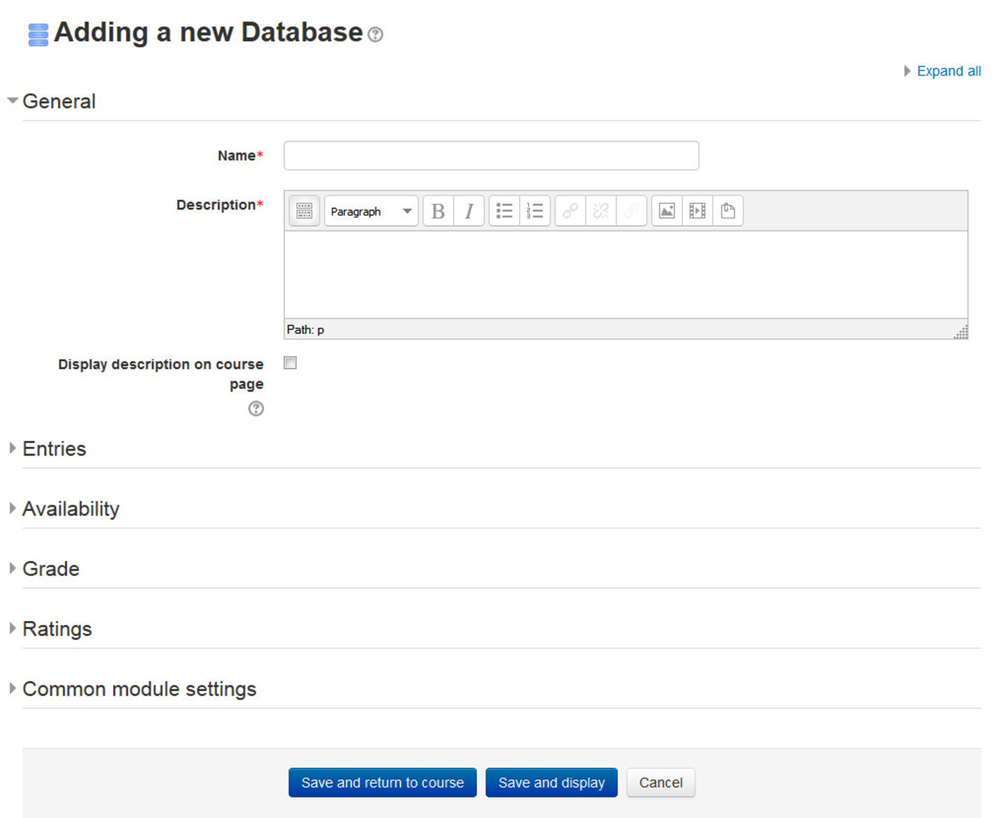
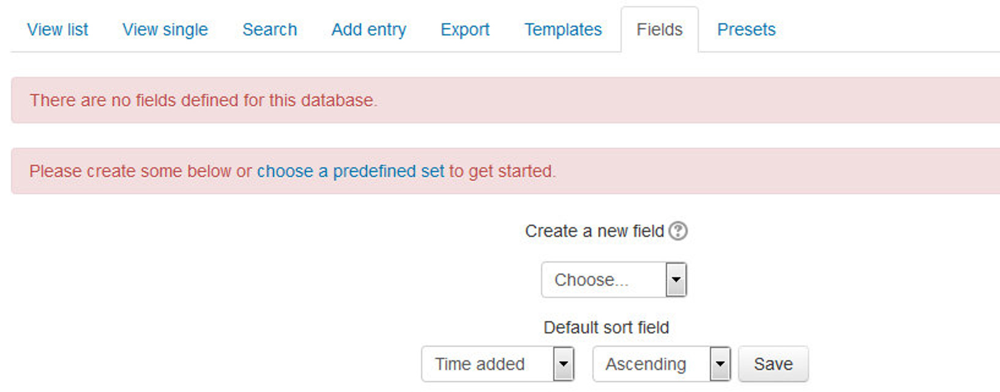
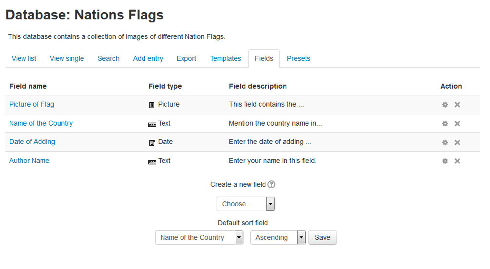
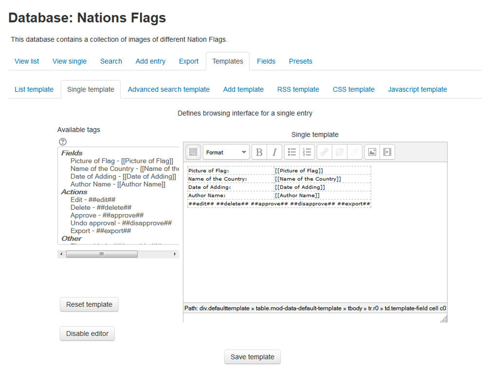
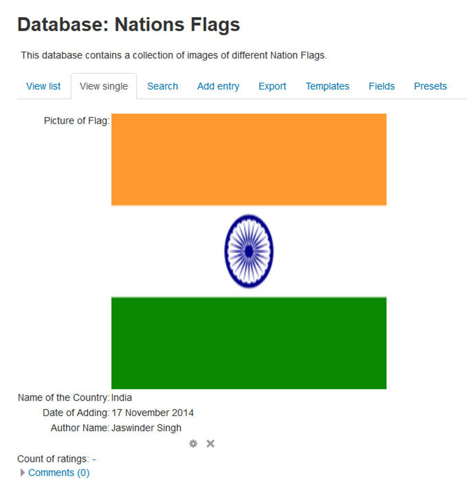
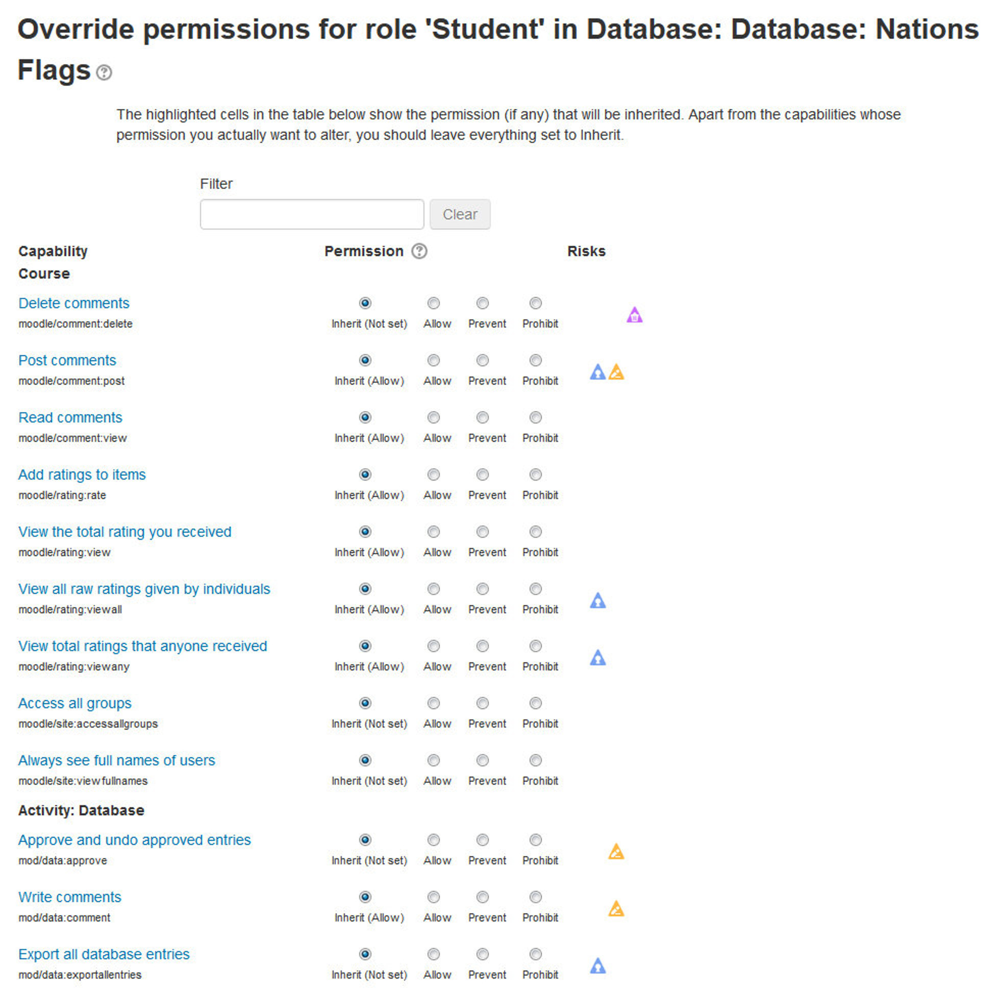

The database activity module allows the teacher and/or students to build, display and search a bank of record entries about any conceivable topic. The format and structure of these entries can be almost unlimited, including images, files, URLs, numbers and text amongst other things.

It is a simple, easy-to-use, general purpose database not meant to be very complex or powerful; it’s simply a way for multiple people to add structured data to a shared resource. The database module provides a tool for collaborative development of a database within the course.

You can use database module in a lot of creative uses which are limited by your imagination. You could use the database to create glossaries, catalogs, taxonomies, registrations, paper submissions, maps, or anything where the students in your class can fill in a form to add data.

You could use the database module to:

- allow collaboration on building a collection of web links/books/journal references related to a particular subject
- display student created photos/posters/websites/poems for peer comment and review
- gather comments and votes on a shortlist of potential logos/mascot names/project ideas
- provide a student file storage area
- Maintain a log of what was done in a face-to-face class each day, so that absent students can get caught up themselves.

Creating database activities is a little more involved than most of the Moodle activities, but it’s not as complex as lessons. You also have the option of using a preset of an empty database activity, rather than creating your own from scratch.

The visual layout of information when listing, viewing or editing database entries may be controlled by database templates. Database activities may be shared between courses as presets and a teacher may also import and export database entries.

If the database auto-linking filter is enabled, any entries in a database will be automatically linked where the words or phrases appear within the course.

A teacher can allow comments on entries. Entries can also be rated by teachers or students (peer evaluation). Ratings can be aggregated to form a final grade which is recorded in the gradebook.

Database activities have many uses, such as

- A collaborative collection of web links, books, book reviews, journal references etc.
- For displaying student-created photos, posters, websites or poems for peer comment and review

## Creating Database  
A database is made up of fields and templates. Fields define the type of data the database will store: text, dates, files, URLs, etc. Templates allow you to control the visual layout of information when listing, viewing, or editing database entries.

A database activity has three basic template types:

- **List template**
The list template allows you to control the fields used and their layout when viewing multiple entries. Usually an overview of each entry is provided, with more detailed information available by clicking on an entry to access the single view.

- **Single template**
The single template is for displaying the detailed view of a single entry. All the data the user entered should be visible here.

- **Add template**
The add template creates the interface form used when adding or editing database entries.

As with many of the activity modules, a little preplanning can go a long way when you are thinking about developing a database activity. The field definitions determine the fields in the add template, which determine the data you can display on the list and single templates. Before you begin digging into the database, try to sketch out the fields you think you need the students to enter, and how you might want to lay them out in each template.

Once you have a rough sketch, creating the database itself will be easier and you will less likely need to go back and add fields later (although you can if you need to).

## Adding a database
The first step to creating a database is adding it to the appropriate section of your course. As with most Moodle activities, you first set the options for the database, then create the fields and templates.

To create a database activity:

- With the editing turned on, in the section you wish to add your database, click the "Add an activity or resource" link and choose Database.
- In the General Section, Give your new database a name and a description.
- In the Entries Section:
	- Approval required? - If set to "yes", the entry will only be visible once a teacher has checked and approved it.
	- Allow comments on entries - If set to "yes", users will be able to comment on database entries.
	- Entries required for completion - Select here how many entries you wish the student to add before the activity can be considered "complete".
	- Entries required for viewing - Select here how many entries you wish the student to add before they are allowed to see entries by other people.

	T> *If entries are required before viewing, the database auto-linking filter should be disabled. This is because the database auto-linking filter can't determine whether a user has submitted the required number of entries.*

	- Maximum number of entries - Select here the maximum number of entries you wish students to make.
- In the Availability Section:
	- Available from/to - Select here when you want the database to be visible to students.
	- Read only from/to - If you wish, select here the dates you want students to be able to see entries in the database but not be able to add their own. For example you could make a database 'available from' January 1st until March 1st, but 'read only' from January 1st to February 1st. This means students can only view entries for a month before being able to add their own.
	
	T> *The 'available from/to' settings override the 'read only from/to' settings. So if a database has 'read only' from 1st January, and "available from" 1st February, students will not be able to view its content during January.*

- In the Ratings Section:
	- Roles with permission to rate: To submit ratings users require the moodle/rating:rate capability and any module specific capabilities. Users assigned the following roles should be able to rate items. The list of roles may be amended via the permissions link in the administration block.
	- Aggregate type: The aggregate type defines how ratings are combined to form the final grade in the gradebook.
	- Scale: Select the type of grading used for this activity. If "scale" is chosen, you can then choose the scale from the "scale" dropdown. If using "point" grading, you can then enter the maximum grade available for this activity.
	- Restrict ratings to items with dates in this range: Select the time range for which you want to restrict the ratings.
- In the Common Module Section:
	- Visible: Select Show/Hide to display or hide the activity to your students.
	- ID Number: Provide a ID number for the activity to be shown in the Gradebook.
	- Group Mode: Select the group mode for the workshop activity. There are three options:
		- No Groups: There are no sub groups, everyone is part of one big community
		- Separate Groups: Each group member can only see their own group, others are invisible
		- Visible Groups: Each group member works in their own group, but can also see other groups.
	- Grouping: Select grouping type if you want to make an activity (such as an assignment or a quiz) visible to only one set of users within a course.
- Click the “Save changes” button and you will be taken to the database setup page. 

## Building Database
When you visit the database activity then it will be displayed like as shown in figure 15-2.

 

There are multiple tabs on the top of the activity which we will discuss one by one. First it will show you an error message with Red background that "There are no fields defined for this database." So, first you need to define some fields or else you can use Presets.

Let’s start by defining some fields for your database:

### Creating Fields
The field definitions create the basic structure of the database and determine what kind of information students can enter into your database. For example a database of famous paintings may have a picture field called painting, for uploading an image file showing the painting, and two text fields called artist and title for the name of the artist and the painting. By combining several fields with appropriate names and types you should be able to capture all the relevant information about the items in your database.

Alternatively, you can use a database preset. You are provided with a choice of 12 data field types.

- Checkbox: This allows you to offer checkboxes for the user to select. Add the options one under the other. The word will appear next to a checkbox when the user clicks to add an entry. They can check more than one box.
- Date: This allows a user to enter a date by picking a day, month and year from a drop down list.
- File: Users can upload a file from their computer. If it is an image file then the picture field may be a better choice.
- Latitude/longitude: Users can enter a geographic location using latitude and longitude. When students view the entry, links are automatically generated to geographic data services such as Google Maps, Google Earth, or Multimap.
- Menu: For students to select an option from a drop-down menu. Enter each option on a different line in the options text field.
- Menu (multiselect): For students to select multiple options from a drop-down menu (by holding down the Control or Shift key as they click).
- Number: For students to enter a number (positive, negative, or zero).
- Picture: For students to upload an image file from their computer.
- Radio buttons: For students to select just one option from a list. If used, “radio buttons” is a required field; a student may only submit his database entry after selecting an option.
- Text: For students to enter text up to 60 characters in length. For longer text, or for text that requires formatting—such as headers and bullet points—the textarea field should be used.
- Textarea: For students to enter text longer than 60 characters in length and/or include formatting such as headers and bullet points.
- URL: For students to enter a URL. Selecting “Autolink the URL” will make the URL a clickable link, and entering a forced name for the link means that the name will be used for the hyperlink. You can choose to have the URL open in a new window if so desired.
 

To create the fields for your database:

- On the database setup page, select the field type you want to add from the “Create a new field” dropdown menu.
- Enter a field name and a field description. The field name is used to create the templates, so make it unique and long enough to be descriptive, but not too long to retype.
- If necessary, add/select the options for each field type. For example, you can set the height and width of the text area generated by the textarea field.

Once you’ve defined the fields you want to use in your database, as shown in Figure 15-3, you are ready to begin editing your templates.

## Editing Templates
Once you have created the fields for your database, you will probably want to edit the templates that define the user interface. Creating the fields produces a default template, as shown in figure 13-4. Templates for the Database activity module allow you to control the visual layout of information when listing, viewing or editing database entries.

Database templates all work on the same principle. They are basically HTML pages with a new set of tags for the database module to interpret. When editing a template, Moodle displays a list of available tags on the left side of the editing screen. Double clicking on any of the tags adds it to the template. The database activity interprets these new tags before sending the template’s HTML to the browser for display. It looks for words enclosed in either two square brackets ([[) or two hash signs (##), representing two different types of interface elements it can add to the template.

The square brackets define data tags, which tell the module to replace the word in the brackets with the value or form element of the field with the same name. So if you have a database with a name field, you would represent it in the template with [[name]]. In the single or list template, the module would replace it with the data in the name field for that entry. In the list template, the module would replace it with a text field, and put the value in the text field if you’re editing the entry instead of creating a new one.

The ## tags indicate the word should be replaced by an icon or link for interacting with the module. These tags are used to place the edit and delete icons, and links for More, Approve, Comments, and User. If you want to add the edit icon to a template, you just add a tag that looks like ##edit##. When the user looks at the page with the tag, the database module replaces it with the edit icon. If the user then clicks on the icon, it takes her to the edit template.

T> *The edit and delete icons only appear for users with appropriate capabilities allowed. The Approve and Comments links only appear if these options are enabled AND only for users with appropriate capabilities allowed.*

Aside from the replacement tags, creating a template is just like creating an HTML page. Use a table to lay out the data elements (this is an acceptable use of tables for layout), add descriptive text around the replacement tags, and publish. The database makes it easy to rapidly view your changes by flipping between the Templates tab and the tab for the template you are working on.

T> *Don’t forget to save the template before you switch views! It’s easy to forget, and very frustrating to switch views and have the template look exactly the same because you forgot to save!*

When you are editing the template, you may find the HTML editor gets in your way, especially when editing the list template (more on the list template below). Fortunately, Moodle has a toggle button for enabling and disabling the HTML editor in the template editing screen. Just below the “Reset template” button on the left side of the template page, you’ll see the “Enable/Disable editor” button. Disabling the editor allows you to get your hands dirty with the raw HTML code rather than trying to use the editor’s GUI. Most of the templates are quite simple, and switching the editor off is a great way to learn how the templates are structured.

As mentioned previously, there are three basic templates necessary to use the database: list, single, and add. The three other templates—RSS, CSS, and JavaScript—are more advanced templates and aren’t necessary for basic database use.

To edit a template:

1. On the database page, click the Templates tab.
2. Click one of the template links below the row of tabs.
3. When you are done, click the “Save template” button.

## Add template
Add template is used to create and edit new entries. In this template, data tags are replaced with the form element for the field. If the user is editing an entry, the field will have the data from the field in the form element for editing as well.

If you have a lot of form elements, consider grouping them together logically. For example, if you have a database asking students to build a catalog of insects found during a field trip, you may want to separate the description and taxonomy from the location data. It will make it easier for students to fill in and organize their data.

T> *It’s important to list every field you want the user to fill in on this template. If you leave off a field, the user won’t be able to add or edit its data.*

### Single template
The single template, as shown earlier in Figure 13-4, is the detailed view of an entry. This template should list all of the available data. Again, consider organizing the data if you have a lot of fields in your database. This is used to display a single entry at a time and so has more space for display and can use, for example, larger versions of images or optionally provide more information than shown in the list view.

### List template
The list template is the first page students will see when they come to your database. The list template should give an overview of the entries and enable users to click through to the single or edit template.

Organizing a good list template is a bit of a challenge. First, you should identify the fields that will be most helpful to users for selecting the entries they want to view. The default layout almost always has too much information and is not laid out well.

The form has three areas: the Header, Body, and Footer. If you lay out the list template as a table, you’ll want to use the Header area as the table header, the Body for the data, and the Footer to close the table, But the HTML editor puts a full table in each area, which makes it difficult to get proper alignment of the elements and not repeat the headers for every entry.

To make the entire list template as one table:

- On the list template page, turn off the HTML editor.
- In the Header area of the template, open the table and add a row for your header text. Each column should contain one element of the header.
- In the Body, create another row with the data and command replacement tags.
- In the Footer, close the table.
- Save the template. DO NOT switch the HTML editor on while editing this template. If you turn the editor back on, it will create tables in each of the areas.

### RSS template
The RSS template allows you to structure the RSS feed from the database. If you have enabled RSS feeds for the database in the database options, the database will publish the entries in a feed. This template allows you to structure how the entries in the feed appear to the readers.

### CSS template
The CSS template defines the CSS styles for all of the templates in the database. If you know CSS, you can adjust the template’s fonts, spacing, colors, and other display information.

### JavaScript template
Like the CSS template, the JavaScript template is used by the other templates. The JavaScript template allows you to add new behaviors to the templates by defining JavaScript routines that can be loaded when the template page loads. 

You can use JavaScript to manipulate the way elements are displayed in the List, Single or Add templates. Basically you need to enclose the part you want to manipulate in any named html element. The naming is essential as it allows you to identify the element for manipulation. 

## Managing Databases
Once you have set up your database, you and your students can begin to enter data. Managing your database as students begin to populate it with data is an important factor in the success of a database activity. Someone will need to maintain the quality of the entries and give students credit for participating.

### Quality Data
Once students have started to add entries to your database, you will need to track their data to help ensure they are making useful contributions. Managing the quality of database entries can be a tedious exercise, but it can also be a learning opportunity for your students. Students will enter their data according to their interpretation of the activity and their abilities. An inaccurate or disorganized entry from a student is a potential opportunity for feedback to help the student learn.

The database module has a few tools that will be useful to you in ensuring data quality:

- Comments: Comments are a great tool for feedback to motivate your students and help them improve their entries.
- Require approval: The ultimate quality assurance tool is the “Require approval” option in your database options. As mentioned earlier, this option hides an entry from the rest of the class until you or someone with approval capability approves it. You might want to use this capability to help students produce good material by giving them feedback before approving an entry.

### Rating
Giving grades for entries is the single most powerful motivator for students. It also rewards students for their time and effort. As always, if you don’t want to assign a numerical grade to an entry, you can create a custom scale and assign a qualitative grade.  When you rate an entry, the grade is added to the gradebook, like a rated forum post.

We would strongly recommend combining rating and comments, as shown in Figure 13-5. Rating allows you to assign a numerical value to an entry, but it doesn’t give you a method to tell the student why she received her particular grade. The comments box enables you to communicate the reason.

Rating and comments can be turned into a collaborative venture with your students. By default, students are allowed to add comments, but only teachers are allowed to rate entries. However, you can enable collaborative rating by setting a student role override.

T> *If you don’t see the “Override roles” link in the Roles tab, ask your system administrator. By default, teachers are unable to override roles, so this ability must be granted by your system administrator, as well as setting which roles can be overridden by the teacher role.*

## Database Presets
To avoid the necessity of always having to create a new database from scratch, the database activity module has a presets feature. An image gallery preset is currently included in the database module to help get you started. You can create your own presets as well and share them with others.

### Creating a new preset

To create a new preset:

- On the database page, click the Presets tab.
- In the "Save as Preset" section, provide a name for the current preset.
- Check the Overwrite checkbox to override an existing preset and click Continue.

### Importing a preset

To import a preset:

- On the database page, click the Presets tab.
- The usual way to import a preset is clicking the "Choose file" button in the Import Section and browsing to the ZIP file containing the preset (e.g. "preset.zip") stored on the server. If there does not yet exist a preset ZIP file on the server, upload it from your local machine. Choose the desired preset file by clicking on its action "Choose". Finally, press the "Import" button.
- Alternatively, you can choose a previously loaded preset.
- After the import, you can start to add or import entries. All the hard work of setting up the fields and templates has been done for you. If you desire, you can still customize the fields and templates.

You will see an "Overwrite current settings" checkbox after the "Import" button has been pressed. If checked, the database activity overwrites some of its current general settings by those stored in the preset:

- the "Introduction" HTML text
- "Required entries"
- "Entries required before viewing"
- "Maximum entries"
- "Comments"
- "Require approval?"
- rssarticles

### Exporting a preset
If you wish to share your database presets with others, you have two options:

- Export as a ZIP file, which can then be imported to another course or Moodle site.
- Save as a preset, which publishes the database for other teachers on your site to use. It will then appear in the preset list. (You can delete it from the list at any time.)

T> *Only the fields and templates of the database are copied when exporting or saving it as a preset, not the entries.*

### Using an Existing Preset
From the presets tab, you can choose to use an existing preset saved by you earlier. In the "Use a Preset" section select the existing preset from the list.

## Database activity capabilities

- Approve unapproved entries: This allows a user to approve and undo the approval of Database activity module entries. This capability is allowed for the default roles of manager, teacher and non-editing teacher.
- Write comments: This allows a user to add comments to Database activity module entries. This capability is allowed for the default roles of manager, teacher, non-editing teacher and student.
- Export all database entries: This allows a user to export all Database activity module entries. This capability is allowed for the default roles of manager, teacher and non-editing teacher.
- Export a database entry: This allows a user to export Database activity module entries. This capability is allowed for the default roles of manager, teacher and non-editing teacher.
- Export own database entry: This allows a user to export their own Database activity module entries. This capability is allowed for the default roles of manager, teacher, non-editing teacher and student.
- Manage database activity comments: This allows a user to edit and delete database activity module comments. This capability is allowed for the default roles of manager, teacher and non-editing teacher.
- Manage database activity entries: This allows a user to add, edit and delete database activity module entries. This capability is allowed for the default roles of manager, teacher and non-editing teacher.
- Manage templates: This allows a user to manage database templates. This capability is allowed for the default roles of manager and teacher.
- Manage all template presets: This allows a user to manage database presets. This capability is allowed for the default role of manager only.
- Rate entries: This allows a user to rate database activity module entries. This capability is allowed for the default roles of manager, teacher and non-editing teacher.

T> *You may want to select a small group of students as moderators and create a role for them to provide feedback to others.*

- View all raw ratings given by individuals: This allows a user to view all ratings given to database activity module entries. This capability is allowed for the default roles of manager, teacher and non-editing teacher.
- View presets from all users: This allows a user to view database presets from all users. This allows also a user to export entries. This capability is allowed for the default roles of manager, teacher and non-editing teacher.
- View total ratings that anyone received: This allows a user to view total ratings for database activity module entries. This capability is allowed for the default roles of manager, teacher and non-editing teacher.
- View entries: This allows a user to view database activity module entries. This capability is moderated by any submission requirements in the database set-up, such as the number of entries required before viewing. This capability is allowed for the default roles of manager, teacher, non-editing teacher, student and guest.
- View the total rating you received: This allows a user to view all ratings which they have received for database activity module entries. This capability is allowed for the default roles of manager, teacher and non-editing teacher.
- Write entries: This allows a user to add entries to a database activity and edit or delete any entries which they have previously added. This capability is allowed for the default roles of manager, teacher, non-editing teacher and student.
- Add a new database activity: This allows a user to add a new database activity to the course. This capability is allowed for the default roles of manager and teacher.

## Effective database practice
The database activity is both powerful and complex. It is probably the most technical module to set up, though a complex lesson may take longer, but it has tremendous power. The database is a veritable Swiss Army knife, useful in many situations with a little ingenuity and work.

To reduce your workload creating databases, make use of one of the presets available on Moodle.org. If a preset doesn’t meet all of your requirements, it’s easier to customize an existing database than create one from scratch.

You can also share the work of creating a database. If you want your students to create and submit a database for a project, you can override the student role and grant them authoring capabilities. If you then use the separate groups mode, each group can create its own database of research and submit it at the end for grading.

T> *Remember to use roles and groups functionality to create additional flexibility to your database.*

## Creative Database Practices
With a little creativity, the database activity can become a useful tool for collaboration. The structure provided by the field definitions and the templates makes it easier for students to understand what you expect of them and to provide each other with good data. Combined with less structured activities, like wikis and forums, you have a powerful combination of thinking tools to enable your students to produce good work.

## Summary
Database activity is the Swiss army knife in the Moodle course. It is also most complex to setup a database activity but it can be used to cater lot of creative uses which makes it a quite useful activity module.

