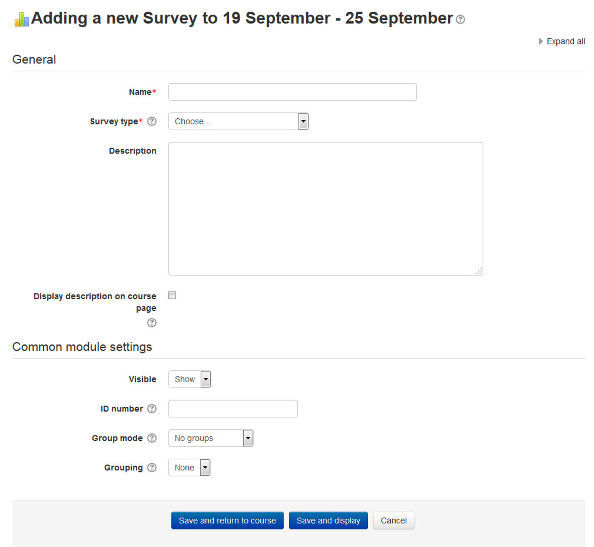
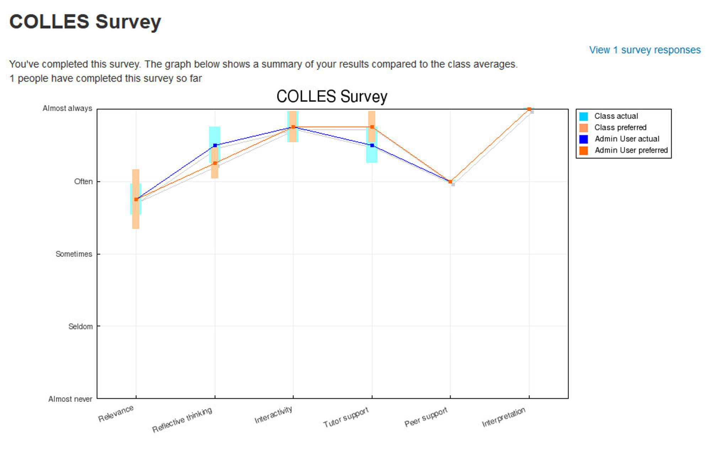
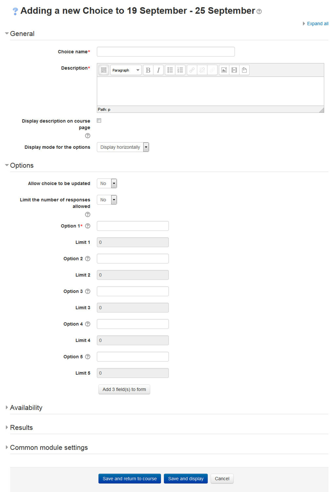
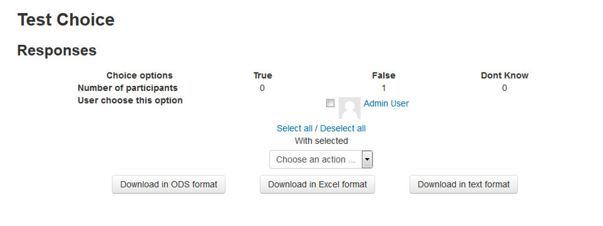
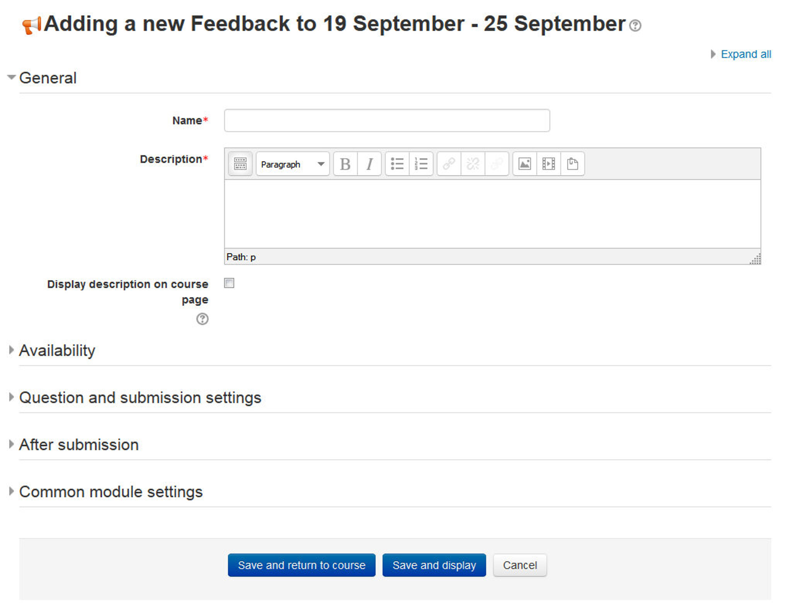
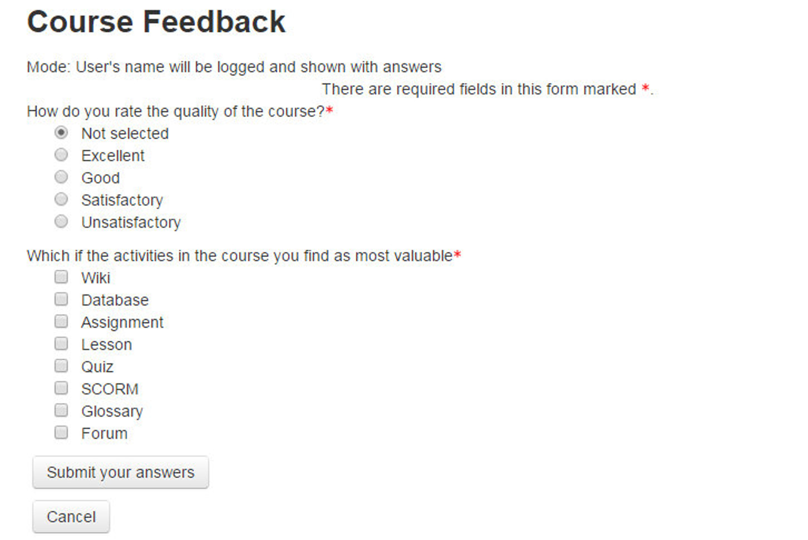
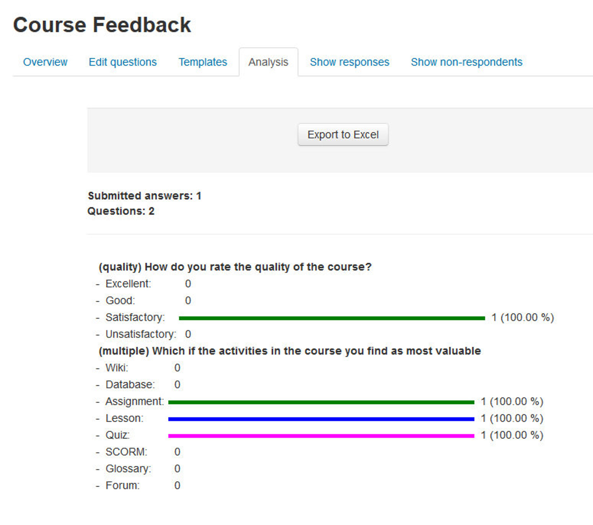
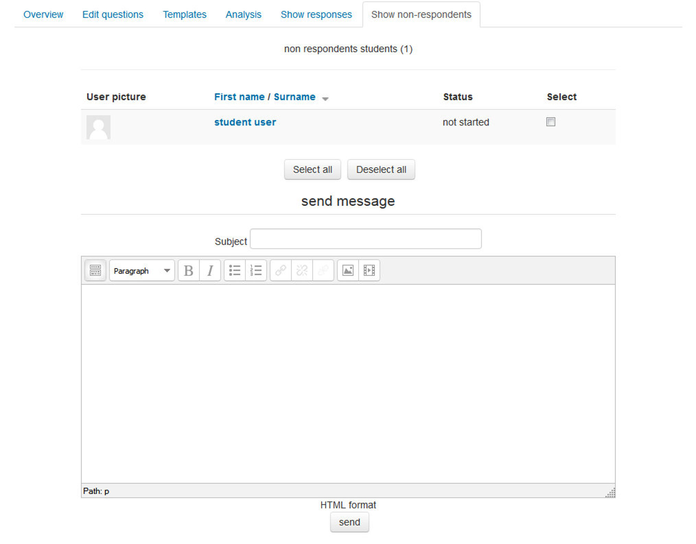

Moodle has three tools specifically designed for collecting ungraded feedback from your students: surveys, choices and feedback. 

The Survey module is a course activity that provides a number of verified survey instruments, including COLLES (Constructivist On-Line Learning Environment Survey) and ATTLS (Attitudes to Thinking and Learning Survey), which have been found useful in assessing and stimulating learning in online environments. 

The Constructivist On-Line Learning Environment Survey (COLLES) was designed to help assess key questions about the quality of an online learning environment from a social constructivist perspective (Taylor & Maor, 2000).

The Attitudes Towards Thinking and Learning Survey (ATTLS) is an instrument developed by Galotti et al. (1999) to measure the extent to which a person is a ‘connected knower’ (CK) or a ‘separate knower’ (SK).

Teachers can use these to gather data from their students that will help them learn about their class and reflect on their own teaching. The current survey focuses on getting feedback from students about the nature of the course.

Choices are small, one-question surveys. They act as small web polls that you may have seen on other web sites. You can use a choice to get rapid feedback from your students about any topic you wish, as long as it’s only one question long.
The feedback activity module enables a teacher to create a custom survey for collecting feedback from participants using a variety of question types including multiple choice, yes/no or text input.

So, let’s start with Surveys first:

## Surveys   

There are three broad types of Survey activity in Moodle which you can give:

- Attitudes to Thinking and Learning Survey (ATTLS) - ATTLS seeks to measure the extent to which a person is a 'connected knower' (tends to find learning more enjoyable, and is often more cooperative, congenial and more willing to build on the ideas of others) or a 'separate knower' (tends to take a more critical and argumentative stance to learning).  People with higher CK scores tend to find learning more enjoyable, and are often more cooperative, congenial and more willing to build on the ideas of others, while those with higher SK scores tend to take a more critical and argumentative stance to learning.
- Critical incidents survey - The Critical Incidents survey asks students to consider recent events and answer questions about their relationship to those events.

- Constructivist On-line Learning Environment Survey (COLLES) - For monitoring the extent to which the interactive capacity of the World Wide Web may be exploited for engaging students in dynamic learning practices. The COLLES comprises an economical 24 statements grouped into six scales, each of which helps us address a key question about the quality of the on-line learning environment:
	- Relevance: How relevant[^2] is on-line learning to students' professional practices?
	- Reflection: Does on-line learning stimulates students' critical reflective thinking?
	- Interactivity: To what extent do students engage on-line in rich educative dialogue?
	- Tutor Support: How well do tutors enable students to participate in on-line learning?
	- Peer Support: Is sensitive and encouraging support provided on-line by fellow students?
	- Interpretation: Do students and tutors make good sense of each other's on-line communications?

[^2]:   A preliminary scale to measure connected and separate knowing: Knight, K. H., Elfenbein, M. H., Messina, J. A. (1995)

The COLLES has been designed to enable you to monitor the extent to which you are able to exploit the interactive capacity of the World Wide Web for engaging students in dynamic learning practices. It includes the ideal and actual experience feedbacks from the students.

### Creating Surveys:
The limited nature of the surveys tool makes surveys very easy to create. Basically, you select the set of prewritten questions you’d like to give, edit the introductory text, and you’re done.

To create a survey:

- Click the “Turn editing on” button.
- Select Survey from the “Add an activity” drop-down menu in the course section where you would like to add the survey.
- On the “Adding a new survey page,” as shown in Figure 16-1, give the survey a name.
- Select the type of survey you want to give from the drop-down menu. The options are:
	- ATTLS (20 item version)
	- Critical Incidents
	- COLLES (Actual)
	- COLLES (Preferred)
	- COLLES (Actual and preferred)
- Add a description of your survey in the description field. To display it on the course page just check the "Display description on the course page" check box.
- Select the common module options:
	- Visible - This determines whether students may view the activity or not.
	- ID Number - Setting an ID number provides a way of identifying the activity for grade calculation purposes. If the activity is not included in any grade calculation then the ID number field may be left blank.
	- Group mode - This is another location in which to set the group mode for the activity. If group mode is forced in the course settings then this setting will be ignored.
	- Grouping - A grouping is a collection of groups within a course. If a grouping is selected, students assigned to groups within the grouping will be able to work together.
- Click the “Save and display” button.

### Administering Surveys
Once you’ve created the survey, students can begin to give their feedback. They simply click on the survey name in the course section and answer the questions. Once students have begun to answer the survey questions, you can track results via the “View xx survey responses” link at the top right of the survey page where xx stands for the number of the responses submitted.

The survey report page contains links at the top right for viewing the data by Scales, by participants, or by questions. You can also download the data in a choice of three formats: Open Document Spreadsheet, Excel, or text.

 

- The COLLES and ATTLS questions are five-point scales that range in responses from Almost Always to Almost Never. These results are reported in graphical form when you view them.
- The Critical Incidents survey is a free-response survey where students must type their answers. You can see what students have typed for each answer.

### Survey Capabilities
The survey module has three capabilities:

- Download responses - This allows a user to download survey responses.
- Respond to survey - This allows a user to participate in a survey.
- View responses - This allows a user to read survey responses via the “View xx survey responses” link at the top right of the survey page.

## Choice Activity  
A choice activity is very simple – the teacher asks a question and specifies a choice of multiple responses. It can be useful as a quick poll to stimulate thinking about a topic; to allow the class to vote on a direction for the course; or to gather research consent. Unlike surveys, the choice tool allows you to ask any question you’d like, as long as it’s multiple-choice. 

Once you’ve set up your choice, it acts as a poll in your course. Students click on the choice and select their answer. You can choose when and if students see the results of the choice and even let them change their minds.

A choice activity may be used

- As a quick poll to stimulate thinking about a topic
- To quickly test students' understanding
- To facilitate student decision-making, for example allowing students to vote on a direction for the course

### Creating Choices
To create a choice:

- Click the “Turn editing on” button if you are not in the editing mode already.
- Select "Choice" from the “Add an activity or resource” drop-down link.
- On the “Adding a new choice” page, as shown in Figure 16-3, given the choice a descriptive name.
- Type the question that you want your students to answer in the description field. An example of the choice text could be "What is your favorite color?" There is also an option to display the choice description on the course page below the link to the activity.
- Display mode for the options: Choose "Display horizontally" if you only have three or four choices maximum; choose "display vertically" if you have a large number of choices.
- In the Options Section:
	- Allow choice to be updated - If this is set to "Yes", students can change their mind after they have voted. If it's set to "No", students cannot change their choice.
	- Limit the number of responses - Enabling this option allows you to limit the number of participants who can select each particular choice. When that number has been reached, no one else can select that choice.
	- Option 1,2,3,4,5 -  Here you can specify the options that participants have to choose from. They will become radio buttons when the choice is saved. You can fill in any number of these. If you leave some of the options blank, they will not be displayed.  If you need more than 8 options, click the "Add 3 fields to form" button.
	- Limit 1,2,3,4,and 5 - Here you can specify  the limit of the number of participants who can select each particular choice. If Limits is disabled, then any number of participants can select any of the options.

	T> *If you unintentionally check the limit of responses check box but don't add a number then your students won't be able to select any choices and will get confused.* 

- In the "Availability" Section:
	- Restrict answering:
		- If you check this box you can set an "open and close" date for your choice.
		- If you leave it, they can respond at any time.
- In the "Results" Section:
	- Publish results:
		- This determines whether (and when) the students will be able to view the results of the choice activity. They may:
			- Do not publish results to students - Students will never see the results of the choice.
			- Show results to students after they answer - Students will see the results only after they have given the answer themselves.
			- Show results to students only after the choice is closed - Students will see the results only after the closing date of the choice.
			- Always show results to students - students will always see the results.
	- Privacy of results: If "Publish" was chosen above, then this dropdown in unlocked. You can decide whether to show names of students or merely the number who responded but without names.
	- Show column for unanswered:  If set to "Yes", this will display a column showing how many participants have not answered the choice activity yet. If set to "No", the results will only include the participants who have already voted.
- Select the common module options:
	- Visible - This determines whether students may view the activity or not.
	- ID Number - Setting an ID number provides a way of identifying the activity for grade calculation purposes. If the activity is not included in any grade calculation then the ID number field may be left blank.
	- Group mode - This is another location in which to set the group mode for the activity. If group mode is forced in the course settings then this setting will be ignored.
	- Grouping - A grouping is a collection of groups within a course. If a grouping is selected, students assigned to groups within the grouping will be able to work together.
- Click the “Save and display” button.

### Administering Choices
After students have answered the choice, you can see their responses via the “View xx responses” link at the top right of the choice page. Unlike the students’ view of the results, irrespective of whether results are published anonymously, you’ll see a column for each response with the student’s picture and name, as shown in Figure 16-4.

 

Selected responses may be deleted if you wish. You may like to delete any test response you made.

As for surveys, results may be downloaded in a choice of three formats (Excel, ODS or Text) by clicking the appropriate button at the bottom of the choice responses page.

### Choice Capabilities
The choice module capabilities are restricted to managing the responses from students:

- Record a choice - This allows a user to answer the choice.
- Read responses - This allows a user to view other users’ responses.
- Delete responses - This allows a user to delete choice responses.
- Download responses - This allows a user to download the full dataset of responses from other users.

## Feedback  
Feedback responses may be anonymous if desired, and results may be shown to all participants or restricted to teachers only. Any feedback activities on the site front page may also be completed by non-logged-in users.

However, feedback module is disabled by default. If you are not able to see the feedback activity in the "Add an activity/resource drop down" then please contact your site administrator for enabling the same.

### Why use Feedback
Apart from the obvious use here of evaluating a course, feedback surveys have a variety of uses, both within a course and for non-logged in users on the front page. The ability to set them as "anonymous" means also those sensitive issues can be surveyed without students worrying who might see their responses. 

Some ideas:
#### Guest surveys
Anonymously, on the front page, non-logged in users such as parents can be questioned on their opinions about, e.g., the website design, school policies, school meals.

#### Sign up!
Guests can be invited to sign up for events/courses via the feedback module. 
Contact us Non-logged in users can use an instance of the feedback module as a "contact us" form.

#### Anti-bullying surveys
Students can be asked to highlight anonymously any incidences of bullying, along with their location and type. 

#### Making choices
Students can select course modules or subjects they wish to study in a subsequent year/semester. The results can be exported and easily collated to match availability

#### IT Skills audit
Staff - or students - can be surveyed to discover their IT skills and weaknesses to highlight training needs.

#### Use of Moodle!
Staff can be surveyed on which Moodle modules they use/would like more training in.

### Creating Feedback
To create a Feedback activity:

- Click the “Turn editing on” button.
- Select "Feedback" from the “Add an activity or resource” drop-down link.
- On the “Adding a new feedback” page, as shown in Figure 16-5, enter a descriptive name of the choice activity.
- Add a description for your Feedback instance in the description field.
- In the "Availability" section you can choose the period when users can complete feedback.
- In the " Question and submission settings" section:
	- Record User Names: Choose here whether to show the names of users who complete the feedback or not.
	- Allow multiple submissions:  Choose here whether or not to allow users to complete the feedback more than once.  This is important when using Feedback for anonymous surveys on the front page as it will allow non-logged in users to complete the feedback.
	- Enable notification of submissions:  If enabled, teachers will receive notification of feedback submissions.
	- Auto-number questions:  If set to 'Yes' then the questions will be automatically numbered.
- In the "After Submission" section:
	- Show analysis page: The summary results can be shown to respondents, or shown only to teachers.
	- Completion message: This allows you to present users with a personalized message after they have answered the questions.
	- Link to next activity:  After submitting the feedback, a continue button is displayed, which links to the course page. Alternatively, it may link to the next activity if the URL of the activity is entered here.
- In the "Common module settings" section:
	- Visible - This determines whether students may view the activity or not.
	- ID Number - Setting an ID number provides a way of identifying the activity for grade calculation purposes. If the activity is not included in any grade calculation then the ID number field may be left blank.
	- Group mode - This is another location in which to set the group mode for the activity. If group mode is forced in the course settings then this setting will be ignored.
	- Grouping - A grouping is a collection of groups within a course. If a grouping is selected, students assigned to groups within the grouping will be able to work together.
- Click the “Save and display” button.

 

### Building Feedback

After setting a new Feedback you have to design it by adding questions. 
Select the type of question from the drop down list. Add your question details and click 'Save question'.

The following options apply to all or most question types.

#### Position
This number controls the order of the questions. Position 1 is the question nearest the top of the page, so when you create or edit a question, you can choose from the dropdown of available positions. You can also rearrange questions by clicking the position up and down arrows on the main add questions screen.

#### Required
These questions are required to be answered and will prompt the user if they are left unanswered. These questions are highlighted with a red star for users, and have a yellow exclamation point beside them when editing Feedback questions.

#### Question Types
The available question types are:

- **Captcha**
A test to make sure a real person is filling in the form and not an automatic spamming program of some sort. Asks a person to write out some distorted text which is displayed on screen. You normally won't need this unless you find you are getting spammed a lot.

- **Information**
This allows you to choose to display one of three types of information: the time of responding; the course and/ or the category where the feedback is located.

- **Label**
Like a standard Moodle label, this allows you to add arbitrary text between questions allowing for extra explanation or to divide the Feedback into sections.

- **Longer Text Answer**
This option is for creating a text box (you specify how big it will appear in rows and columns) which people can write a long answer into.

- **Multiple choice - multiple answers**
This will give you a series of options with a checkbox next to each one. The respondent can check as many as they want and there is currently no way to specify a limit to how many they can choose which is lower than the total.

- **Multiple choice - single answer allowed (dropdownlist)**
This will give you a dropdown list from which only one answer can be selected.

- **Dropdownlist (rated)**
This is similar to the dropdownlist option, except that each option has a numerical value associated with it.

- **Numeric answer**
Here, you ask a question which must have a number as an answer and specify the acceptable range e.g. "How many arms would you like, if more than 2 were possible? (please specify 0-10)" with a range of 0-10 set in the options. It helps if you specify the acceptable range in the question text.

- **Multiple choice - single answer**
This will give you a series of radio buttons, which starts on 'Not selected' and then has your options afterwards. Only one can be chosen and 'Not selected' is a valid answer if the question is not set to 'required'.	
 

- **Multiple Choice (Rated)**
This is similar to the other multiple choice options, except that each option has a numerical value associated with it.

- **Short Text Answer**
This option lets you specify a single line answer, with an input box which is a set number of characters long (you choose). You also specify the maximum number of characters you will accept, so that the answer is not too long and/or does not run over the length of the box on screen.

#### Dependence item and Dependence value
It is possible to direct the user to specific questions depending on a previous answer. For example, if they say 'Yes' to the question "Do you have a car?" they will be directed to a different question from if they answer 'No'. To set dependent questions:

- Set up your initial question and give it a name in the Label field:
- Add a Page break
- Add the question to go to if (for example)the user replies 'Yes'.
- In 'Dependence item', select the Label of your first question.
- In 'Dependence value' type your dependent answer (such as 'Yes' in our example.)
- Follow the same process for the other response (such as 'No')

### Managing Feedback:
When you first visit the feedback activity page just after creating it, then you will find several tabs in the top bar like: Overview, Edit Questions, Templates, Analysis and show responses.

##### Overview 
When a feedback survey has been completed the teacher will see, via the Overview tab, the number of students who have responded so far including the numbers of questions, submitted answers, description and completion message of the activity.

#### Edit questions
The Edit Questions tab allows you to add/edit the questions in the feedback activity.

#### Template
The Template tab allows you to save this particular survey's questions as a template for future use, or to use a template that has already been created.

#### Analysis
This screen shows a graphical summary of the results of each question, along with the option to download the results to Excel.

#### Show responses
This screen allows the teacher to see and then delete individual responses.

#### Show non-respondents
Unless the responses are set to "anonymous", there will also be a "Show non-respondents" tab where the Teacher or Feedback activity administrator can select some or all users who have not yet completed the feedback and send them a reminder message.

### Feedback Templates:
Within the Feedback Module you can create and re-use sets of Feedback questions using the Template tool. The Templates tab provides the following template features:

#### Use a template
Previously saved Templates will be listed in this area and can be selected using the dropdown menu.

After selecting a Template, Moodle will display a preview of the Feedback questions contained within the Template and confirm Are you sure you want to use this template?

You will also be required to select one of two options:

- Delete old items: Remove any questions/text types previously added to the Feedback Activity you are viewing before importing items from the selected Template
- Append new items: Add items stored within the selected template to the current Feedback activity, to any existing questions/text types.

 
Once you have made your selection click “Save changes” to copy across the Feedback items or press Cancel to exit from the template copy process.

 

#### Save these questions as a new template
After creating a new Feedback activity and populating it with questions, you can save it as a Template for re-use by yourself or others. 

When saving a new Template enter a descriptive title in the Name field and choose whether you wish to make this Template available for use by others via the Public tickbox. A Public template may be viewed and re-used by users with appropriate access rights such as administrators and teacher/trainers. When a Public template is used as a basis for a new Feedback, the activity settings and questions within it may be edited by the teacher/trainer; however the original Template remains unchanged.

#### Delete Template
To remove a Template you have created or have appropriate permissions to edit, from your Moodle site, use the Delete template... link and click the delete icon next to the corresponding template name.

#### Export Questions
The Export Questions tool allows you to save the questions/text types within your Feedback Activity in .xml format. Clicking the Export questions link will prompt you to Save or Open this file

#### Import Questions
When you have previously exported and saved questions from a Feedback activity in .xml format, you can reimport them into a new Feedback activity. 

The Import questions tool is particularly useful where you need to import questions from a different instance of Moodle and the Template tool is not applicable. 

T> *You can also use the Import/Export ability to combine multiple Imports from multiple templates; also it can be used to avoid creating duplicates when using Append.* 

After clicking on the Import questions link you will be prompted to select one of the following options:

- Delete old items - The current questions and all your user's responses will be deleted within the current Feedback activity
- Append new items - All old questions and the assigned values will be preserved within the current Feedback activity and the imported questions will be added to the existing questions. 

Use the Choose a file button to navigate to the course Files area and upload and/or select the relevant .xml file. Once selected, use the Import from this file button to import the questions or use Cancel to return to the Templates general tab. 

### Feedback Capabilities:

- Complete a feedback: This allows a user to complete a feedback form.  This capability is allowed for the default role of student only.
- Create private template: This allows a user to create templates for their own use in the feedback module. This capability is allowed for the default roles of manager and teacher
- Create public template: This allows a user to create templates for others to use in the feedback module. This capability is allowed for the default roles of manager and teacher.
- Delete completed submissions: This allows a user to delete feedback module submissions. This capability is allowed for the default roles of manager and teacher.
- Delete template: This allows a user to delete feedback module templates. This capability is allowed for the default roles of manager and teacher.
- Edit items: This allows a user to edit feedback module items. This capability is allowed for the default roles of manager and teacher.
- Map courses to global feedbacks: This allows a user to map courses to global feedback for the feedback module. This capability is allowed for the default role of manager only.
- Receive email notification: This allows a user to receive email notification of feedback module submissions. This capability is allowed for the default roles of teacher and non-editing teacher.
- View a feedback: This allows a user to view a feedback activity. This capability is allowed for the default roles of manager, teacher, non-editing teacher, student and guest.
- View the analysis page after submit: This allows a user to view the feedback module analysis page after submitting the form. This capability is allowed for the default roles of manager, teacher and student.
- View reports: This allows a user to view feedback module reports. This capability is allowed for the default roles of manager, teacher and non-editing teacher.
- Add a new feedback: This allows a user to add a new feedback activity to the course. This capability is allowed for the default roles of manager and teacher

## Summary
This chapter deals with the different tools for gathering feedback data from students. Moodle surveys are formal and based in theory. Choices are quick and simple for both you and your students. They can both provide useful data about your course and your students’ success. Feedbacks can be used to create surveys which can be utilized to gather data about some sensitive issues.

