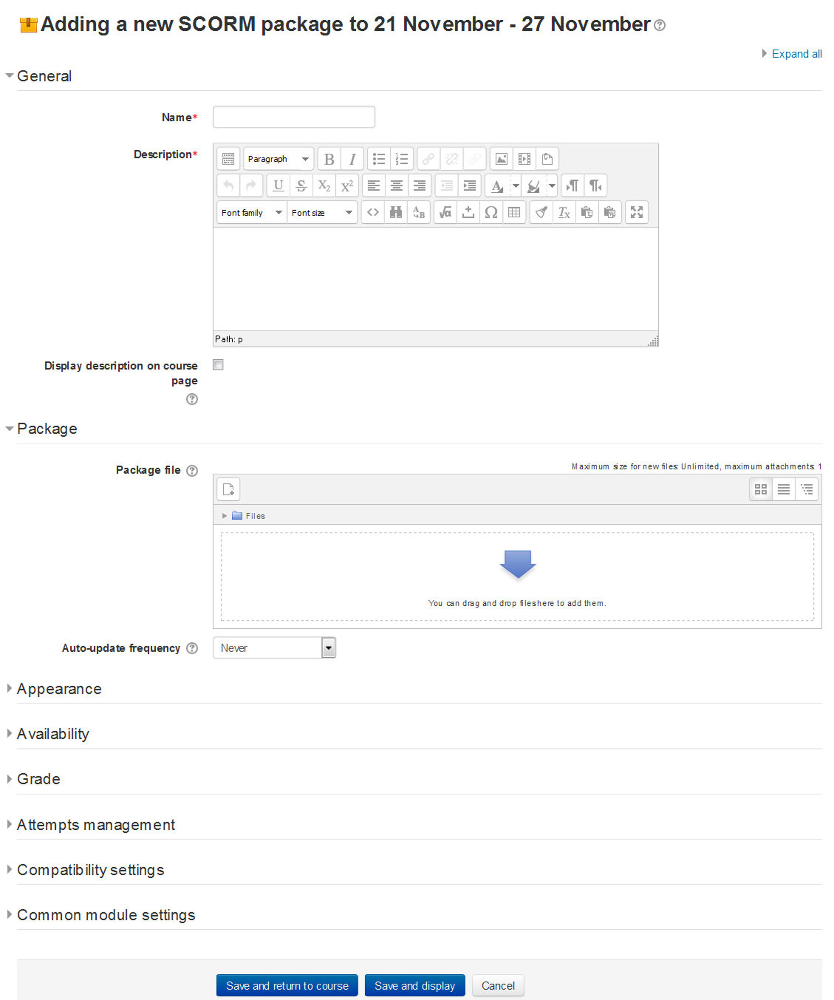
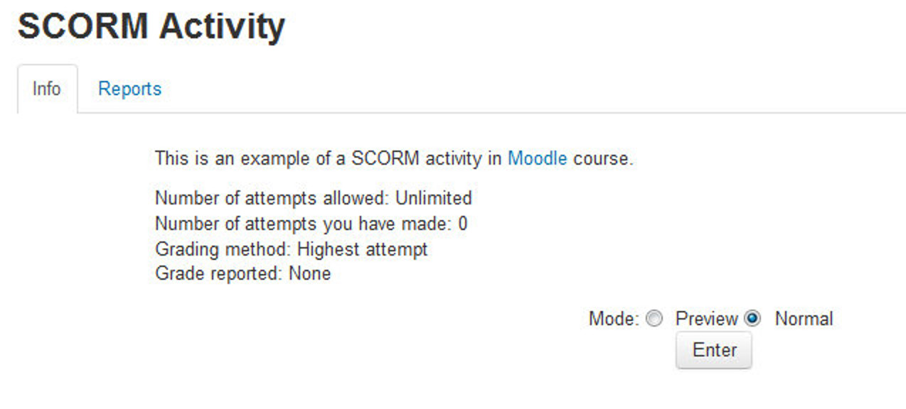
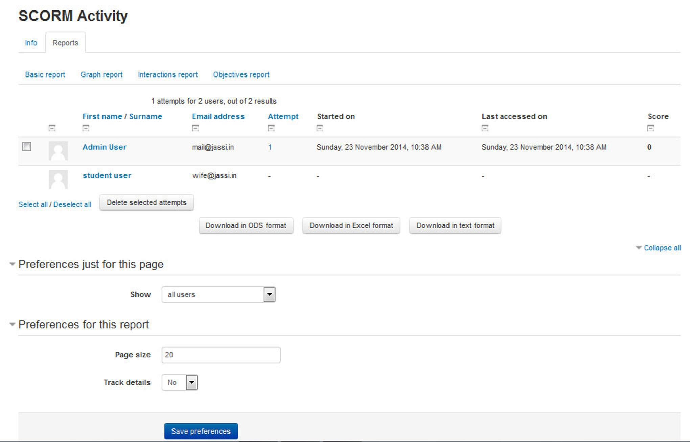
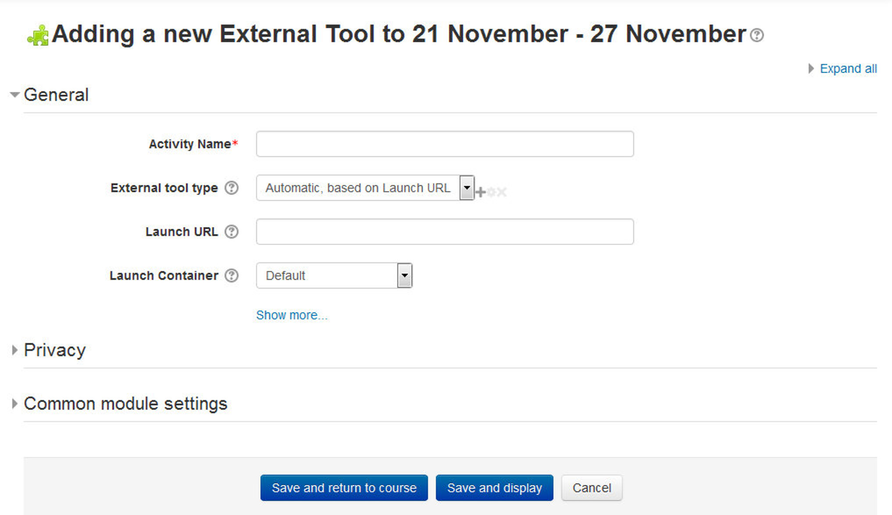
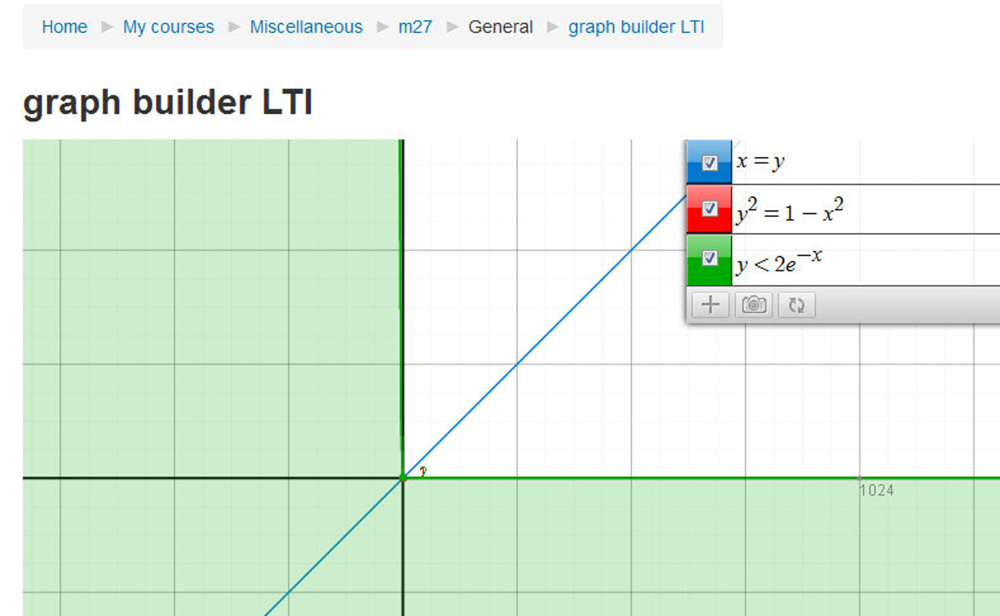

Moodle provides a number of ways to share the tools and educational resource created in some other systems. A teacher can utilize the videos, quizzes and other activities which are created in standard packages like SCORM, LTI compliant systems to be utilized in his Moodle course.

## SCORM Packages
A SCORM package is a collection of files which are packaged according to an agreed standard for learning objects. The SCORM activity module enables SCORM or AICC packages to be uploaded as a zip file and added to a course.

Content is usually displayed over several pages, with navigation between the pages. There are various options for displaying content in a pop-up window, with a table of contents, with navigation buttons etc. SCORM activities generally include questions, with grades being recorded in the gradebook.

SCORM activities may be used

- For presenting multimedia content and animations
- As an assessment tool

T> *Moodle does not generate SCORM content. Moodle presents the content in SCORM packages to learners, and saves data from learner interactions with the SCORM package.* 

### Adding SCORM Activity  
To add a SCORM package to your course 

First method:

- Click the 'Turn editing on' button at the top right of the course page
- Drag and drop the SCORM package zip file onto the course section where you'd like it to appear
- Answer 'Add a SCORM package' to the popup dialogue asking what you want to do with the zip file then click the upload button
- If necessary, edit the title of the file by clicking the pencil icon, or edit other options by clicking the editing icon.

 

Second method:

- Click the 'Turn editing on' button at the top right of the course page.
- Click the 'Add an activity or resource' link in the section you wish to add your SCORM package, then in the activity chooser, select SCORM package then click the Add button (or select 'SCORM package' from the 'Add an activity' dropdown menu)
- In the General Section:
	- Enter a name and a description (which may be required or optional according to the admin settings)
- In the Package Section:
	- Either drag and drop a SCORM package zip file into the box with an arrow or click the Add button to open the File picker menu in order to choose a file from your computer or a repository.
	- Auto Update Frequency: If you access your SCORM package from a repository (such as File system repository or Private files) you can choose to create an alias/shortcut to it and then set an update frequency to set how often Moodle should check to see if there is an updated zip.
- In the Appearance Section:
	- Display Package: Choose from current or new window. Note that if you choose a new window, students need to ensure pop ups are enabled.
	- Display activity name: Whether or not to display the activity name above the SCORM player.
	- Display course structure on entry page: If this is enabled then the table of contents of the package will be displayed when the students clicks to access the package.
	- Display attempt status: This preference allows a summary of the users attempts to show in the course overview block in My home and/or the SCORM entry page.
	- Width*: Stage size width as a css value, either % or pixels. Default is 100%
	- Height*:  Stage size height as a css value, either % or pixels. Default is 500 pixels.
	- Options (Prevented by some browsers)*: There is a series of check boxes for: Allow the window to be resized ad scrolled, displaying directory links, location bar, menu bar, toolbar and/or status.
	- Student skip content structure page*: This setting specifies whether the content structure page should ever be skipped (not displayed). If the package contains only one learning object, the content structure page can always be skipped.
	- Disable preview mode*: Preview mode allows a student to browse an activity before attempting it. If preview mode is disabled, the preview button is hidden.
	- Display course structure on entry page*: If enabled, the table of contents is displayed on the SCORM outline page.
	- Display course structure in player*: How the table of contents is displayed in the SCORM player.
	- Show Navigation*:  This setting specifies whether to show or hide the navigation buttons and their position. There are 3 options:	
		- No - Navigation buttons are not shown
		- Under content - Navigation buttons are shown below the SCORM package content
		- Floating - Navigation buttons are shown floating, with the position from the top and from the left determined by the package
	- Display attempt status*: This preference allows a summary of the users attempts to show in the course overview block in My home and/or the SCORM entry page.
- In the Availability Section: Choose here the dates you wish the SCORM package to be available to students.
- In the Grade Section:
	- Grading method: The grading method defines how the grade for a single attempt of the activity is determined. There are 4 grading methods:
		- Learning objects - The number of completed/passed learning objects
		- Highest grade - The highest score obtained in all passed learning objects
		- Average grade - The mean of all the scores
		- Sum grade - The sum of all the scores
	- Maximum grade: Not applicable if Grading Method is Learning objects. Usual setting is 100. If your SCORM's high score is something other than 100, you should adjust this value appropriately. When grading Method is one of the score settings, then the gradebook grade is package score divided by this number.
- In the Attempts Management Section:
	- Number of attempts: This setting enables the number of attempts to be restricted.
	- Attempts grading: If multiple attempts are allowed, this setting specifies whether the highest, average (mean), first or last completed attempt is recorded in the gradebook.
	- Force new attempt: If enabled, each time a SCORM package is accessed will be counted as a new attempt.
	- Lock after final attempt: If enabled, a student is prevented from launching the SCORM player after using up all their allocated attempts.
- In the Compatibility Settings Section:
	- Force completed: If enabled, the status of the current attempt is forced to "completed".
	- Auto-continue:  If enabled, subsequent learning objects are launched automatically; otherwise the Continue button must be used.
- In the Common Module Settings:
	- Visible: Check whether to show/ hide the activity from the students.
	- ID Number: Provide an ID number for the activity if you want to identify the activity for the grade calculation purpose.
- Click Save and Display to show up the SCORM activity.
 

### Using SCORM Activity
Like a Moodle course, each SCORM package will vary with the modules used in its construction by the teacher and by the SCORM activity settings established by the teacher. The Info tab displays the general information about the activity. 

A teacher can access 4 report types for the SCORM activity via the reports tab:

- Basic report: The basic report page shows a table of attempts for the SCORM activity. If you have the SCORM activity set up to allow multiple attempts, there may be more than one attempt for some users. The basic report may be downloaded in ODS, Excel or text format. A detailed report of each user's attempts may be obtained by clicking on the number in the attempts column. The track details link provides information on specific SCORM values recorded in Moodle by the SCORM object.
- Graph report: The graph report displays graphs of percentage obtained against number of participants.
- Interactions report: The interactions report shows students' responses to questions together with the correct answers.
- Objectives Report: The objectives report shows the objectives data. 

### SCORM Capabilities

- Delete own attempts: This allows a user to delete their own SCORM attempts. This capability is not set for any of the default roles. This capability is intended for use by developers to run ADL tests, as it makes it easier if the student can clear their own attempts.
- Delete SCORM attempts: This allows a user to delete SCORM attempts. This capability is allowed for the default roles of manager, teacher and non-editing teacher.
- Save tracks: This allows a user's SCORM tracks (scores etc.) to be saved. This capability is allowed for the default roles of manager, teacher, non-editing teacher and student.
- Skip overview:  This allows a user to skip SCORM/AICC overviews.  This capability is allowed for student’s role only.
- View reports: This allows a user to view SCORM/AICC reports. This capability is allowed for Administrator, teacher and non-editing teacher.
- View scores: This allows a user to view SCORM/AICC scores. This capability is allowed for Administrator, teacher and non-editing teacher and student.
 

## External Tools (LTI)  
The external tool is an activity module supporting LTI (Learning Tools Interoperability). It is similar to SCORM as a standard for educational objects, but instead of being a package of content that is uploaded to Moodle, LTI is a way of integrating the functionality provided by another system into your course.

The external tool enables Moodle users to interact with LTI-compliant learning resources and activities on other web sites. For instance, an external tool could provide access to a new activity type or learning materials from a publisher.

To create an external tool activity, a tool provider which supports LTI (Learning Tools Interoperability) is required. A teacher can create an external tool activity or make use of a tool configured by the site administrator.

External tool activities differ from URL resources in a few ways:

- External tools are context aware i.e. they have access to information about the user who launched the tool, such as institution, course and name
- External tools support reading, updating, and deleting grades associated with the activity instance
- External tool configurations create a trust relationship between your site and the tool provider, allowing secure communication between them

A teacher can add an external tool from their course page and an administrator can make an external tool available to all teachers on the site. 

### Adding a new external tool 

To add a new external tool to your course:

- With the editing turned on, in the section you wish to add your external tool, click the "Add an activity or resource" link (or, if not present, the "Add an activity" drop down menu) and choose External tool.
- This will take you to the settings page titled "Adding a new external tool". All settings may expanded by clicking the "Expand all" link top right.
- If the external tool has not been configured by the administrator, you will need to have in advance the correct configuration URL, Launch URL, consumer key and secret. These should have been provided to you by the managers of the LTI compliant website you are going to be connecting to.
- In the General Section:
	- Activity Name: Provide the title you wish the students to see on the course page.
	- External Tool Type:  this is how Moodle communicates with the tool provider. If in doubt, leave as default. If your administrator has made a tool available sitewide, you will be able to select it here. Otherwise, you can add an external tool by clicking on the "+" icon besides the field which will open in a new tab.
		- To add an external tool: Enter the Top Base URL (Configuration url), consumer key and secret in the respective fields.
		- Click Save changes and it will take you back to the same page.
	- Launch URL:  This is the URL for connecting to site. The Launch URL indicates the web address of the External Tool, and may contain additional information, such as the resource to show.
	- Launch container- this is how the external tool will be displayed.
		- Default -if in doubt; leave as default
		- Embed - the external tool will be embedded in the Moodle course page with blocks and navigation bar
		- Embed without blocks - the external tool will be embedded in the Moodle course page but without blocks
		- New Window - the external tool will open in a new window. (A new window or tab will open with the External tool and the old browser window containing the course page will not change.)

	- The following settings are available by clicking ""Show more" button:

		- Activity description - give a short description here
		- Display description on course page - choose to show the description along with the activity name
		- Display activity name when launched - have this appear when the student clicks the link.
		- Display activity description when launched - have this appear when the student clicks the link.
		- Secure launch URL – If you want to launch it in a secured manner then mention the URL with https://    in this field.
		- Consumer key -this tells the connecting LTI compliant site that your Moodle is allowed to connect. The "tool provider", i.e. the manager of the connecting LTI compliant site will issue you with this key. If you are merely linking to a tool with no secure access or gradebook sharing then you won't need a consumer key.
		- Shared secret - this is the "password" to connect to the tool - the LTI compliant site.
		- Custom parameters - most times you can leave this blank. The tool provider might use this to allow you to display a specific resource.
		- Icon URL - you can display a different icon from the default External Tool icon by entering its URL here
		- Secure Icon URL - enter the URL of a different icon here if your students are accessing Moodle securely via SSL.
- In the Privacy Section:
	- Share launcher's name with the tool:  this checkbox means that the student's name will be displayed on the connected site.
	- Share launcher's email with the tool:  this means that the student's email will be displayed on the connected site
	- Accept grades from the tool: if this is checked, the connecting site will send back grades to Moodle's gradebook.
- In the Common Module Settings:
	- Visible: If you want to Show/Hide activity from the students then you can choose here.
	- ID Number:  Setting an ID number provides a way of identifying the activity for grade calculation purposes.
- Click "Save and Display" and Moodle will display the resource from the external LTI tool within the Moodle site.

### Why use an external tool?
Many websites provide materials and interactive learning exercises different from and complementary to Moodle's own resources and activities. The External tool module offers a way for teachers to link to these activities from within their Moodle course page and where available to have grades sent back into Moodle. Students only need to log in to Moodle; they do not have to log in a second time to the connecting site.

### External Tool Capabilities:

- Add external tool: This allows a user to add an External tool activity to the course. This capability is allowed for the default roles of manager, teacher and non-editing teacher.
- Submit a tool to admins for configuration:  This allows a user to submit an External tool to admins for configuration.  This capability is allowed for the default roles of manager, teacher and non-editing teacher.
- Grade external tool activities: This allows a user to grade External tool activities. This capability is allowed for the default roles of manager, teacher and non-editing teacher.
- Edit external tool activities: This allows a user to edit External tool activities. This capability is allowed for the default roles of manager, teacher and non-editing teacher.
- View external tool activities: This allows a user to view External tool activities. This capability is allowed for the default roles of manager, teacher, non-editing teacher, student and guest.
- Add a new external tool activity: This allows a user to add a new external tool activity to the course. This capability is allowed for the default roles of manager and teacher.

 

## List of LTI Apps
You can find a lot of useful LTI tools compliant to Moodle from the link: [http://lti-examples.herokuapp.com/index.html](http://lti-examples.herokuapp.com/index.html).

You may need to contact the specific vendor to provide the URL, consumer key and secret which can be integrated within your Moodle. Some popular LTI tools are: Youtube, Khan Academy, Chemvantage, Wordpress, Piazza and many more. 

## Summary
Using an SCORM or external tool can help the teachers to share the functionality provided by other systems within the Moodle course.  Teachers can use the quizzes, videos and other resources provided by the other systems to integrate within the Moodle course and improve the student interaction to enhance the learning experience.

