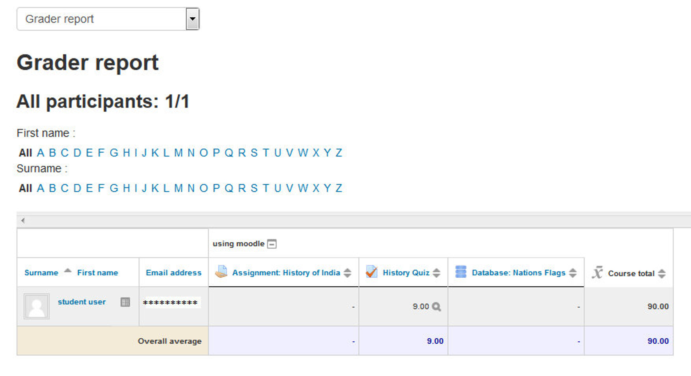
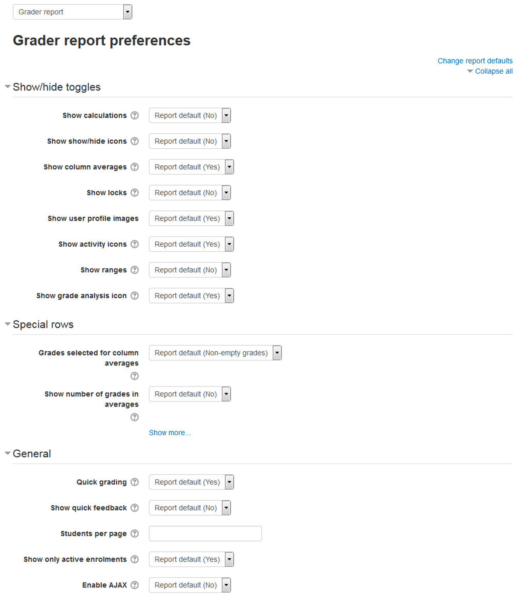
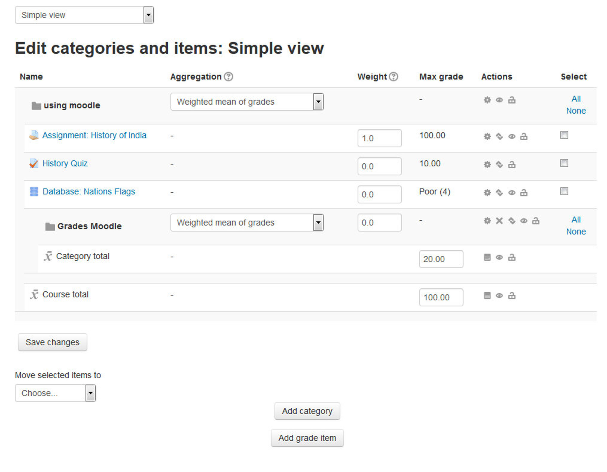
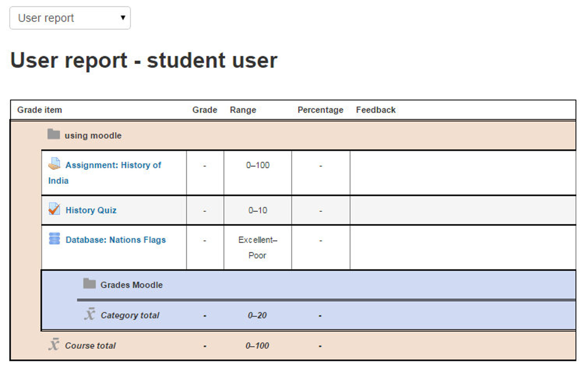
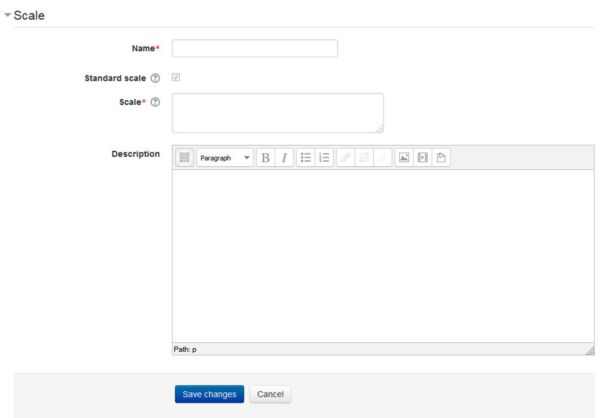
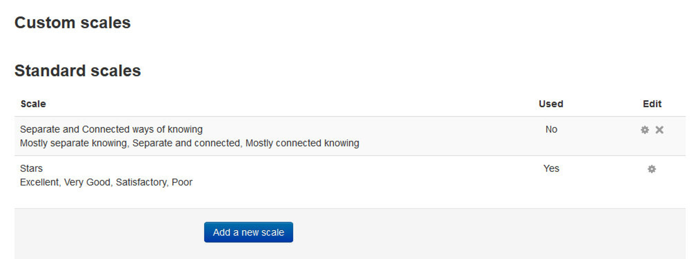

Grades are a necessary evil in modern education. They take a complex task—learning a new subject—and reduce it to a single measure. Grades can function as both carrot and stick for motivating students, and they are the primary measure of success in a course. Tracking and calculating grades are serious and tedious tasks. Fortunately, Moodle has a great tool to help.

The Moodle grades area is a sophisticated tool for tracking student scores in your course. You can use it for scored activities in the classroom, in Moodle and in extracurricular activities.

Grades aren’t the only way to give feedback to students. With Moodle’s scales, you can create lists of nonnumeric feedback options for assessing student work. Moodle comes with one scale by default, “Separate and Connected ways of knowing,” which we’ll discuss later in this chapter. You can easily create your own additional scales for feedback options that are meaningful to you and your students.

## Grades Interface
You can access the grades area for each student in a course in the course gradebook, or 'Grader report' in Administration > Course administration > Grades.
The grader report collects items that have been graded from the various parts of Moodle that are assessed, and allows you to view and change them as well as sort them out into categories and calculate totals in various ways. When you add an assessed item in a Moodle course, the gradebook automatically creates space for the grades it will produce and also adds the grades themselves as they are generated, either by the system or by you.

T> *Note that various default options for the gradebook are set at system level by the administrator and can be marked as being overridable by you, or fixed. This means that the options will not always be set up the same way for every user when they see the grader report for the first time.* 

The View Grades page, as shown in Figure 18-1, contains several rows: first the course, then the category, then the columns for each graded activity (for example: Assignment, Quiz, and Lesson). Any activities settings which were left "uncategorized" will appear in the general category which is named after the course by default. 

There are three ways that the categories can be displayed:

- Grades only - without the category totals column
- Collapsed - Category total column only
- Full view - grades and the aggregates (the totals column for the category)

Each section has a small icon immediately to the right of its name. Clicking this will cycle through these display modes for that category. + Goes to grades only view, o goes to full view and - goes to collapsed view. 

 

## Editing
Editing anything in the gradebook refers to editing the grades only and none of the available operations bear any relationship to editing the main course page i.e. the appearance of your course page cannot be influenced by anything you do in the gradebook. The "Turn editing on" button functions separately from the main course one, so editing can be on in the gradebook, but simultaneously off when you switch back to course view. This is because editing grades and editing the course page are separate capabilities.

### Highlighting rows and columns
When your gradebook starts to grow, it can be hard to keep track of which student and which assignment a cell refers to. Highlighting solves that.

- Clicking on empty space in the cell that contains the students name will toggle the highlighting of that entire row.
- Clicking on empty space in the cell at the top of each column will toggle highlighting of the entire column.

### Sorting by columns
You can sort by any column. Click the   symbol near the top of a column to sort by that column. This will change the symbol to a single down arrow. Clicking again will sort lowest-to-highest (ascending), changing the symbol to an up arrow. The arrows will toggle between these two states until you click on a different column.

The student name columns do not have the symbol. Clicking on either the first or last name will cause the report to sort.

### Highlighting scores that are either adequate or unacceptable in red and green
Turn editing on and click on the edit icon in the controls cell at the top of the column. You can then (maybe need to click 'show advanced') see the option to enter a 'grade to pass'. Once set, any grades falling above this will be highlighted in green and any below will be highlighted in red.

T> *Note that the highlighting will not show if the Grader report is viewed in the editing mode.*

### Horizontal scrollbar
A horizontal scrollbar enables teachers to scroll grades in the grader report. The horizontal scrollbar is available both at the bottom and at the top of the grader report.

### Mouse-over tooltips
Whenever you move your mouse each grade cell in the table displays a tooltip indicating the user and grade item to which the grade belongs.

### Hiding columns or individual grades
In the context of the gradebook, hiding refers to whether a student will be able to see that grade or grade item in their user report. You can have an activity available on the course page for which you would not want the students to know their grade. Also in reverse - an offline activity that is hidden in the course page, but which you want the students to know their grade for.

### To hide/show columns or individual grades just click 
"Turn editing On" & then clicking the Gear Icon link will take you to the control page of that individual activity/ column where you can check the "Hidden" checkbox for hiding the grades. 

### Altering the grades
You can click "Turn editing on" at the top right to show an edit icon next to each grade. Clicking on the icon will bring up the editing screen for that grade which will allow you to set the grade, its written feedback and a number of other attributes. 

Alternatively, you can choose "Quick grading" and "Quick feedback" in 'My preferences' to make the report appear with editable boxes containing each grade, so you can change many at once.

## Set Preferences
You can set your personal preferences for the grader report via 'My preferences'. These settings will apply to all courses for you as a teacher. You can change them at any time. The Set Preferences page contains the following settings:

- Show calculations: If enabled, when editing is turned on, a calculator icon is shown for each grade item and category, with tool tips over calculated items and a visual indicator that a column is calculated.
- Show show/hide icons:  If enabled, when editing is turned on, a show/hide icon is shown for each grade for controlling its visibility to the student.
- Show column averages:  If enabled, the grader report will contain an additional row displaying the average (mean) for each category and grade item.
- Show locks: If enabled, when editing is turned on, a lock/unlock icon is shown for each grade for controlling whether the grade can be automatically updated by the related activity.
- Show user profile images: You can choose to display user profile pictures for easy identification of students.
- Show activity icons: If enabled, activity icons are shown next to activity names.
- Show ranges: If enabled, the grader report will contain an additional row displaying the range for each category and grade item.
- Show grade analysis icon: If the activity module supports it, the grade analysis icon links to a page with more detailed explanation of the grade and how it was obtained.
- Grades selected for column averages:  This setting determines whether cells with no grade should be included when calculating the average (mean) for each category or grade item.
- Show number of grades in averages: If enabled, the number of grades used when calculating the average (mean) is displayed in brackets after each average.
- Quick grading: If enabled, when editing is turned on, a text input box appears for each grade, allowing many grades to be edited at the same time. Changes are saved and highlighted when the update button is clicked.

T> *Note that when a grade is edited in the grader report, an overridden flag is set, meaning that the grade can no longer be changed from within the related activity.* 

 

- Show quick feedback: If enabled, when editing is turned on, a feedback text input box with a dotted border appears for each grade, allowing the feedback for many grades to be edited at the same time. Changes are saved and highlighted when the update button is clicked.

T> *Note that when feedback is edited in the grader report, an overridden flag is set, meaning that the feedback can no longer be changed from within the related activity.*

- Students per page: This setting determines the number of students displayed per page in the grader report.
- Show only active enrolments: This setting determines, if only active enrolled users will be visible in gradebook report. If enabled suspended users will not be shown in gradebook.
- Enable AJAX:  Adds a layer of AJAX functionality to the grader report, simplifying and speeding up common operations. Depends on JavaScript being switched on at the user's browser level. 

## Grade Categories
Grades can be organized into grade categories. A grade category has its own aggregated grade which is calculated from its grade items. There is no limit to the level of nesting of categories (a category may belong to another category). However, each grade item may belong to only one category. Also, all grade items and categories belong to at least one, permanent category: the course category. 

### Adding a grade category
To add a grade category:

- Select "Categories and items" from the gradebook dropdown menu.
- Click the "Add category" button near the bottom of the page.
- Give the grade category a meaningful name.
- Select the aggregation method for the grades: The aggregation determines how grades in a category are combined, such as
	- Mean of grades - The sum of all grades divided by the total number of grades
	- Median of grades - The middle grade when grades are arranged in order of size
	- Lowest grade
	- Highest grade
	- Mode of grades - The grade that occurs the most frequently
	- Sum of grades - The sum of all grade values, with scale grades being ignored.
- In the "Category Total" Section:
	- Grade Type: There are 4 grade types:
		- None - No grading possible
		- Value - A numerical value with a maximum and minimum
		- Scale - An item in a list
		- Text - Feedback only

	T> *Only value and scale grade types may be aggregated. The grade type for an activity-based grade item is set on the activity settings page.*

	- Scale: This setting determines the scale used when using the scale grade type.
	- Maximum and Minimum Grade: Enter the maximum and minimum grades for the category. You can also set passing marks for the category by clicking the "Show More" link.
	- Select grade category settings as appropriate. Advanced settings may be made available by clicking the "Show More" button.
- Click the "Save changes" button.

 

### Grade calculations
A grade calculation is a formula used to determine grades, based (optionally) on other grade items. Calculations for the gradebook follow the pattern of formulas/functions in popular spreadsheet programs. They start with an equal (=) sign, and use common mathematical operators and functions to produce a single numerical output. This output is then used as the computed value for the grade item you are editing. 

#### Setting a grade calculation
To set a grade calculation:

- Click on Grades in the course administration block
- Click the 'Categories and items' tab (or select it from the gradebook dropdown menu)
- Click the 'calculator symbol'   (in the 'Actions' column, on the category total line) for the category you wish to set a calculation for
- Start with an equal sign (=)
- Choose a function; Example: =sum()
- Plug in your ID numbers enclosed in double square brackets, for example =sum([[item1]][[item2]][[item3]])
- Separate each ID number with a comma, for example =sum([[item1]],[[item2]],[[item3]])
- Click the "Save Changes" button.

#### Assigning ID numbers
You can include the values of other grade items by using their ID number as references in your formulas. The ID number is surrounded by double square brackets, for example if you have a grade item with Quiz.3 as ID number, you will refer to this item as [[Quiz.3]] in your calculation.

Below the calculation field is a list of your course with its grade categories and grade items. Next to each item or category's total is displayed the ID number you can use in your calculation (already surrounded with double square brackets). However, since the ID number is optional, some items may not yet have one. These items without an ID number have instead a form field which lets you enter an ID number directly.

As soon as you have assigned the ID numbers you need, you can click the "Add ID numbers" button, and the page will reload and show you the same list with the ID numbers you have just assigned.

#### Calculation functions
Every calculation must start with an equal sign (=). Following is a list of the functions supported by the calculation. The comma (,) character is used to separate arguments within function brackets. The comma can also be used to separate different functions. (The separator character could be a semicolon (;) in other languages, see below).

- average([[item1]], [[item2]]...): Returns the average of a sample
- max([[item1]], [[item2]]...): Returns the maximum value in a list of arguments
- min([[item1]], [[item2]]...): Returns the minimum value in a list of arguments
- mod(dividend, divisor): Calculates the remainder of a division
- pi(): Returns the value of the number Pi
- power(base, power): Raises a number to the power of another
- round(number, count): Rounds a number to a predefined accuracy
- floor(number): Maps a real number to the largest previous integer
- ceil(number): Maps a real number to the smallest following integer
- sum([[item1]], [[item2]]...): Returns the sum of all arguments
- an asterisk (*) gives the product of two items: [[item1]]*[[item2]]q

### Grade letters
Grade letters, also called letter grades, are symbols used to represent a range of grades. You may choose letters (e.g., A, B, C, D, E) or words (e.g., Below Pass, Pass, Merit, Distinction). 

#### To set your grade letter scale
Grade letters are set initially at site level. To use different grade letters in a particular course:

- Follow the grades link in the course administration block.
- Select Letters from the from the gradebook dropdown menu.
- Click the edit tab in the middle of the page.
- Check the override site defaults box.
- Change grade letters and/or boundaries as required. (You may wish to use words, for example Below Pass, Pass, Merit, Distinction, rather than letters.)
- Scroll to the bottom of the page and click the "Save changes" button.

#### Displaying letter grades
To change particular grade items, category and course summaries (called aggregations) in the grader report and user reports to display letter grades:

- Follow the grades link in the course administration block.
- Select "Categories and items" from the gradebook dropdown menu.
- Click the edit icon for Category total or Course total.
- From the Grade display type menu, select letter.
- Click the "Save changes" button at the bottom of the page.

Repeat this for any other totals that you want displayed as letters. Alternatively, to display ALL grades as letter grades:

- Follow the grades link in the course administration block.
- Select "Course settings" from the gradebook dropdown menu.
- From the Grade display type menu, select letter.
- Click the "Save changes" button.

### Student Grade View
Students can check their grades by clicking the Grades link in their Administration block. They can see only their own grades, not the other students’, as shown in Figure 18-4. 
 

### Export Grades (Backing up your gradebook)
We recommend that you regularly download your gradebook for backup. Your system administrator should be backing up the entire server on a regular basis, but you can never be too certain. After all, your students will complain to you if they lose their grades, not to the system administrator.

To download your gradebook:

- Navigate to Administration > Grade Administration > Export and choose the format in which you want to export the gradebook.
- Select the preferences for exporting the grades like items to be included and including feedback in export etc. and click Submit.
- It will take you to the preview page where you can take a preview of the exported file.
- Click Download to download the gradebook to your computer.

If you follow the backup procedure on a regular basis, you will have a record of student grades if there is a catastrophic loss of data on the server. You can always recover students’ grades up to that point in the semester if you have a regular backup.

### Import Grades
Grades may be imported as a CSV or XML file. The import file format is the same as the corresponding export format.

To import grades into the gradebook:

- Navigate to Administration > Grade Administration > Import  & Select your chosen import format from the gradebook dropdown menu.
- Browse and upload your previously saved file.
- Set options as required.
- Click the "Upload grades" button

## Scales
Scales are a way of evaluating or rating a students' performance. Administrators can create standard scales which are available across the site, and teachers can create custom scales just for their own course. Scales may be used in Forums, Glossaries and Assignments for rating and/or grading a student's activity.

### Creating a new scale

To create a scale for your course:

- Click the "Add a new scale" button in Course administration > Grades > Scales.
- On the next page give your scale a name in the Name box that will identify it among other scales.
- 'Standard' scale is a scale which can be applied to every course in Moodle. Only those with site permissions such as administrators can make a new scale 'standard'. A regular teacher can only create a scale for their own course.
- In the Scale box, create your scale. Each item in the scale should be separated by a comma. You can use as many options here as you require. You must order the comma separated elements in increasing order of value. For example, an A,B,C,D scale must be entered as D,C,B,A.
- Write a detailed description in the Description box to remind you (or other teachers) of how the scale is to be used.
- Save the changes.
 

### Using scales
You can select a scale by going to the Edit settings screen of any activity, for example an assignment, scrolling to 'Grade' and then selecting 'Scale' from the Type dropdown: Which will then open up the 'Scale' dropdown, allowing you to choose the scale you wish to use.

### Creative Grade Uses
The gradebook can be as useful in a business context as it is in traditional education. Most business training tends to be shorter and more focused than traditional education, but scores are still important. Usually, managers and trainers are only interested in exceptional/pass/fail or other simple scales for both activities and final scores. But trainees will still want to be able to track their progress and see how they are performing. 

Gradebook scores can also be used to track progress against competency models. Try creating a category for each competency and track student scores on activities designed to measure the students’ performance against the performance standard.

### Scale Practices
Scales give you the ability to provide qualitative, rather than quantitative, feedback, but they require careful wording. When creating scales, ensure that your word choices are meaningful to the students and provide information they can use to improve their performance in the future.

## Summary
This chapter deals with the most important aspect of online learning environment i.e. grading. Moodle has got sophisticated grading tools through which you can grade the work of students. In the next chapter, we will take a glance on the administration part of the Moodle site.

