In this chapter we will get a brief introduction about the Moodle 2.7 interface and the options you have while setting up your course. Then we will start adding some content to your course.

## Getting Started

As mentioned in Chapter 1, Moodle is a web-based tool you can access through a web browser. This means that in order to use Moodle, you need a computer with a web browser installed and an Internet connection. You also need to have the web address (called a Uniform Resource Locator, or URL) of a server running Moodle. If your institution supports Moodle, it will have a server with Moodle up and running. You can then get the server address from the system administrator. If you don’t have access to a server with Moodle installed, and you’d like to set up your own, you can download a Moodle package from [http://moodle.org/](http://moodle.org/).

### The Moodle Interface
When you will first visit your Moodle site you will see the front page of the Moodle Site with the list of the courses which are available for the students. 

Take a moment and familiarize yourself with the interface. In the Header bar the name of your Moodle site is displayed along with a link to Login to the Moodle site in the extreme right corner.  

On the left hand side of the screen you will see some blocks which are enables by the admin of your Moodle site. By default it will show the navigation block in collapsed form. On the right hand side of the screen you will see the Calendar block.

There are a number of useful blocks installed by default on a Moodle server. Your system administrator may install additional optional blocks to add different functionality as per the requirements of your institution.

### Languages
In the upper-left corner, besides the Site name, you may see a drop-down menu with language options. As of November 2014, Moodle has been translated into over 126 languages by the developer community. The number of languages is now so large that Moodle only loads one language by default. Your system administrator can download additional language packs to provide support for new languages. Moodle also supports UTF-8, a standard for the display of non-Latin character sets, like Chinese or Arabic characters. The language features can be useful for learning foreign languages or supporting students from different countries.

 

Anyone who uses Moodle can select the language in which Moodle’s labels and instructions will appear. For example, if you choose to view the site in French, the labels and help files will be translated into that language. Moodle does not translate user-generated content—such as forum posts—automatically, though it’s possible to create Multilanguage content.

You can choose the language settings for the front page and for each course you visit. As an instructor, you can also force students to use a given language. This is a useful feature if you’re teaching a language course and want the entire course to be in that language. Or you can simply confuse the heck out of your students by choosing some really obscure language and have them guess what everything means.

The system administrator can decide not to display the language drop-down menu on the front page. If you want to change the language and find that you cannot, contact your system administrator.

### Moodle’s Help System and Documentation
Throughout Moodle, you will see a question mark in a yellow circle. This is a link to Moodle’s very extensive help system. Although you shouldn’t need it very frequently after you read this book, the community has worked hard to provide you with a help system that is tied to what you are doing at that moment.

When you click the question mark icon, a new pop up window will open with the help file for the item you are asking about (see Figure 3-2). 
 

In addition to the help system, if you are logged in as a teacher or an administrator, you’ll find a “Moodle Docs for this page” link at the bottom of each page. Clicking this link will take you to the corresponding page on http://docs.moodle.org/. Moodle Docs is the documentation for Moodle, written by the Moodle community.

## Creating an Account
In the extreme top right corner of your Moodle site you will find a Hyperlink which says "You are not logged in (Log In)". You can also find the same link in the Footer of your site just above the Moodle Logo.  Click the link and Moodle will present you with the login to the site page as shown in the Figure 3-3. 

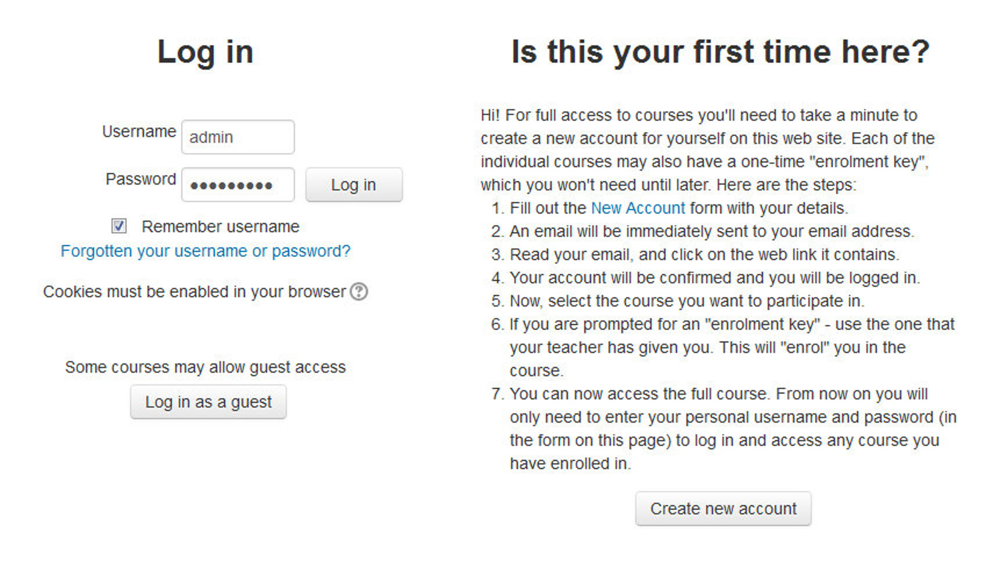

Your username and password will depend on how your system administrator set up the system. Moodle has a number of options for user authentication, including email-based self-registration, where you create your own account. If you are logging in to a server run by your university or department, check with the Moodle administrator to see if you need to create an account. As use of Moodle grows, more institutions are automatically creating accounts for all of their users, so you may already have a login.
 

If you need to create a new account:

- Click the "Create New Account" Button.
- Fill in the new account form by creating a username and password for yourself.
- Enter a valid email address. The system will send you an email to confirm your account. You won’t be able to log in again until you confirm your account.
- Click “Create my new account.”.
- Within a few minutes, you should receive an email at the account you specified on the form. 

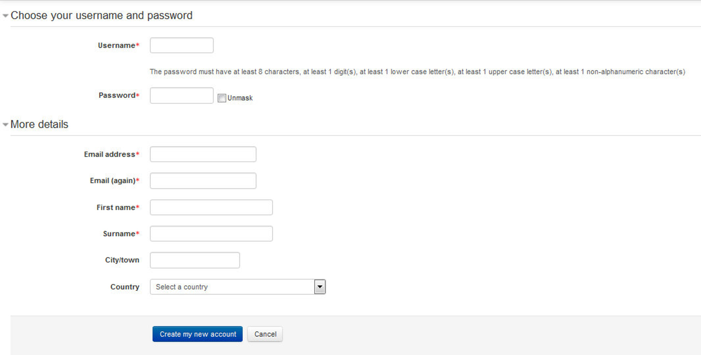

Click the link in the email (or copy/paste it into the address window in your browser) to confirm your account. 

You now have a verified account. Your account isn’t automatically associated with the courses you’re teaching. Most likely, your system administrator will assign you the role of teacher in the courses you’re teaching.

 

### Editing Your User Profile

Once you have successfully confirmed your account and logged in, you will find yourself back at the main page along with one additional block on the Left hand side of the screen with title "Administration". The links in this block will depend on the permissions available for your account. 

If you look at the upper-right corner as well as in the footer of the site, you’ll see that the Login link has changed. It now says “You are logged in as: Your Name" highlighted as a clickable Link. So, just click on your name.

Moodle will then present you with your personal profile details page, like the one shown in Figure You’ll see your profile summary, interests, your courses and the first and last time you logged in.

In the navigation block you will find the links for the Forum posts, Messages, Blogs, Badges under the My Profile sub tree.

In the left side under the Administration Block you will find the links related to your profile settings e.g. changing password, Preferences for the badges and Blogs and Edit your profile.

 
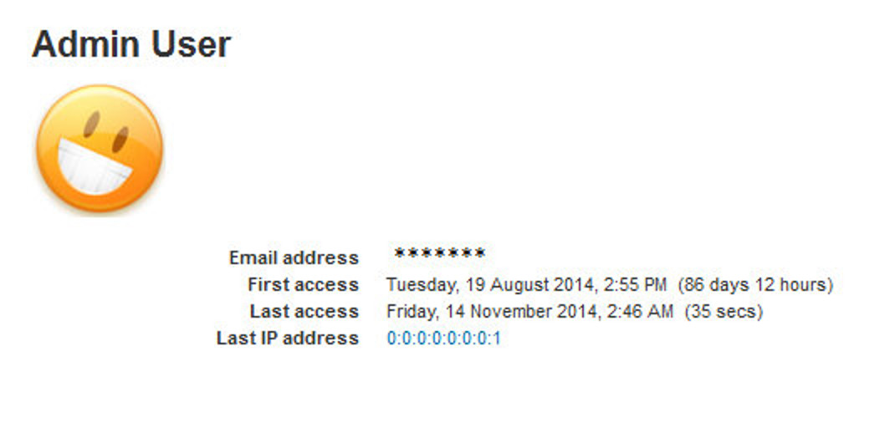

Let’s take a moment and edit your profile to customize the page and help other people get to know you.

To edit your profile:

- Click on the Edit profile link in the administration Block on the left hand side under My profile settings tree.
- Moodle will take you to the edit profile page where you can update your details, interest, preferred language etc. On the Edit profile page, the fields with a red star next to them are required fields; they must contain some data in order for you to submit the form.
- By default only the General section of your profile is expanded, You can expand all the sections by clicking the Expand all link in the right corner of the page.
- If you wish, you can change the first name and surname the system has stored for you.
- You can edit any of the following fields: 
	- Email address: Make sure this is an address you check frequently and that it is correct. Moodle has a lot of important email features, and you wouldn’t want to miss out because your email address has a typo or is not an address you check frequently.
	- Email display: You can choose who can see your email address. Your choices are to hide your email from everyone, allow only the people in your courses to see it, or display it to everyone who logs in to the site. If you choose to hide your email from other people, they will not be able to send you email directly from Moodle.
	- Email format: Here  you  can  select  whether  mail  sent  from  Moodle  is  formatted using HTML or is sent in plain text. Most modern email clients can receive and properly display HTML mail, although this may be a setting you have to enable in your email preferences. If you have a slow connection, or you simply prefer your email plain and simple, the plain-text option is probably a good choice.
	- Email Digest type: This is the daily digest setting that forums will use by default. 
		- No digest : you will receive one e-mail per forum post;
		- Digest - complete posts : you will receive one digest e-mail per day containing the complete contents of each forum post;
		- Digest - subjects only : you will receive one digest e-mail per day containing just the subject of each forum post.
		- You can also choose a different setting for each forum if you wish.
	- Forum auto-subscribe: Moodle forums are a powerful communication tool for classes. You have the option of “subscribing” to forums, which means that new forum posts will be sent to you via email. This is a great way of keeping current with your course discussions without having to log in and look at the forums every day. Of course, if your discussions really get cooking, you’ll end up with a lot of email, but at least it won’t be spam.
	- Forum tracking: If you choose to enable forum tracking, Moodle will highlight posts added since the last time you read the forum. This is a useful way of quickly identifying new content in a forum.
	- Text Editor: This option lets you choose whether to use the Site's default Text editor or else you can choose from Atto, Tiny MCE HTML editor to enter text or to use plain text. Moodle’s HTML editor is an easy way to enter formatted text into your course site. We will cover the specifics of How it works in Chapter :5
	- Time zone: The time zone setting can be very important, especially if you’re working with an international audience or if you will be traveling. Be sure to set the time zone to your local time, not the server’s local time.
	- Preferred language: Setting your language here makes it your default language for all pages.
	- Description: The description box gives you a place to tell your Moodle community a little about yourself. If you don’t feel comfortable writing a description, just put a space in here so you’re allowed to submit the form.
 
	The remaining optional fields allow you to include personal details about yourself, including your photo or a representative image and contact information. Your picture  will  appear  by  your  postings  in  the  forums,  in  your  profile,  and  on  the Participants page. You can also add your Phonetic name, Alternate Name, Interests, and other personal details.

- When you’re done, click the “Update profile” button at the bottom of the page.

To upload a new profile picture: 

- Prepare the picture you want to use by converting it to a JPG or PNG if you haven’t already. It should be smaller than the maximum upload size of your site.
- You can directly drop the image file onto the user profile area of else you can manually add them by clicking the    icon. It will open the file browser where you can upload the profile picture by choosing "Upload a file" and navigating to the file and click upload.
- You can enter a picture description as well for your profile picture for the benefit of anyone using a screen reader.
- Click the “Update profile” button at the bottom of the page. Moodle will crop your picture into a square and shrink it to 100×100 pixels.

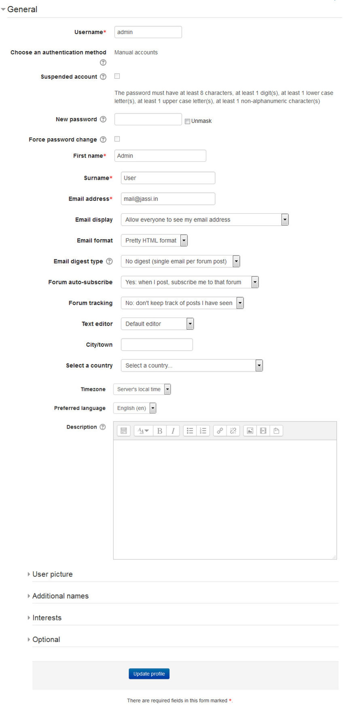

Moodle provides you with a number of ways to personalize your experience and share information about yourself with other people. Your profile will be linked to your forum posts and other contributions around the site. The picture from your profile will be your icon, so pick something that represents who you are on the Moodle site or a shot of your good side.

Now let’s take a look at a course, the main organizing feature of Moodle.

## A First Look at a Course
On the left side of the front page, you’ll see the “My Courses” tree under the Navigation Block, which includes a list of all the courses you are teaching or taking as a student, as shown in Figure. You can access your courses by clicking on the course name in the block.
 
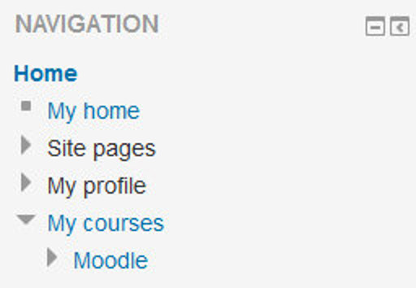

Let’s start with the upper-left corner of the course page, as shown in Figure 3-8. There you’ll see the name of your course as entered when the course was created. Your system administrator either entered your course name by hand or she got it from your institution’s course database. (Read the “Course Settings” section later in this chapter if you need to change the name.)

 
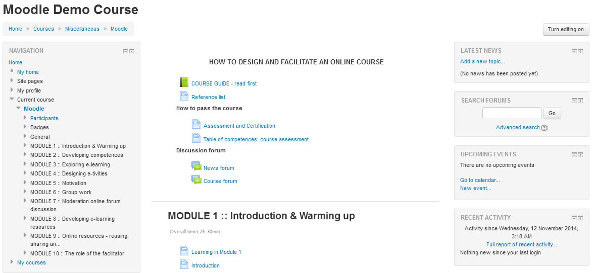

Below the course name is a navigation bar that fills with the hyperlinked names of pages as you navigate from one page to another. Frequently, the best way to return to your course page is to click on the course short name in the navigation bar. For example, in Figure 3-7, you would click on "My Courses" to go back to the "My Home" from another page in the course. 

T> *"My home is a customizable "dashboard" page for providing users with links to their courses and activities within them, such as unread forum posts and upcoming assignments."*

Below the navigation bar are three columns. The far-left and far-right columns contain tool blocks, while the center column contains your course content and activities. The topmost tool block on the left is the Navigation block. From here, you and your students can:

- Access your customized dashboard "My home" which can be set as the default home page if your administrator has enabled it for you.
- Navigate to different site pages including the Site Blogs, Site Badges, 
- Navigate to your profile details like: Forums posts and discussions you are involved into, your personal blog, messages, your private file and your badges.
- Get details about the current course like participants, badges and the topics within the course.
- Navigate to your courses in which you are enrolled as a teacher, student or any other role.

Beneath the Navigation Block is the Administration block.

- Assuming you’ve been assigned the role of teacher, you’ll find links to set your course options, assign roles, perform backups of the course, and manage student grades.
- You can also switch role as a Student to have a look upon How any resource or activity will be visible to students.
- You can also edit settings related to your profile like changing password, messaging settings, blog settings and badges settings.

In the far right column you will find the Search Forums Block through which you can search within the forums along with some search filters mentioned under the advanced search link.

The other blocks on the right side provide reports on the activity within the course. The Latest News block lists the latest items added to the News forum, such as important news stories that pertain to the subject you’re teaching.  The Upcoming Events block lists events you’ve created in the calendar, such as exams and holidays, together with assignment and quiz deadlines. At the bottom of the block are links to view the calendar and add new events. And the Recent Activity block, which lists recent course activity, such as forum postings and uploads.

The middle column is where the action is. This is where you add all of your content and activities, such as forums, quizzes, and lessons for students to access. Before we get to that, however, you need to make a choice about the format in which to present your course.
 

### Course Formats
Unlike some LMSs that force you into one format, Moodle provides you with a number of options for the general format of your course. You can choose to order your course chronologically by week, conceptually by topic, or socially with a big forum as the central organizing principle.

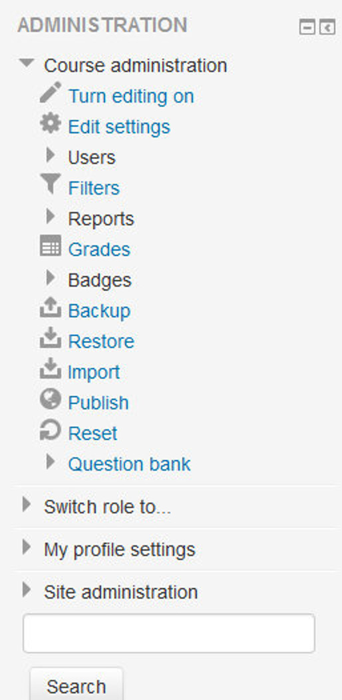

The course format determines the layout of the course page. By default there are four course formats in Moodle:

- Single activity format - The single activity format only has 1 section, and allows the teacher to add one activity only to the course. When the single activity format is selected, a drop down menu appears for the teacher to choose the activity they wish to use.  The best uses of this format are for displaying a single activity or resource (such as a Quiz or SCORM package) on the course page. This format has replaced the SCORM format from the earlier Moodle versions as SCORM can also be chosen as an activity in this format.
- Social format -   This format is oriented around one main forum, the social forum, which appears listed on the main page. It is useful for situations that are more free form. They may not even be courses. A forum is displayed on the course page.
- Topics format - The course is organized into topic sections that a teacher can give titles to. Each topic section consists of activities, resources and labels. This is great to use if your course is objective based and each objective may take different amounts of time to complete.
- Weekly format - The course is organized week by week, with a clear start date and a finish date. Moodle will create a section for each week of your course. You can add content, forums, quizzes, and so on in the section for each week.  This format is best suited if you want all your students to work on the same materials at the same time, this would be a good format to choose.

To set the course format:

- Click "Edit Settings" under the course administration tree in the Administration block.
- Select the course format from the drop-down list under the Course Format Section which is collapsed by default.
- Enter the parameters for your course:
	- For the weekly format, set the start date and the number of weeks.
	- For the topic format, set the number of topics.
	- For the social format, set the course start date. You don’t need to worry about the number of weeks or topics.
	- For the Single activity format choose the type of the activity which you wish to use. 

 
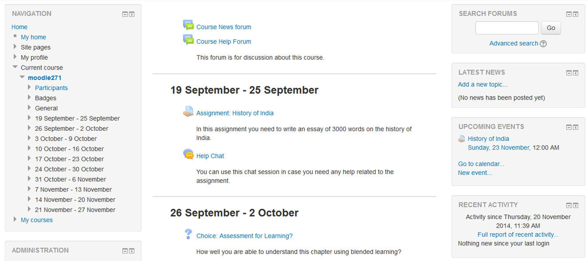

T> *When changing the existing course format to "Single activity" make sure that you removed all extra activities from the course including the "News forum". Note that sections structure may be modified.*

Moodle allows you to switch between formats if you find that a given format isn’t working for you. Simply follow the preceding instructions and select a different format. You can also add or remove topics or weeks at any time. So you don’t have to worry too much about locking yourself into a format before you really understand the system.

### Course Settings
The settings page, as shown in Figure 3-11, where you set the course format, also gives you access to a number of important course options. You’ll find it is important to take a moment to review the settings for your course to ensure that it behaves the way you want it to.

To change your course settings:

- Click Edit Settings in the Administration block under the course administration sub tree on your course page.
- Review each of the general options to ensure they are appropriate for your course: 
	- Course Full name: This is the name that is displayed on the top header of every page in your course and also in the course listings page. The name should be descriptive enough so students can easily identify the course in which they are working, but it shouldn’t be too long. For example, use “English 400—Beowulf” and not “ENG400—Beowulf and the heroic poems of the ancient world.”
	- Course Short name: Enter the institutional shorthand for your course. Many students recognize “Eng101,” but not “Introduction to composition.”  The short name also appears in the navigation bar at the top of the page.
	- Course Category: Your system administrator may have created course categories, such as department or college labels, to help students and teachers find their courses. Depending on how your system is set up, you may be able to categorize your course by department, subject, or other organizational principle.
	- Visible: You can hide the course from students in case it is under preparation or some modification by using this setting. If it’s Hidden then only teachers and Site administrators can access this course.
	- Course start date: The start date is the day the course is first active. If you are using a weekly course format, the first week will start on the date you set here. The start date is also used in course reports as the earliest possible date for which you can obtain logs, activity, and participation reports. In general, if your course does have a real starting date, then it makes sense to set this date to that, no matter what course format you are using.
	- Course ID number: The course ID number is used to provide a link between Moodle and your institution’s backend data systems. Most Student Information Systems (SIS) has a unique identifier for each course. Moodle has its own unique identifier, which is different from the SIS ID. This field is used by Moodle to store the SIS unique ID so Moodle will know which course the SIS is talking about when synchronizing courses and enrollments.
	- Course Summary: The summary appears in the course listings page. A good one-paragraph summary will help communicate the essence of your course to your students.
	- Course Summary Files: If you wish to add some images to the course summary then you can add it here which will be displayed in the list of the courses together with the summary.
	- Course Format:
		- Course Format: This is where you can set the course format as discussed previously.
		- Number of Sections: Use this to set the number of sections your course will have. If you need to change this later, you can. Increasing the number results in sections being added to the bottom of your course page; reducing the number results in sections being removed from the bottom of your course page, and any content in them hidden.

		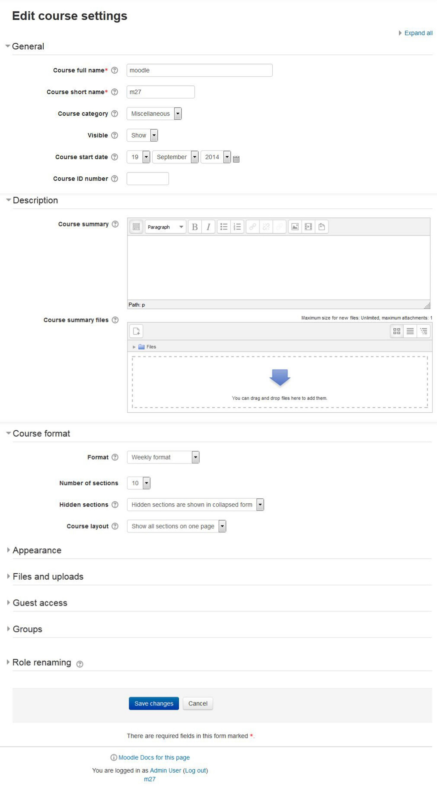

		- Hidden sections: When you hide an upcoming topic section to prevent your students from jumping ahead, you can choose to display the title as a collapsed section or simply hide the topic altogether. Displaying the collapsed sections gives your students a road map of the upcoming topics or weeks, so it’s probably a good idea to leave this on the default setting.
		- Course Layout: You can change the course layout to display whole course on a single page or else to split it into several pages.
	

	- Appearance: 
		- Force Language: If you want to take your course in a specific language you can force it here.  If you do so, your students cannot change languages within the course. For example for language teaching course like German, French etc.
		- News items to show: Use this setting to determine the number of course news items displayed on the course page.
		- Show gradebook to students: This setting allows you to select whether students can see the gradebook. If set  to  No,  it  doesn’t  stop  instructors  from  recording  grades,  but  simply prevents the students from seeing them.
		- Show activity reports: This setting allows students to view their activity history in your course. This is useful if you want students to reflect on their level of participation.
	- Files and Uploads:
		- Maximum upload size: This setting limits the size of files you or your students upload to the course. Your system administrator sets the maximum size for the system, but you can choose to make the limit smaller than the system maximum. You can also further limit the size of files that your students upload as assignment submissions and for other activities. (We’ll cover them as they come up later in the book.)
	- Guest access:
		- Allow Guest access:  This setting determines whether a user can access the course as a guest, without being required to enroll.
		- Password:  A password allows guest access to the course to be restricted to only those who know the password. Guests will be required to supply the password each time they access the course.
	- Groups:
		- Group Mode: Here you can define the group mode at the course level by a pull down menu. "No groups", "Separate groups" and "Visible groups" are the choices. The selected setting will be the default group mode for all activities defined within that course. The group setting can affect what users see in the Participants list and who they can interact with in activities.
		- Force Group Mode: If the group mode is "forced" at a course-level, then this particular group mode will be applied to every activity in that course. This will override any activities that may have a special group setting.
		- Default grouping: If groupings are enabled, a default grouping for course activities and resources may be set. Groupings are used in case if you want to make an activity (such as an assignment or a quiz) visible to only one set of users within a course, you need first to put the users into a group and then put them into a grouping. A single grouping can house one group or several groups. We will discuss about Groupings in the later chapter.
	- Role Renaming: You can rename the roles used in your course. For example, you may wish to rename the Teacher role as "Facilitator", "Tutor" or "Guide". These new role names will appear within the course. For example on the participants and the override permissions pages.
- Once you’ve made all your selections, click the “Save changes” button.

### Enrolling Students in the course
To select the Enrollment options for your course, click and expand the Users tree under the course administration tree in the Administration Block. Then, click on "Enrolled users". It will show the list of the participants enrolled in your course including their details like First Name, Surname, Email address, Last access, Assigned Roles within the course, and the Enrollment method.
 
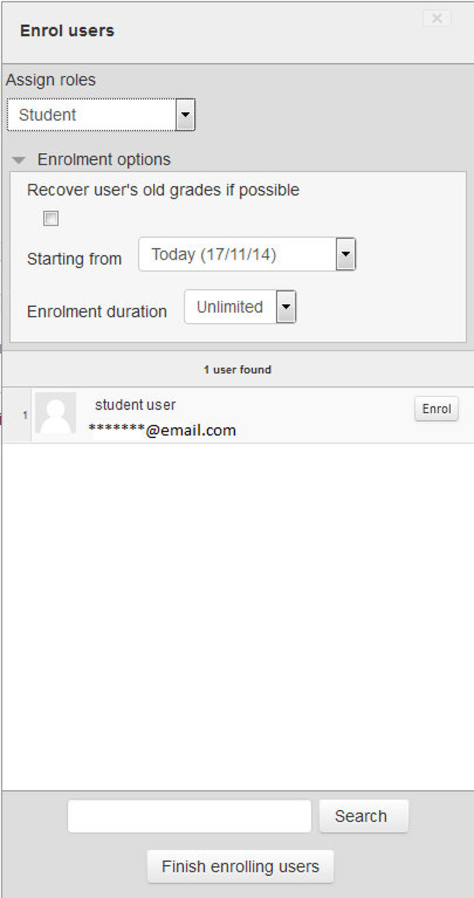

To enroll users to your course:

- Click "Enroll users" in the top right side as shown in the image.
- In the pop up window, first choose the role to be assigned from the drop down menu. Let’s say that you want to assign Student role to your users.
- To limit the Enrollment duration for some specified time, expand the Enrollment tree and set the Enrollment duration.Click on the Names of the users to Enroll them as a Student in your course.
- After finishing click "Finish enrolling users".

### Editing Mode (“Turn Editing On” Button)
Now you are having your own course in preferred format and settings along with your students, we'll look at how to add content.

To  start  the  process,  you’ll  first  need  to  turn  editing  on which will allow you to add resources and activities to your course. At the top right of the page of any course you are teaching, you’ll see a button labeled, surprisingly enough, “Turn editing on.” Clicking on this button will present you with a new array of options. You can also switch on the editing mode from the Administration Block under Course Administration tree.

 

Starting at the top of the screen, let’s look at what turning editing on enables you to do.  At the top of each section, you’ll see an icon of a gear like  . When you click it, you are presented with a Summary text area. You can use this to change the default section name and summarize each topic or weekly section in your course. You should keep the summary to a sentence or two for each block to avoid making the main page too long. Click “Save changes” button when you’ve added your summary. You can go back and change it later by clicking the gear icon again.

You will find the following icons as mentioned in the table in a single course section.

|Icon| Function |
|----|----------|
||Edit Settings. This icon is used to edit the settings of the particular item like editing the settings of a label.|
||Drag and Drop Icon - Move any item in a different section/week or change the order of the sections in the course layout.|
||The highlight icon allows you to highlight a section as current.|
||Open Eye Icon. Used to show a section or week or any single activity.|
||Closed Eye Icon. Used to show a section or week or any single activity.|
||Pencil Icon - Used to change the Title of a file as displayed on the course page.|
||Drop down menu to reveal the below mentioned icons.|
||Move right or left. You can move blocks to the left- or right-hand columns. You can also use this to indent items in the middle column.|
||Groups Icon - the groups icon allows you to change between no groups or separate/visible groups|
||Duplicate Icon- the duplicate icon allows you to copy an activity or resource. It's done directly on the course page.|
||Roles icon - allows you to assign roles locally in the item.|
||Delete icon - will permanently delete something from the course.|

Table 3-1 Icons used in Moodle

You can use these icons throughout your moodle site to customize the activities according to your requirements.

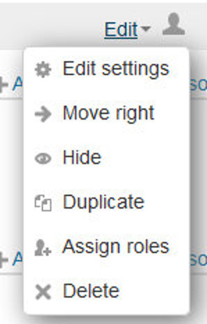

In addition to the icons for manipulating blocks and activities, each section in the middle column has a link "Add an activity or resource"  to add tools for adding resource content such as web pages and links to web sites and activities such as forums, quizzes, lessons, and assignments.

If you like the native separate activity and resource drop down menu like in Moodle 1.9 then you can switch Off the activity chooser from the course administration tree by clicking "Activity Chooser Off".

By adding the resources available in the Moodle you can create content directly within Moodle or link to content you’ve uploaded. We’ll describe each of these tools briefly now, and cover them in depth in the next chapter:

- Book: The first tool, “Book” creates a Book resource on your course page which can be used for creating a multi-page resource with Chapters and subchapters.
- File: A picture, a pdf document, a spreadsheet, a sound file, a video file. You can also directly drag and drop the files onto the course home page to add them as a resource. 
 
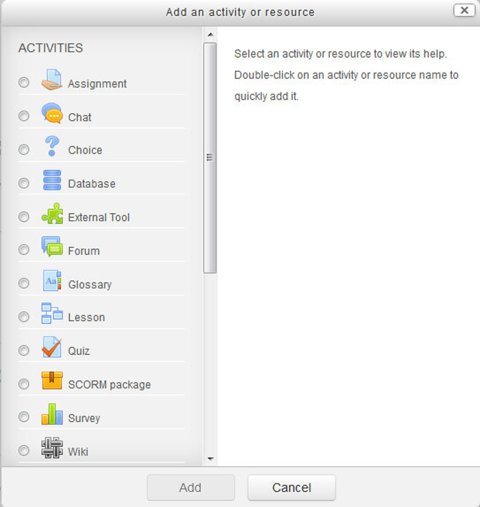

- Folder:  For helping organize files and one folder may contain other folders.
- IMS Content Package:  Add static material from other sources in the standard IMS content package format.
- Label:  Can be a few displayed words or an image used to separate resources and activities in a topic section, or can be a lengthy description or instructions.
- Page: The student sees a single, scrollable screen that a teacher creates with the robust HTML editor.
- URL:  You can send the student to any place they can reach on their web browser, for example Wikipedia.

All the resources are known as the Static activities in Moodle as they are for sharing the information with the student in a single direction whereas the activities allows you to add interactive tools to your course. 

An activity is a general name for a group of features in a Moodle course. Usually an activity is something that a student will do that interacts with other students and or the teacher. There are 14 different types of activities in the standard Moodle. The bulk of this book is dedicated to describing how each of these tools works and how to apply them in your course.

Table 3-2 explains each tool very briefly. We’ll learn more about these tools as they come up later in the book.

|Activity Type	|Description													|
|---------------|---------------------------------------------------------------|
|Assignments	|Enable teachers to grade and give comments on uploaded files and assignments created on and off line.																						| 
|Chat			|Allows participants to have a real-time synchronous discussion.| 
|Choice			|A teacher asks a question and specifies a choice of multiple responses.																													| 
|Database		|Enables participants to create, maintain and search a bank of record entries.																												|
|External Tool	|Allows participants to interact with LTI compliant learning resources and activities on other web sites.																					|
|Feedback		|For creating and conducting surveys to collect feedback.		|
|Forum			|Allows participants to have asynchronous discussions.			|
|Glossary		|Enables participants to create and maintain a list of definitions, like a dictionary.																										|
|Lesson			|For delivering content in flexible ways.						|
|Quiz			|Allows the teacher to design and set quiz tests, which may be automatically marked and feedback and/or to correct answers shown.															|
|SCORM			|Enables SCORM packages to be included as course content.	|
|Survey			|For gathering data from students to help teachers learn about their class and reflect on their own teaching.																		|
|Wiki			|A collection of web pages that anyone can add to or edit.		|
|Workshop		|Enables peer assessment.										|
 
Table 3-2 Activity types in Moodle

### Adding content to the course: 
By now, you’re probably wondering, “When the heck do I get to add stuff to my course?” We’ve provided a lot of background so you’ll understand some of the available options. But, now it’s the time to start building your course.

Let’s start with a news item to announce to everyone that your online materials are coming soon. The Site News is a special type of forum (for a full description of forums, see Chapter 6). It is automatically created when the course is first generated.
 
Everyone in the course can read the postings and the news is automatically emailed to them. It’s a good tool for making general announcements and sending reminders to students about upcoming assignments.

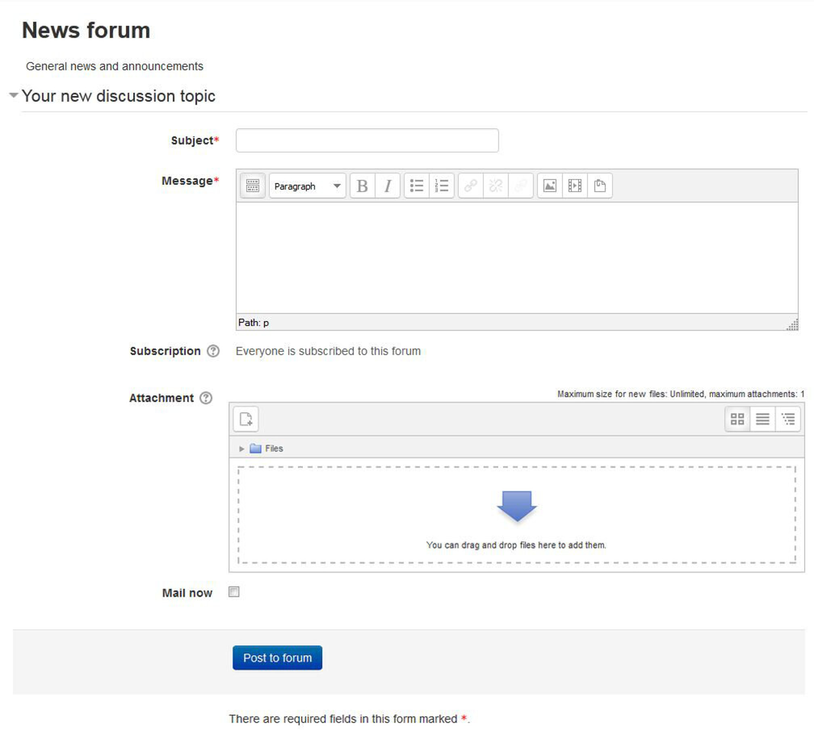

To add a news item:

- Click the "News Forum" link near the top of your course page.
- Click the “Add a new topic” button. You’ll see the page to add a new topic, as shown in Figure 3-16.
- Enter the subject of the announcement and the message to your class.
- If you want to attach any files also then you can attach with the post.
- By default all Moodle notifications are sent out after a specified time configured by your Site Administrator. So, if you need to send the News urgently before that time has elapsed then you can check the box "Mail Now" to send it immediately.
- Click the “Post to Forum” button. You will be returned to the News Forum page.
- Click on your course name in the navigation bar at the top to return to your course page.

## Summary
In this chapter, we’ve looked at how to create an account and personalize your profile. We’ve become acquainted with Moodle’s user interface and tools, and we’ve chosen a course format. In the next chapter, we’ll start adding different types of content to your new Moodle course.

