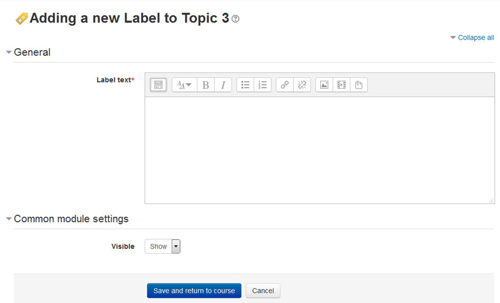
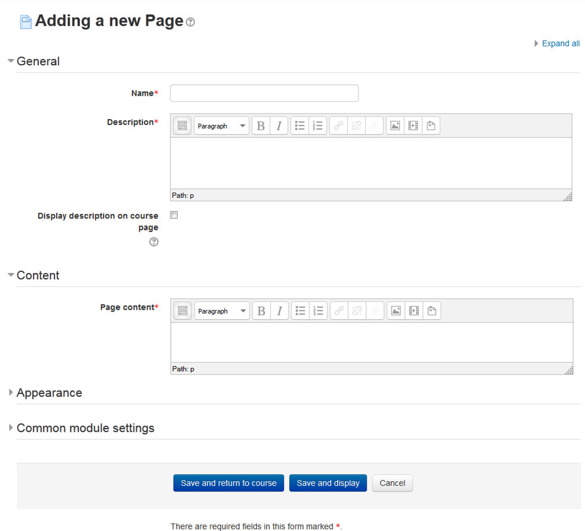
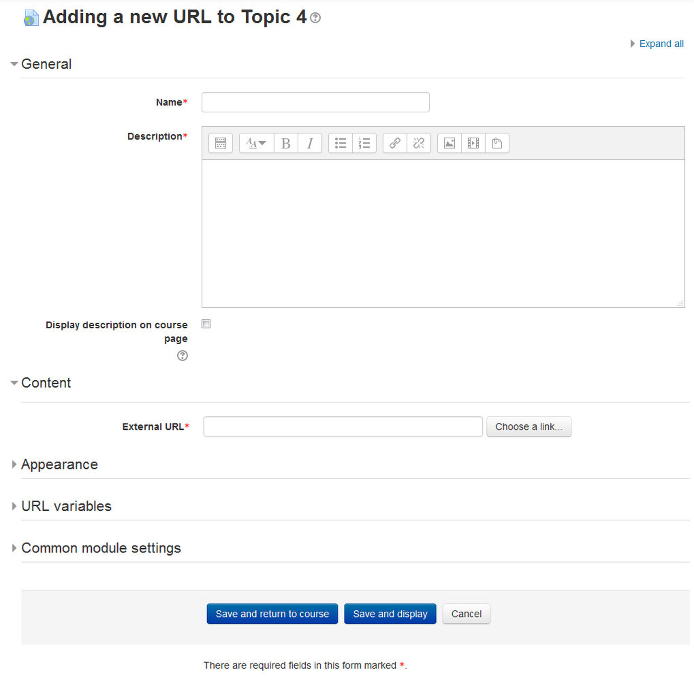
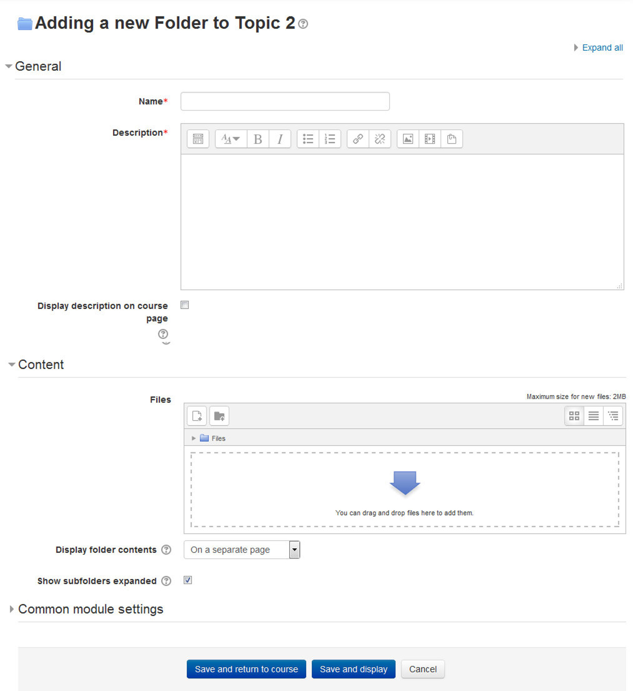
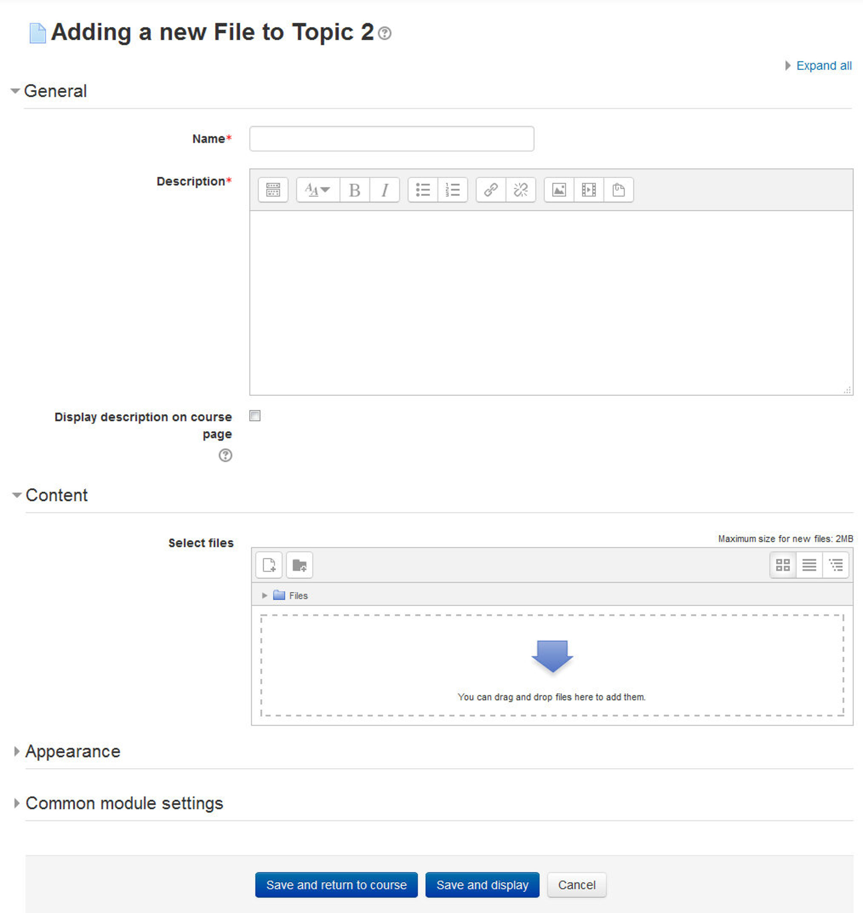
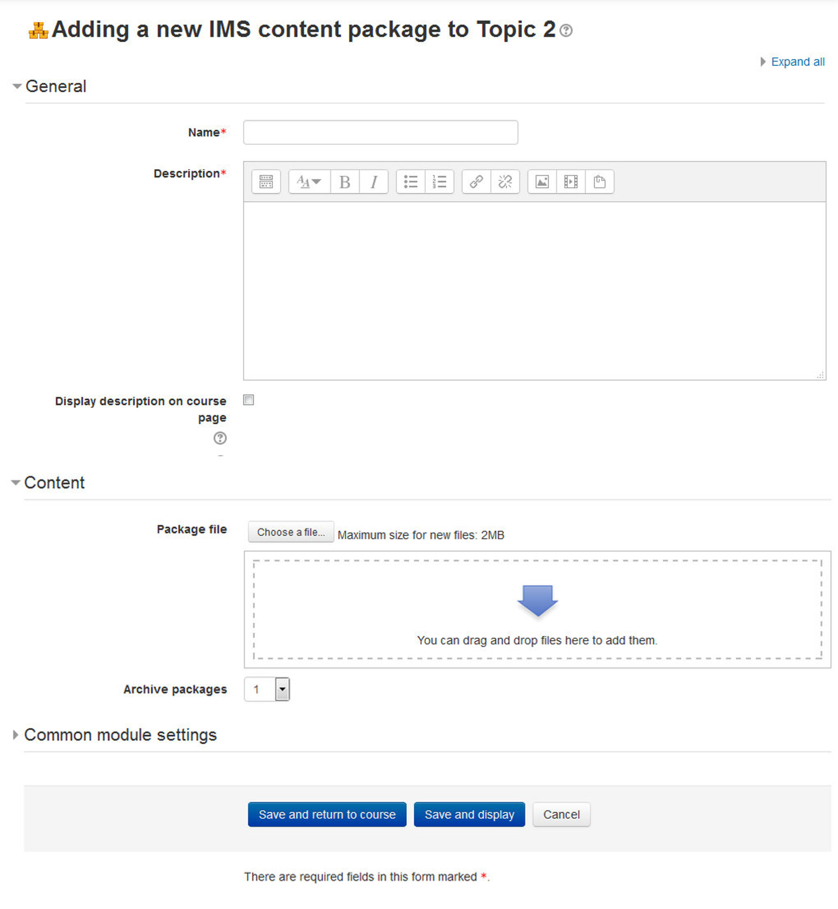
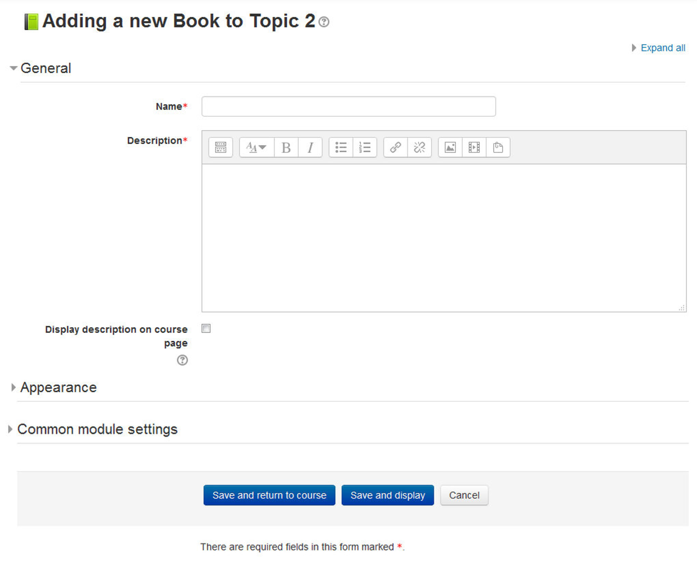
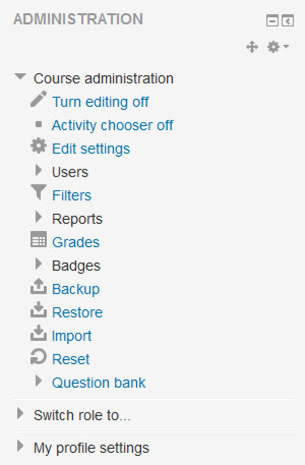

## Adding Content to Moodle

The first thing most people want to do when they create a course in Moodle is add some content, such as a syllabus or a course outline. As we explained in Chapter 2, you can add content to your course using the “Add an activity or resource” link in the central section of your course.

Since Moodle 2.3, the Add a resource and Add an activity menu's are clubbed together in a single menu with link Add and activity or resource. When you click on the link then it will open a popup menu for you to choose which resource or activity you want to choose. In this chapter, we’ll use all of the tools under the resource menu. Future chapters will cover the tools in the “Add an activity” menu.

T> *Remember that you need to turn editing on to see the “Add an activity or resource” link.*

The first tool, “Book” creates a Book resource on your course page which can be used for creating a multipage resource with Chapters and subchapters. The following two, “File” and “Folder,” are used to manage content developed in other programs, such as Word or PowerPoint. You can also add content from other web sites and take advantage of the rich library of information available on the Web. You can also drag and drop files onto the course page directly to add them as a file resource. The next resource, “IMS Content Package” enables you to add prepackaged content from sites around the Web. The next tool "page" can be sued to create a web page resource within the course by using the text editor. And finally the last tool "URL" can be used to provide a weblink as a resource.

Let’s begin by creating a simple label for your course.

### Adding a Label  

Labels enable you to add additional text or graphics to your course page. Labels can be used to add banners to courses, label sections of resources and activities, or provide quick instructions on the front page of your course. 

To add a label from the Course page:

- Click the “Turn editing on” button.
- Click the "Add and activity or resource" link in the course page in the section where you want to add the label.
- In the popup menu select Label under the resources menu.
- Create your label using the HTML editor (see the following section “Using Moodle Text editor” for more details on this). You can use Label to insert Images, Videos, Audio files in your course.
- Select whether to make your label visible by selecting Show or Hide from the visible menu which is collapsed by default.
- After you have created your label, click the “Save and return to course” button.
 
 

Once you have created a label, the full text of the label will appear in the section where you created it.

T> *You can use a hidden label to provide information only for other teachers on your course, since students are unable to see hidden items.*
     
T> *If you want to use a label to identify a grouping of resources and activities within a section, you can indent the links under the label using the arrows adjacent to each resource or activity link. This will give your grouping some visual separation from the rest of the content.*

### Composing a Page  
The page module enables a teacher to create a web page resource using the text editor. A page can display text, images, sound, video, web links and embedded code, such as Google maps.

A page may be used:

- To present the terms and conditions of a course or a summary of the course syllabus
- To embed several videos or sound files together with some explanatory text

	T> *Advantages of using the page module rather than the file module include the resource being more accessible (for example to users of mobile devices) and easier to update.*

 

T> *Using the page resource is advantageous instead of uploading a word-processed document, particularly if the document contains text that is just to be read and not downloaded.*

T> *For large amounts of content, it's recommended that a book is used rather than a page.*

Composing a page resource is very easy:

- Click the “Turn editing on” button.
- Click the "Add and activity or resource" link in the course page and select "Page" in the popup menu. Moodle will then display the page to compose a text page like the one in Figure 4-2.
- Enter a name for the text page. The name you give the page will be displayed in the content section on your course page. Students will access your page by clicking on the name. Be sure to give the page a descriptive name so students will know what they are accessing.
- Write a description of the page in the description field.
- Add the contents in the Page content field. You can use the features of the Text editor to add media, images, links and more.
- Under the Appearance section, you can control if you want to hide the page name and description to be displayed onto the course page.
- Under "Common Module settings" you can completely hide the page from students by choosing Hide under the Visible drop down menu. You can also hide the page at a later stage by clicking the Eye icon/disable from the course home page.
- In the ID number field, you can mention the ID number for identifying the activity for grade calculation purposes. If the activity is not included in any grade calculation then the ID number field may be left blank.
- Scroll down to the bottom of the page and click the "Save and return to course". If you want to have a look onto the just composed webpage then you can click on "Save and Display" to display it directly.

### Adding URL to the course  
The URL module enables a teacher to provide a web link as a course resource. Anything that is freely available online, such as documents or images, can be linked to; the URL doesn’t have to be the home page of a website. The URL of a particular web page may be copied and pasted or a teacher can use the file picker and choose a link from a repository such as Flickr, YouTube or Wikimedia (depending upon which repositories are enabled for the site).

You can also add the URL's to any other resource/activity by using the text editor.

To add a URL to the course home page:

- Click the “Turn editing on” button.
- Click the "Add and activity or resource" link in the course page and select "URL" in the bottom of the popup menu.  All settings may expanded by clicking the "Expand all/Collapse all" link top right.
- In the name field whatever you type will form the link learner’s click on to view the URL so it is helpful to give it a name that suggests its purpose.
- In the description field: Add a description of your page here. Click "Show editing tools icon"  to display the rich text editor, and drag the bottom right of the text box out to expand it. 

 

- If the display description in the course page is checked then the description you entered above will be visible under the name of the URL.
- In the content field enter the URL of the external site you want to link to or else click the "Choose a link" button to open the file picker and choose a URL YouTube, Picasa etc.
- Under the Appearance section which is collapsed by default you will find options to control how the URL is displayed.
- Display:  This setting, together with the URL file type and whether the browser allows embedding, determines how the URL is displayed. The options in the drop down menu are:
	- Automatic - The best display option for the URL is selected automatically
	- Embed - The URL is displayed within the page below the navigation bar together with the URL description and any blocks
	- Open - Only the URL is displayed in the browser window
	- In pop-up - The URL is displayed in a new browser window without menus or an address bar.
- Pop-up width/height: If your URL is to be displayed in a pop-up, specify the width and height here.
- Display URL description: To show the resource name and/or description when clicking to access the URL, simply tick the appropriate checkboxes. 
•	URL Variables: This section allows you to pass internal information as part of the URL. This is useful if the URL is actually an interactive web page that takes parameters, and you want to pass something like the name of the current user, for example.
•	Under "Common Module settings" you can completely hide the page from students by choosing Hide under the Visible drop down menu.
•	In the ID number field, you can mention the ID number for identifying the activity for grade calculation purposes.
•	Click "Save and return to course" to save and return to the course home page. If you want to have a look onto the just composed URL then you can click on "Save and Display" to display it directly.

T> *If your site administrator has enabled the feature drag and drop upload of text/links then a link can also be dragged into a section of the course and given a name.*

### Creating a folder resource  
The folder module enables a teacher to display a number of related files inside a single folder, reducing scrolling on the course page. A zipped folder may be uploaded and unzipped for display, or an empty folder created and files uploaded into it.

A folder may be used:

- For a series of files on one topic, for example a set of past examination papers in pdf format or a collection of image files for use in student projects.
- To provide a shared uploading space for teachers on the course page (keeping the folder hidden so that only teachers can see it).

To add a folder to the course page, you need to first get it zipped or compressed using some file compression tool.  The way you do this depends on your computer and operating system. You can use the open source file compression tool [7 zip](http://www.7-zip.org/).

 

There are two methods of adding a folder to your course.

- First Method:
	- Click the 'Turn editing on' button at the top right of the course page.
	- Drag and drop the folder onto the course section where you'd like it to appear.
	- Click the button of the action you would like to take with the folder (in our case, "Unzip") and click "Upload"
	- If necessary, edit the title of the folder by clicking the pencil icon and you're done.
- Second Method:
	- Click the 'Turn editing on' button at the top right of the course page.
	- Click 'Add an activity or resource' link, then in the activity chooser; select folder and click the "Add" button.  All settings may expanded by clicking the "Expand all" link top right.
	- For General Section: Add name and description of the folder you want to display to your students.
	- For Content Section:  You can either drag and drop a zipped/compressed folder into the box with an arrow or click the Add button to open the File picker menu in order to choose a file from your computer or a repository.
	- When the folder thumbnail appears, click on it and select "Unzip" as shown in Fig 4-4.
	- For Display folder contents section:  Decide here whether to have the folder displayed on a separate page (the default) or in line with or without subfolders expanded or collapsed.
	- Click "Save and return to course" to save and return to the course home page. 
	

### Creating a file resource  
When you wish to share with your students a simple file such as a Word-processed document or slideshow (e.g. created in MS Word, MS Powerpoint, or Open Office) you use the file resource type. It allows you to upload and display a variety of resources on your course. How your students access them depends on your choices in File resource settings.

T> *Your students will only be able to open your files if they have the appropriate software on their own devices.*

To add a file to your course:

- First method:
	- Click the 'Turn editing on' button at the top right of the course page.
	- Drag and drop the file onto the course section where you'd like it to appear.
	- If necessary, edit the title of the file by clicking the pencil icon, or edit other options by clicking the editing icon.
	- And you're ready with a file resource to share with your students.
- Second Method:
	- Click the 'Turn editing on' button at the top right of the course page.
	- Click 'Add an activity or resource' link, then in the activity chooser, select file then click the Add button.
	- In the general section provide a name and description for our file to be displayed on the course page.
	- In the content section you can either drag and drop files into the area specified by the arrow if you are using an appropriate browser, or click on "Add" and use the File picker to upload your file. 
	- In the Appearance Section:
		- Display:
			- Automatic - Make the best guess at what should happen (probably what is wanted 99% of the time).
			- Embed - Show the Moodle page with heading, blocks and footer. Show the title/description of the item and display the file directly in the page as well (good for images, flash animations, videos?, PDFs).
			- Force download - user clicks on the file, then the web browser pops up with the 'where do you want to save this file' box.
			- Open - No Moodle heading, blocks, footer or description - just show the file in the web browser (e.g. shows image, PDF, flash animation, taking up the whole browser window)
			- In pop-up - Same as 'Open', but opens a new browser window to show this file (without the Moodle heading, blocks, etc.) 
		- Show Size/Type: To show the file size and/or type on the course page and also on the resource page, simply tick the appropriate checkboxes.
		- Display resource name/description:  To show the resource name and/or description when clicking to access the file, simply tick the appropriate checkboxes.
		- Below the Display resource name/description you will find a link: "Show More" When you click on the link then you will additional options for controlling the appearance of the resource such as:
			- Pop-up width/height:  If your file is to be displayed in a pop-up, specify the width and height here.
			- Use filters on file content:  If you wish included media such as images and mp3 to appear embedded in the files then select "all files" or "HTML files only", according to your file types.
	- Click Save and return to course to return back to the course home page.

### Adding an IMS content package  
IMS Content Packages are resources packaged to an agreed specification, making it
possible for a package to be reused in different systems without needing to convert it to a different format. Content-authoring software often provides the option of packaging as an IMS Content Package. You may have IMS Content Packages from a different LMS system or have purchased some IMS Content Packages as course content.

To add an IMS Content Package:

- Click the 'Turn editing on' button at the top right of the course page.
- You can add an IMS Content package to a course by choosing it from the "Add an activity or resource" link.
- In the general section provide a name and description for IMS content package to be displayed on the course page.
- In the Content section, drag and drop your IMS Content package into the box with the arrow or else click the button "Choose a file" to locate and add your IMS Content package via the File picker.
- Click Save and return to course to return back to the course home page.

 

- And you're done with the IMS content package in your course.

### Adding a book resource  
The Book module makes it easy to create multi-page resources with a book-like format, with chapters and subchapters. The book module allows you to have main chapters and sub chapters, but it goes no deeper.

Books can contain media files as well as text and are useful for displaying lengthy passages of information which can be broken down into sections. You can use the book module to present information in a well-structured, user-friendly format to your students.  

Book module also allows you to import individual web pages or folders of web pages from Administration >> Book Administration >> Import Chapter which makes it useful for group work. 

For Example: Each student creates a simple web page about your school and the teacher, (that's you!) uploads the pages to the book. Voila! You and your students have created a useful, interesting resource for new students and their parents. You could do this to create a class cook book and nutrition guide, a resource about local civic organizations, triangles in our daily lives, world leaders, you name it.

A book may be used:
- To display reading material for individual modules of study
- As a staff departmental handbook
- As a showcase portfolio of student work

Whole books and individual chapters may be printed by selecting the relevant link in Administration > Book administration.

To Add a book to your course page:

- A teacher can add a book by choosing it from the "Add an activity or resource" link.
- In the general section provide a name and description for the Book.
- In the appearance section:
	- Chapter formatting: You can choose how to format the chapters of the book. The options are:
		- None - chapter and subchapter titles are not formatted at all, use if you want to define special numbering styles.
		- Numbers - chapters and subchapters are numbered (1, 1.1, 1.2, 2, ...)
		- Bullets - subchapters are indented and displayed with bullets.
		- Indented - subchapters are indented.
	- Custom Titles: Normally the chapter title is displayed in the table of contents (TOC) AND as a heading above the content. If this checkbox is ticked, the chapter title is NOT displayed as a heading above the content. A different title (perhaps longer than the chapter title) may be entered as part of the content. 
	- Click "Save and display" to proceed further to add some chapters and subchapters in the just composed book.
	- Moodle will take you to a new page where you can add a new chapter to the book.
	- On add new chapter page Provide a title of the chapter.
	- If you've already created a chapter then you can mark this chapter as a subchapter. Please note that this checkbox will remain disabled when you are adding the first chapter of the book.
	- Add your chapter content in the Content field neatly formatted with the help of the HTML editor tools.
	- Click Save Changes in the bottom of the page.

Then you will see the first chapter of the Book you had just created. To navigate within the chapters of the book there is an additional block available in the left side i.e. Table of Contents. And if you have still the Editing Mode On then you will see some icons in the TOC block where you can edit the settings of the chapters of your book.

- To update/edit the content of the chapter click the gear icon.
- To add more chapters/subchapters to the book, click the "Plus" icon.
- To delete a chapter click the "Cross icon".
- To hide the chapters from being visible to the students click the disable eye icon.

You can also download the complete book in the IMS content package format by clicking Administration >> Book Administration >> Generate IMS CP  link.

### To add Multilanguage content
Moodle allows you to publish resources in multiple languages.  The language of the resource will change when the user changes their selected Moodle language. 
If you want the content of your course to be displayed in more than one language, you can create content in multiple languages and the Multilanguage content filter will ensure the language displayed is the one selected by the user.

T> *Your system administrator needs to enable the Multilanguage content filter for these instructions to work.*

Let’s add a page resource with multiple languages:

- First create your content in different languages. You can use the Google Input Tools for typing in different languages.
- Add a page resource as mentioned in previous section.
- In the page content section click the  icon to expand the editor toolbar to show all the available tools.
- Then, click  in the HTML editor to enable the HTML code editing mode.
- Enclose each language block in the following tags, where xx and yy are two-letter language codes (as shown in the languages drop-down menu on the front page of your Moodle site):
		- `your content in lang xx here`
		 `your content in lang yy here`

### Adding Media files to your course

Adding media content can help you communicate some ideas and processes more easily than text alone. Imagine trying to teach a language if the students aren’t able to hear it spoken. Or how much easier it would be to learn how volcanoes work if you could see a video or an animation. Fortunately, Moodle makes it easy to add rich media content to your course. The Moodle media filters automatically recognize your media type and put the right sort of link into your web page so students can access it easily.

To add a new media file:

- Let’s say you want to add a .swf (ShockWave Flash) file, which is saved in your computer, containing some animation about the solar system.
- Click the Turn Editing Mode On Button on your course page if you are not in editing mode.
- Drag and drop the file from your computer onto your course window in the topic/section where you want to add the multimedia file. Make sure that it doesn't exceed the file size limit of your site.
- Change the title of the file as you want to show it to your students and you've successfully added a media file onto your course page.

T> *In case the file is not displaying correctly, then you may have to adjust the appearance settings of the file.*

## Managing and updating your content
Uploading content is only half the battle of content management in Moodle. You’ll need to ensure that your uploaded content is current, and you’ll occasionally want to replace or delete files. Fortunately, Moodle has some useful features to help you manage your content once it’s on the server.
 

###Creating an alias/shortcut
When an uploaded file or a file from the Private files, Dropbox, File system or EQUELLA repositories - is re-used elsewhere on Moodle, the teacher has the option to make a copy (a new, unconnected version) or to create a shortcut or alias. If an alias is created, then when the original file is updated, it will change in all instances of the alias. So a teacher might add course notes to their private files for example, and then add them into a number of courses. When the teacher makes an alteration in the file in their private files, this alteration will be reflected in all instances of the course notes.

An alias cannot be made in the following areas of Moodle: 

- an assignment submission 
- a forum post attachment 
- a workshop submission 
- a quiz essay 
- a database activity file field

 
This is to prevent cases such as a student uploading an item for assessment and then subsequently changing the original in their private files. When a student uses a file from their private files in one of these instances, they do not see the options to "copy" or "create an alias".

### Tracking Versions
One of the biggest challenges you will face in keeping your content organized is dealing with versioning. As the semester progresses, you may have multiple versions of your syllabus that reflect changes to the calendar. Or you may have multiple versions of a presentation that has evolved over the years. There are a couple of strategies you can use to track versions and ensure that your students are accessing the correct version.

The easiest way is to develop a naming scheme for your files. While many people will attach a version number, we recommend using a date stamp. A date stamp lets people know just how recent the version is, and you don’t have to track the current version number. To add a date stamp, simply add the date on which you saved the version to the end of the filename. For example, the first version of a syllabus for your fall course may be called Syllabus_8_30.pdf. Later in the semester, you may post a revised version named Syllabus_9_21.pdf. Date versioning helps you keep track of the version on the server and the latest version on your computer.

## Effective Content Practices
There are a few effective practices that can make life easier for you and your students. First, there are file format tricks to ensure your students can download and use your content. Second, make sure the bit size of your files is as small as it can be, so your students won’t grow old waiting to download tomorrow’s lecture notes. Third, there are creative ways to use static content in your courses to help you and your students succeed.

### File Formats
Every file you create and save on your computer has a specific file format. For example, Word files are saved in .doc or .docx format, and can be opened only in a compatible version of Word. However, this can cause problems if your students don’t have the same version of Word you do. A solution is to continue to create your documents in Word but save them as Rich Text Format, or RTF, a format that a wide variety of word-processing programs can open. In most versions of Word, you can save a file as RTF by following these steps:

- Select “Save As” from the file menu.
- Choose Rich Text Format (RTF) from the file type drop-down.
- Save the RTF copy of your document.

There are a number of file formats for displaying text and images that almost everyone can open, regardless of their computing platform, and you should strive to use these wherever possible. These formats include RTF, Hypertext Markup Language (HTML), Portable Display Format (PDF), and picture formats, including PICT, TIFF, JPEG, GIF, and PNG.

Table 4-1 describes some common file formats.

|File type|Description|Software needed to use the file|
|---------|------------------------------------------------|-----------|
|RTF|A word-processor format that is readable by a wide range of applications.You can save Word and PowerPoint documents as RTF.|Most modern word processors will read RTF, including OpenOffice.org Writer.|
|---------|------------------------------------------------|-----------|
|HTML| The language of the Web. Every web page displayed in a browser is created in HTML. Moodle has a built-in HTML editor you can use to create documents directly in Moodle.| Any web browser. Some word processors will also read HTML documents.|
|---------|------------------------------------------------|-----------|
|PDF|PDF is a file format created by Adobe Systems for document exchange. PDF files may be created with Acrobat (not the reader but the professional package) or the OpenOffice.org suite.|Acrobat Reader is a free download from Adobe.|
|---------|------------------------------------------------|-----------|
|PowerPoint (ppt)|As the most widely used presentation-creation software, PowerPoint files are natural candidates for upload. The presentations are easy to share, but be careful about file size and access.	|PowerPoint, PowerPoint viewer, or OpenOffice.org Impress.|
|---------|------------------------------------------------|-----------|
|Pictures (PICT, TIFF, JPEG, GIF, PNG)|	There are a lot of graphic file formats. Generally, only GIF, JPEG, and PNG are viewable directly in a browser.	|GIF, JPEG, and PNG require a browser. Other formats require appropriate external viewers.|
|---------|------------------------------------------------|-----------|
|Audio files (WAV, MP3, RAM, MOV)| Audio files can be large, depending on your bit rate and compression format. Be sure the file size is smaller than the maximum file upload size for Moodle. Check with your system administrator.|Your students will need media player software. Many students will be able to play audio in MP3 format.|
|---------|------------------------------------------------|-----------|
|Video files (MOV, WMV, RV)| Your Moodle server may not accept a large video file. Before you attempt to upload a large video file, ask your system administrator about file size limits. Your students will need to download the entire video, which may be a problem with a slow dial-up connection.	| To view a video, your students will need a media player that can play the appropriate format. Know whether your movies can play in QuickTime, Windows Media Player, or RealPlayer.|

Table 4-1 Common file formats

### Reducing file sizes
As important as creating files your students can open is making sure those files are a manageable size. Graphics are usually the biggest offenders, and they crop up in some unlikely places. There are three strategies that will give you the best results for the effort.

#### Strategy 1: Save your PowerPoint presentations as PDF
Big PowerPoint files are often the worst file-size offenders. It’s too easy to add cool transitions, clip art, and images that expand a simple hour-long presentation into a Gigabyte behemoth that takes an hour to download. Not a good use of time for something that students will simply print out and bring to class.

We recommend exporting your presentation as PDF using [OpenOffice.org](http://www.openoffice.org/download/index.html). Students will get the benefits of the outline of the lecture, including graphics, and be able to print copies of the presentation slides, and the file will be quick and easy to download.

#### Strategy 2: Scan articles as text, not images
There are many good articles that just aren’t available in electronic format. If you want to avoid printing an entire reader, scanning articles is an easy way to give your students access to important resources. Many libraries now have electronic reserve services that will scan them for you.

Scanning articles can result in very large files because most scanner software, by default, scans everything as a graphic. So when you scan a page, you’re really creating a picture of the page that is much larger than a text version. The computer has to store information about every dot on the page, not just information about the characters and their placement.

The solution is to use a software tool called Optical Character Recognition, or OCR. This great tool recognizes the shape of the letters and gives you a text version of the article. You can then manipulate the text version in the same way you’d edit any other text document. It has the added advantage of being accessible to screen readers for students with visual disabilities.

You can use the [open source tool Capture2Text](http://capture2text.sourceforge.net/) for optical character recognition.

#### Strategy 3: Reduce your image size and use compression
Finally, if you have digital images, it’s very important to optimize their size and resolution for sharing over the Web. Modern digital cameras and scanners can produce amazing, crystal-clear images, but at a price of very large file sizes.
Most cameras and scanners come with free utilities that enable you to manipulate images. Other programs such as Photoshop are fully featured, professional packages with lots of tools. To reduce your file size, you only need some very simple tools, provided by most image-manipulation software.

To reduce the image size you can also make use of some open source tools available like [Image Resizer for Windows](https://imageresizer.codeplex.com/) or [batch image compression tool for windows](http://sourceforge.net/projects/bir/) 

By reducing the size of your files, you’ll make life easier for yourself and your students. But the smallest, most portable files in the world don’t mean much if your students can’t use them successfully in your class. Next, we’ll discuss some interesting ways you can use content to make your Moodle class a valuable resource for your students.

### Creative Content
Moodle allows you to upload just about any file that resides on your computer. However,  the  key  to  a  successful  content  strategy  is  knowing  what  content  helps  your students be successful and what is unnecessary or confusing. Below are two best practices for adding content to your course. These practices work well in a range of course designs, but there are others that might work just as well for your particular course.

#### Uploading lecture notes
One of the easiest ways to use Moodle to increase student learning is to upload your lecture notes before the lecture. Providing access to your lecture outlines before a class meeting gives your students a tool to help prepare for class and structure their class notes. If students know which topics you consider important enough to include in your lecture, they are more likely to pay attention to those areas in any assigned readings. During class, they can use the lecture notes as a basic outline and concentrate on elaborating the main ideas with examples. Lecture notes are also a useful tool for students whose first language is different from that of the speaker. If they get lost during a lecture, they can refer to the notes to get back on track.

If you use PowerPoint in your lectures, a simple way to create and upload lecture notes is to save your slides as an RTF file. The RTF file eliminates graphics and other extras and provides the students with a plain-text outline. It will be easy to download and print for class.

#### External web sites
Effectively using the Web means you don’t have to create or photocopy everything you want to use in your class. There is a lot of quality content available on the Web, if you know where to look and how to evaluate it. A full discussion about vetting online resources is beyond the scope of this book, but your institution’s librarian can recommend some sources to get you started.

Most newspapers and news magazines have online versions you can bring into your class for discussions of current events.  Universities, schools, and nonprofit organizations publish huge amounts of content available for you to use free of charge. In addition, there is a growing open content movement, which publishes content available for anyone to use.

Most open content is published under a Creative Commons license, which allows users to choose the type of public license they want to use (http://creativecommons.org). Authors can use the CC licenses to license their work for use through any combination of attribution (their name stays attached), with a share-alike license (you can share any derivative works as long as you use the same license), or noncommercial use (you can’t use the materials for commercial purposes). The Creative Commons site also has a search engine for content that has been licensed using a CC license.

T> ***This book has been licensed under the Creative Commons attribution and share-alike license.***

In addition to the general content released by people under the Creative Commons licenses, some universities have begun publishing course materials for use by the general public. These collections are known as OpenCourseWare (OCW) repositories. MIT has the most well-known collection, but other universities are following suit. Some of the bigger collections are:

- [MIT](http://ocw.mit.edu) - MIT offers a comprehensive collection of courses from accounting to zoology. Some of their courses have video lectures available in addition to the syllabus, lecture notes, and problem sets.
- [Utah State University](http://ocw.usu.edu) - Utah State offers a good collection of basic courses with an emphasis on biological and irrigation engineering and instructional technology.
- [Johns Hopkins Bloomberg School of Public Health](http://ocw.jhsph.edu) - This is a collection of public health courses from one of the world’s leading medical schools.
- [UK Open University](http://openlearn.open.ac.uk) - The OU offers full-text versions of their content, instead of just course outlines and notes.

In addition to the institutional collections, there are a growing number of user-created content sites available on the Web. These sites allow anyone to create, change, remix, and catalog content. While the quality of the content can vary wildly, there is a large and growing body of excellent content available for you to use. Some of these sites are:

- [Wikipedia](http://www.wikipedia.org) - An online encyclopedia developed by thousands of volunteers. Anyone can create and edit documents.
- [Wikibooks](http://en.wikibooks.org) - A sister project of Wikipedia. It aims to create open textbooks that are freely available to the whole world.

This list is by no means exhaustive. Simply using Google as a tool in your class vastly expands the amount and variety of content available to your students.

## Summary
Ultimately, the content you develop and share in your Moodle course is up to you. Static Moodle content provides resources for students as they engage in the learning process. In this chapter, we’ve looked at how to upload and create content for your Moodle course. In the following chapters, we’ll discuss some of the dynamic activities you can add to your class to make it truly compelling.

