Now that we have covered the basics of setting up a course and adding content, we need to take a look at some of Moodle’s underlying capabilities. At first glance, this may seem like administrivia, but understanding roles and groups is one of the keys to unlocking Moodle’s full potential as a learning environment. A person’s role in a course determines what he can do—in other words, what capabilities he has. It’s a very powerful system, but it does have a bit of underlying complexity. You can use groups to create student workgroups, recitation sections, or any other arbitrary grouping you need to realize your learning design.

We will start by discussing roles, since anyone who wants to do something in your course need to be assigned a role.

## Understanding and Using Roles:

The roles and permissions system in Moodle provides you with a huge amount of flexibility for managing how students and other people interact with your course. The new roles system supports guest, student, non-editing teacher, editing teacher, course creator, and administrator roles out of the box; it also allows you to create and customize roles, and to change what a given role can do in each activity. 

For example, you can now create permissions in individual forums, which allows you to let students act as moderators in one forum while you retain the moderator role in all of the other forums in your course.

A role is a collection of permissions defined for the whole system that you can assign to specific users in specific contexts. The combination of roles and context define a specific user's ability to do something on any page.

For many people it seems a bit daunting to understand roles, but don’t worry. Using roles and permissions is something you can take slowly. You can start the usual way, assigning people as students, teachers, and other roles specified by your institution. Later, when your course design grows more elaborate, you can begin to experiment with overrides and assigning specific roles in specific contexts.

## Moodle's Default roles description
The description of each standard role in Moodle including the basic description and short name is given in Table 5-1.

|Role		|Short Name		|Description										|
|:----------|:--------------|:--------------------------------------------------|
|Administrator|admin|Administrators have full access to the entire site and to all courses. They can do all the necessary changes in the configuration files.	|
|:----------|:--------------|:--------------------------------------------------|
|Guest|guest|Guests have minimal privileges and usually cannot enter any content except a teacher allows for it.													|
|:----------|:--------------|:--------------------------------------------------|
|Authenticated User|user|All logged-in users in the Moodle site in any role.		|
|:----------|:--------------|:--------------------------------------------------|
|Authenticated user on front page|frontpage|All users logged in to the frontpage course. Since Moodle’s front page is also a course with ID=1 where you can add some activities where the users can participate if they have assigned this role.|
|:----------|:--------------|:--------------------------------------------------|
|Teacher|editing teacher|Editing teachers can do anything within a course, including changing activities and grading students.								|
|:----------|:--------------|:--------------------------------------------------|
|Non-editing teacher|teacher|Non-editing teachers can teach in courses and grade students, but not alter any activities.											|
|:----------|:--------------|:--------------------------------------------------|
|Student|student|Students can participate in courses and participate in activities within the course.													|
|:----------|:--------------|:--------------------------------------------------|
|Manager|manager|Managers can access courses and modify them, without participation.																	|

Table 5-1 Moodle’s default role description

We’ll start simply, by assigning users to predefined roles in your course. Then we’ll take a look at the roles and capabilities system and later discuss how to use the advanced features. 

Now, before we start using roles let’s get some basics about Context, Permission, Role and Capability.

- Context:  A functional area of Moodle. Contexts have a hierarchy. Examples of contexts include a course, activity module, or resource.
- Permission:  Permissions are paired with each capability. There are four possible permission values: Allow, Prevent, Prohibit and Not set /Inherit. (It is called not-set when defining roles and inherit when overriding permissions.)
- Role:  A named set of permissions those are associated with each capability. For example. The "Teacher" and "Student" roles come with the standard Moodle install.
- Capability: A configurable aspect of program behavior. Moodle has 100s of capabilities. Each capability has a computer friendly name like mod/forum: rate and a human-friendly name like "Rate posts."

## Assigning Roles in Your Course:
Most of the time, students will enroll themselves or be added automatically by your university’s enrollment system, so there shouldn’t be much need for you to manually enroll students. However, if you need to add a teaching assistant, an outside guest, or a student who is having a problem with financial aid, you must manually enroll them, i.e., assign them a role in your Moodle course.

 

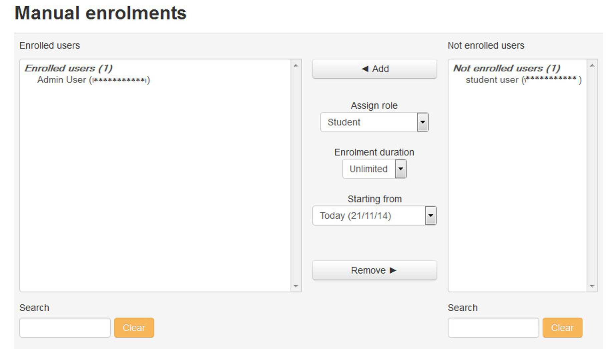

T> *By default, teachers are only allowed to assign the roles of non-editing teacher, student, and guest. If you want to assign the role of teacher, you will need to ask your system administrator for this to be allowed.*

To assign a user the role of student:

- Click Course Administration > Users > Enrolled Users  in the administration block.
- It will display all of the enrolled users in your course.
- Click "Enroll users" in the top right side as shown in the image.
	- In the pop up window, first choose the role to be assigned from the drop down menu. Let’s say that you want to assign Student role to your users.
	- To limit the Enrollment duration for some specified time, expand the Enrollment tree and set the Enrollment duration and starting date.
	- Click on the Names of the users to Enroll them as a Student in your course.
	- After enrolling the students click "Finish enrolling users".

T> *Users must have an account on your Moodle site before you can assign them a role in your course. If they don’t appear in either the existing or potential users list, they will need to create an account before they can be assigned a role.* 

Students will have access to your course as soon as you assign them a role. They won’t need to have an enrollment key or to confirm the enrollment.

## Removing Students
If a student drops your class, you’ll want to remove the student from your Moodle course as well. Leaving a student enrolled in your Moodle course when she is not on the official roster makes grading and class management much more difficult. When you record grades or look for student assignments, extra students on the roll gets confusing. The nonparticipating student will also have access to your discussion boards and other potentially sensitive information.

Fortunately, removing students is easy. Simply click the  "delete" icon besides the Enrollment method column in the extreme right on the Enrolled Users page of your course.

## Temporarily Suspending a User Account
There may be times when you are not sure about the status of the students and you want to disable them for a while before removing them completely from your course. 

In that case, to suspend a user from the course:

- Click the icon in the Enrollment method column against the Students name that you want to suspend.
- Under the Status drop down menu change the status from "Active" to "Suspended" and you're done.

## Managing Enrollment Methods for your course
If your university/institution doesn’t have an automatic enrollment system, then ensuring that only students who are officially enrolled in your course have access to your Moodle course can be tricky.

Some of you may want to make courses accessible for guest users also so that they can also take a sneak preview of the course which can be used especially for corporate training. You may also want to let the students within your Moodle site to be capable to enroll themselves in your course. For all these you have to configure the enrollment methods for your course.

To manage the enrollment methods:

- Click Course Administration > Users > Enrolled Methods  in the administration block.
- It will display all the available enrollment methods including the number of students enrolled using the method in your course and options to add new enrollment methods (New enrollment methods have to be first enabled by site administrator along with the capability to add, then only you will be able to add them).
- The enrollment methods which are shown as grayed out are currently disabled. You can delete any enrollment method by clicking the delete icon.
- To enable the Guest access of enrollment for the course, simply click the "Eye " icon besides the Guest access enrollment method.
- To let the students enroll themselves in your course, turn on the "Self Enrollment (Student)" method by clicking the "Eye" icon.
- You can also set an enrollment key for self-enrollment method and directly add the students to a group by setting the Group enrollment key.

## Capabilities and Permissions
Now it’s the time to learn about the Capabilities and permissions. As we discussed earlier there are 4 key concepts to understand.

- Role:  A named set of permissions that is associated with each capability. For example. The "Teacher" and "Student" roles come with the standard Moodle install.
- Permission:  Permissions are paired with each capability. There are four possible permission values: Allow, Prevent, Prohibit and Not set /Inherit. (It is called not-set when defining roles and inherit when overriding permissions.)
- Capability: A configurable aspect of program behavior. Moodle has 100s of capabilities. Each capability has a computer friendly name like mod/forum:rate and a human-friendly name like "Rate posts."
- Context:  A functional area of Moodle. A context is the scope within which a role assignment is valid. Contexts are organized in a hierarchy, where lower (more specific) contexts inherit capabilities from higher (less specific) contexts. The contexts in Moodle in order of inheritance are:
	- System: All contexts in the site, including site settings and user administration
	- Site: The site front page course and its activities
	- Course category: All courses in a category
	- Course: A single Moodle course
	- Module: A module instance within a course (a specific forum, quiz, wiki, etc.)
	- Block: A specific block instance within a course (at the time of this writing this feature is not fully implemented)
	- User: A user’s profile or personal activities

Roles are made up of a matrix of capabilities and permissions that determine what a user can do within a given context. For example, a user may have course creator privileges at the site level but be unable to post to a particular forum in a certain course. The permissions determine whether someone can use a capability. Permissions may be set to one of four values:

- Inherit: The default setting. If a capability is set to inherit, the user’s permissions remain the same as they are in a less specific context or another role where the capability is defined. For example, if a student is allowed to attempt quiz questions at the course level, his role in a specific quiz will inherit this setting.
- Allow: This enables a user to use a capability in a given context. This permission applies for the context that the role gets assigned plus all lower contexts. For example, if a user is assigned the role of student in a course, she will be able to start new discussions in all forums in that course (unless a forum contains an override with a prevent or prohibit value for the capability).
- Prevent: Prevent disables a capability for a user in a given context but does not disallow it in a more specific context. You can prevent students from adding attachments to forum posts in your course, but allow them to do so in one particular forum.
- Prohibit: Prohibit is rarely needed, but occasionally you might want to completely deny permissions to a role in a way that cannot be overridden in any lower context.

T> *Keep in mind that permissions are set within a role, and then people are assigned to roles in a given context. A person can be assigned to more than one role, depending on the context, or even multiple roles within the same context.*

## Override Permissions
Overrides are specific permissions designed to override a role in a specific context, allowing you to "tweak" your permissions as required. 

Overrides may be used to "open up" areas by giving users extra permissions. For example, an override may be used to enable students to rate forum posts.

The way to achieve this is through a role override. As long as the capabilities you want to allow your students to have in your course (or within a module in your course) aren’t prohibited at a higher level, you can override the permissions. Within your course, for example, you can override roles at the course level or in a particular activity. If you want to change what students can do anywhere in your course, override the role at the course level. If you want to create a different set of permissions for a given activity, override the role in the activity itself. Overrides may also be used to prevent actions, such as starting new discussions in an archived forum. 

T> *Overriding roles is itself a permission. By default, teachers are unable to override roles so this ability must first be granted by your system administrator for the course or site as appropriate. They must also set which roles can be overridden by the teacher role. If you don’t see the “Override roles” link in the Roles tab, ask your system administrator.*

### Locations for overriding permissions
Since Moodle has got a very fine grain control of the permissions systems, so initially you may be sometimes confused by the permission system interface. To change the permissions for specific contexts the locations are: 

- Front page context: Administration > Front Page settings > Users > Permissions
- Course category context (when used):Category > Administration > Permissions
- Course context: Administration > Course administration > Users > Permissions 
 

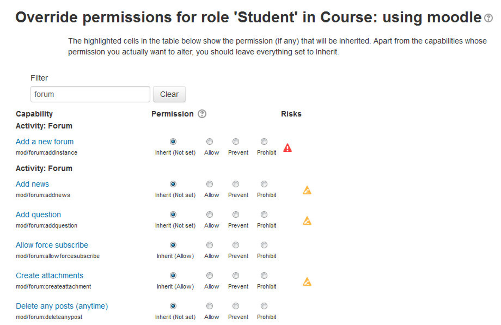 

- Module context: (from the chosen module) Administration > Module administration > Permissions 
- Block context: (from the chosen block) Administration > Block administration > Permissions 
- User context: (from the user's profile) Administration > Roles > Permissions 

### Overriding permission in activity

The override interface will only show you the capabilities for the context you are overriding. So if you want to allow students to rate forum posts, you can override the student role in a particular forum. You will only see the forum capabilities in the interface, as shown in Figure 5-2.

To override permission for a forum activity:

- Open the activity for which you want to create the override.
- Click Administration > Forum Administration> Permissions.
- You can see the list of all roles having permission in the activity and even add a specific role for that permission.
- In the top dropdown menu “Advanced role override” field select the role for which you want to create the override.

 

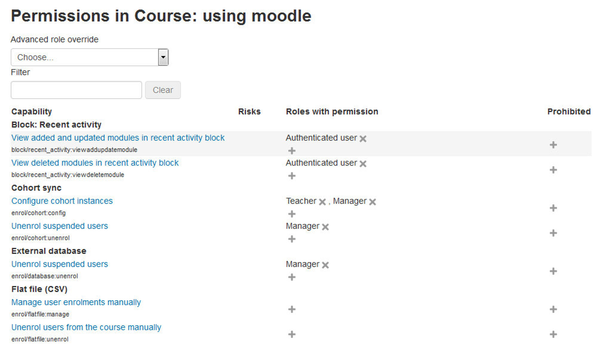 

- Modify the permissions for the override on this activity.
- Click the “Save changes” button. Anyone with the role you have just overridden will now have those capabilities in this activity when they next log in to Moodle.

Overrides allow you to create a lot of variation in the way students interact with an activity. However, before digging into the overrides system itself, be sure you have a clear understanding of what you are trying to achieve educationally with the override.

## Student Groups
Moodle has an unusual but effective way of managing small student workgroups within your course. You can define groups at the course level, then set each activity to a group mode or leave it available to everyone. The group mode you choose may also determine the behavior of the module. Think of groups as a filter. If you are a member of a group within a course, and an activity is set to group mode, Moodle will filter out any work from anyone who is not part of your group. You are all looking at the same activity, but you can’t interact with anyone who is not in your group.
 

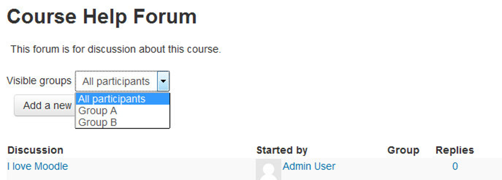 

### Group levels
A group or grouping can be used on two levels: 

- Course level - The group mode defined at the course level is the default mode for all activities defined within that course. To use groups you need first to set a group mode in Administration>Course administration>Edit settings.
- Activity level - Each activity that supports groups can also have its own group mode defined. If the course setting "Force group mode" is set to "Yes" then the option to define the group mode for individual activities is not available. If it is set to "No", then the teacher may change the group mode: 

Group Modes
There are three group mode options:
•	No groups  - Everyone participates as part of the class. Groups are not used.
•	Separate groups  - Each group can see only their own work. They can’t see the work of other groups.
•	Visible groups   - Each group does their own work, but they can see the work of the other groups as well, as shown in Figure 5-4.

Once the group mode is set for the course or activity, students will interact with your Moodle course as they normally would. The only difference will be the people they meet in certain activities, such as forums. For example, if you set the group mode of a forum to separate groups, Moodle will create a forum for each group. Each student will see the same link to the forum, but she will be able to access only the discussions for her particular group. You need to create the forum only once; Moodle takes care of creating the individual group forums.

### Why use groups?
- You are a teacher in a course where you have several classes and you want to filter your activities and gradebook so you only see one class at a time.
- You are a teacher sharing a course with other teachers and you want to filter your activities and gradebook so you don’t see the students from your colleagues’ classes.
- You want to allocate a particular activity, resource or topic section to just one class or set of users and you don’t want others to see it.

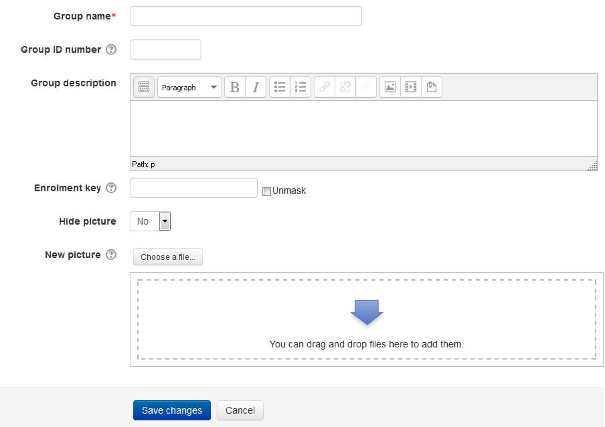 

### Creating a group
- Click the 'Create group' button in Administration > Course administration > Users > Groups
- Add a group name and optional description (displayed above the list of group members on the participants page), enrolment key and picture (displayed on the participants page and next to forum posts) 
- Click the 'Save changes' button
- Select the group to which you want to add participants, then click the 'Add/remove users button 
- In the "Potential members" list, select the users you want to add to the group. Multiple users may be selected using the Ctrl key.
- Click the Add button to add the users to the group.

An optional group ID number (an advanced setting) may be added for matching the group against external systems. Group ID numbers are not displayed anywhere on the site. Within a course, all group ID numbers must be unique. Thus it's not possible to create a group with a duplicate group ID number.

|Icon							|Group Mode				|
|-------------------------------|-----------------------|
|		|No Groups				|
||Separate Groups		|
|	|Visible Groups			|
 
Table 5-2 Group Mode Icons
 

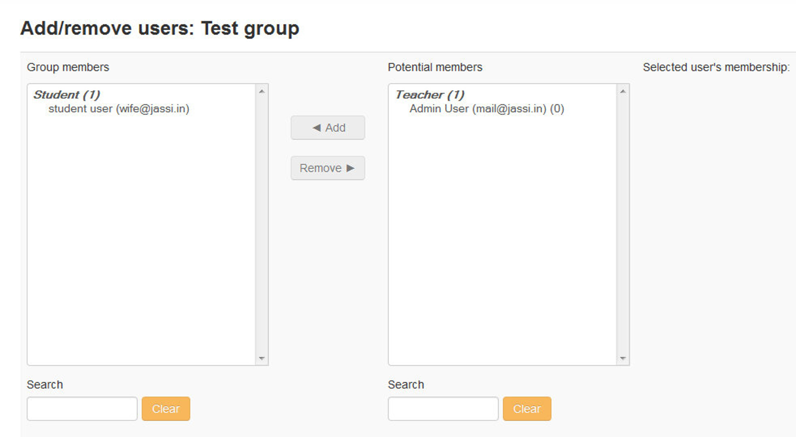 

### Auto-create groups
Groups may be created automatically via the 'Auto-create groups' button in Administration > Course administration > Users > Groups.

- In the General Section: A naming scheme can be created automatically. # is replaced by sequential numbers, and @ by letters. For example: 
	- Group @ will create group with a naming scheme Group A, Group B, Group C . . .
	- Group # will create group with a naming scheme Group 1, Group 2, Group 3 . . . 

	You can specify if you would like to create:
 
	- x number of Groups or
	- each group contain x number of students 

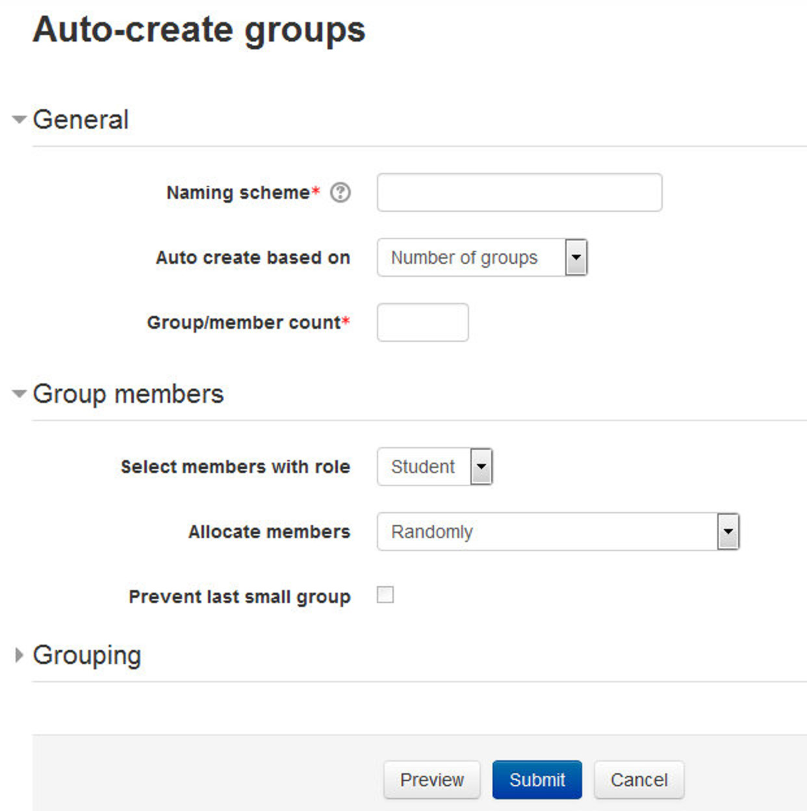 

- In the Group Members Section:
	- Select members from ... allows you to choose from roles or available cohorts.
	- Allocate Members dropdown allows you to allocate group members in different ways.
	- The Prevent last small group checkbox will allocate additional members to an existing group rather than create a new group with fewer members than x.
	
 
- In the Grouping Section:
	- Grouping of auto-created groups and Grouping name allows you to create a new grouping and allocate the new auto-created groups to be created to it.  Prior to creating the groups, you can view the groups. 

## Backup and Restore
After spending a lot of time setting up your course and delivering it to your students, you’ll want to make sure you don’t lose your work. Fortunately, Moodle gives you a backup tool to create archives of your courses. Backups can also be used to copy course resources and activities from one course to another.

A course can be saved with some or all of its parts by using the course backup. Typically, the site administrator will set a schedule of automated course backups for the whole site. A teacher with editing privileges can create a backup or download an existing backup for safe keeping, or for use on another Moodle site.

### Backing up a course
To backup a course 

- Go to Administration > Course administration > Backup 
- Initial settings - Select activities, blocks, filters and other items as required then click the Next button. Users with appropriate permissions, such as administrators and managers, can choose whether to include users, anonymize user information, or include user role assignments, user files, comments, user completion details, course logs and grade history in the backup. 
- Schema settings - Select/deselect specific items to include in backup, then click the Next button. 
- If desired, select specific types of activity to be backed up by clicking the link 'Show type options'.
- Confirmation and review - Check that everything is as required, using the Previous button if necessary, otherwise click the 'Perform backup' button.
- Complete - Click the Continue button 

 

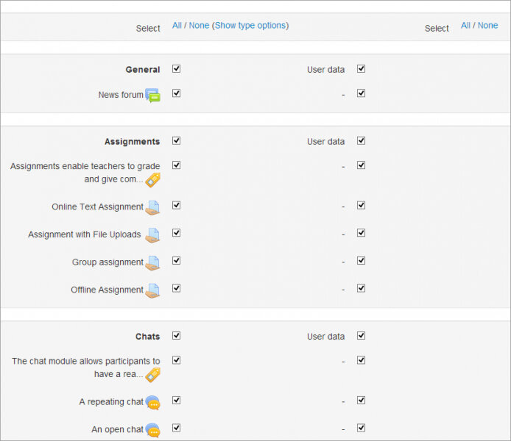 

A backup file (with distinctive .mbz extension to avoid confusion with .zip files) is then saved in the course backup area. Backup file names are of the form backup-moodle2-course-coursename-date-hour.mbz, ending in -nu.mbz when backed up with no users and -an.mbz with anonymized names.

T> *Anonymize user information is a backup feature which "protects user identities" by making each user anonymous. If this box is checked in the backup initial settings, Moodle will substitute aliases for real names.*

### Automated course backup
***(This section is only for Site Administrators, Teachers can skip this.)***

A site administrator can configure a schedule for automated course backups in Administration > Site administration > > Courses > Backups > Automated backup setup. 

Automated course backups runs the same functions as individual course backups. It's a good idea to schedule backups at the time when your server isn't usually busy. Running the backup tool over all the courses can be processor-intensive, so you shouldn't run it when there are a lot of students trying to access the server. You should always alert users with an announcement on the first page that if they log on during the backup hours they may notice a decrease in performance.
 
T> *In order to configure scheduled backups, you have to first set up the CRON job on your site to run periodically.*

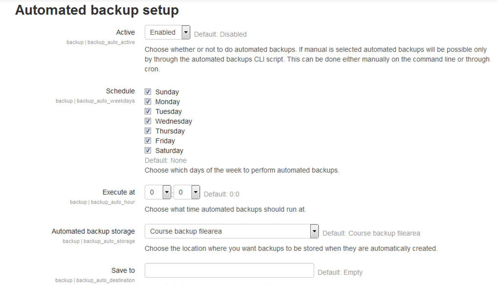 

To set the backup schedule: 

- Go to Administration > Site administration > Courses > Backups > Automated backup setup. 
- Set backup_auto_active to enabled.
- Select the days of the week to run the backup.
- Set the execution time for the backup process. For most servers, early morning will be the best time. Keep in mind the time zone your server is using.
- Set the "Save to..." path. If you can, choose a backup path on another machine or on a different drive than the one Moodle is on. You don’t want to lose your backups at the same time you lose your Moodle site if the drive fails. If you leave the field blank, then backup zip files will be saved in the backup folder of each course files folder. On a Linux server the path might look like: /home/(your user or domain)/public_html/archive/ or if it's below the publicly accessible folders: /home/(your user or domain)/archive/ if the path is not recognized a red X is shown after saving, otherwise a green check.
- Choose whether to skip the backup of hidden courses or courses which have not been modified within a specified number of days, or not modified since the last backup.
- Click the "Save changes" button. 

Once you've set up your backup schedule, Moodle will automatically create archives of all the courses on the server at the time you specified. Once the backup is complete, Moodle will send you an email describing the status of the backup.

### Restore a course
A course backup file (.mbz) may be restored from within any existing course for which you have permission. During the restore process, you will be given the option to restore as a new course or into an existing course.
 

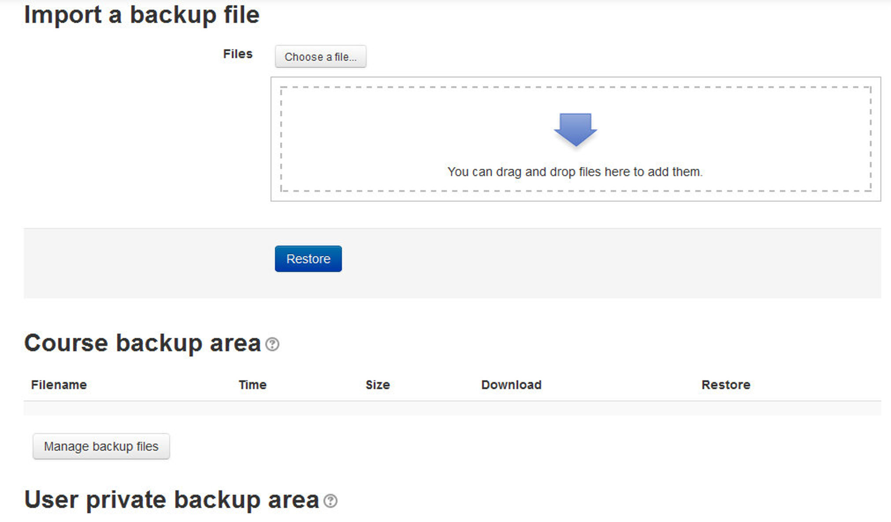 

To restore a course:

- Go to Administration > Front page settings > Restore (if you have front page permissions) or Administration > Course administration > Restore (if you have an empty course to restore into.) 
- Upload the backup file or choose a file in the course backup area or user private backup area and click Restore 
- Confirm - Check that everything is as required then click the Continue button
- Destination - Choose whether the course should be restored as a new course or into an existing course then click the Continue button 
- Settings - Select activities, blocks, filters and possibly other items as required then click the Next button 
- Schema - Select/deselect specific items and amend the course name, short name and start date if necessary then click the Next button 
- Review - Check that everything is as required, using the Previous button if necessary, then click the 'Perform restore' button 
- Complete - Click the continue button 

### Creative uses
The backup and restore processes can offer the teacher and administrators many creative solutions. 

- Duplicating courses or specific activities in one course to another course (similar to Import)
- Updating a production Moodle site course, with material from a localhost site course
- Transferring a course to a new Moodle site.
- In earlier versions of Moodle, a way of rolling a course forward without past student activity 
- Creating a blank activity, save just that activity and then restore it to the course or another course one or more times. 

## Reports
Once your course is up and students are working, Moodle provides you with detailed logs and participation reports of student activity.

The logs and participation reports are useful for tracking students’ activity in a class. If a student doesn’t spend time with the material, he will have difficulty succeeding in the course. Frequently, students who don’t do well simply haven’t spent the time working with the material.

If you analyze your course reports on a regular basis, you can monitor when your students engage with the course material. You won’t be able to tell exactly how long they spent with a certain activity or resource because the logs report only the time of access. Of course, you can guess how long a student spent with a resource by noting the time when the student began the next activity.

Logs and participation reports can also tell you which resources and activities students find most valuable. For example, if you upload all your PowerPoint slides for students to take notes on in class, but no one accesses them, you might want to find out why.

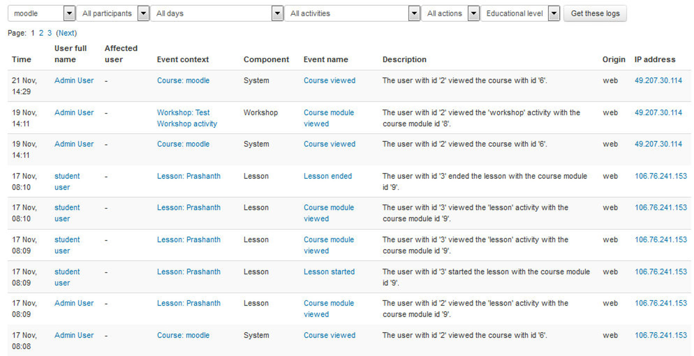 

To access course reports:

- Click Reports in the Administration block.
- On the Reports page, choose from the following:
	- Logs: Select any combination of group, student, date, activity, and actions, then click the “Get these logs” button.

		You can see what pages the student accessed, the time and date she accessed it, the IP address she came from, and her actions (view, add, update, delete), as shown in Figure 5-11
		You can choose to display the logs on a page or download them in text, ODS, or Excel format.

		T> *The Logs page contains active links enabling you to access the student’s profile page or a particular page that the student was viewing. The IP address link provides an estimate of the student’s location.*
	- Live Log: 
		If you’d like to track the latest activity on your course, select Live Logs. It shows you all the activity, teachers and students, for the last hour. 
	- Activity Report: 
		A course activity report, showing the number of views for each activity and resource (and any related blog entries), can be viewed by managers, teachers and non-editing teachers

		T> *The length of time that the activity report covers is determined by the loglifetime setting in Administration > Site administration > Courses > Backups > General backup defaults.*

	- Course Participation:

		To generate course participation report:

		- Select an activity module, the time period to look back over, to show only student reports, and the actions you are interested in (views, posts, or all actions), then click the Go button.
		- A list of all instances of the selected activity module in the course will be generated. Select one, then click the Go button.

		The participation report, as shown in Figure 5-12, lists the number of times each student has done the action selected.

 

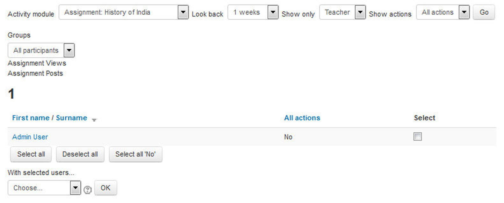 

If you wish, you can select particular users and send them a message. Select “Add/send message” from the drop-down menu and click the OK button.

## Summary

In this chapter we have taken a detailed look on the Moodle’s roles and permissions system along with student’s group modes, managing enrollment methods and backup and restoring a course. Moodle has the best roles and permissions system which makes you capable of taking fine control over the permissions available to your participants. In the next chapter we will take a look on the Moodle’s text editors: Atto and TinyMCE.

