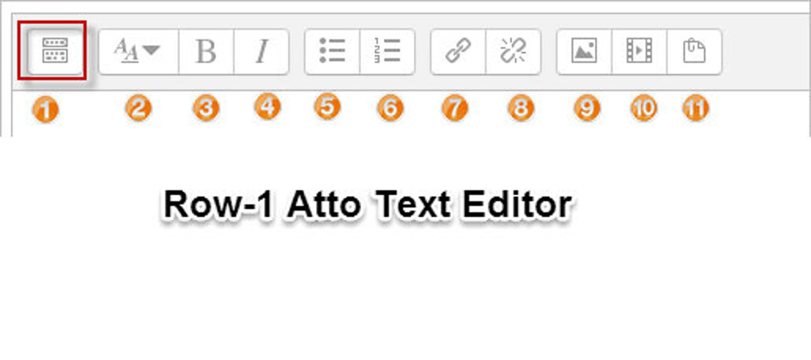
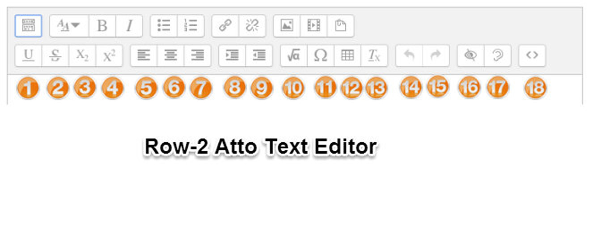
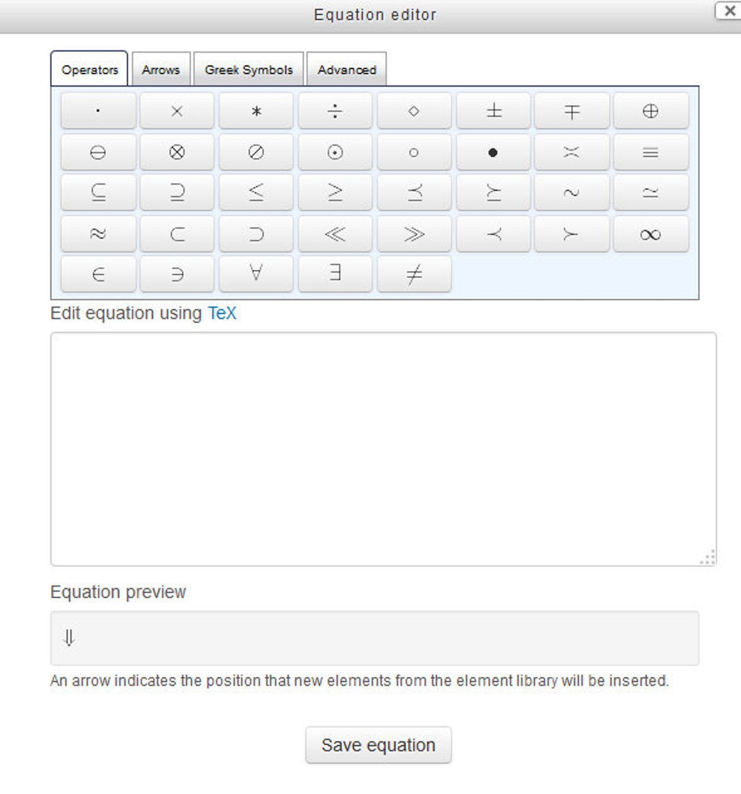
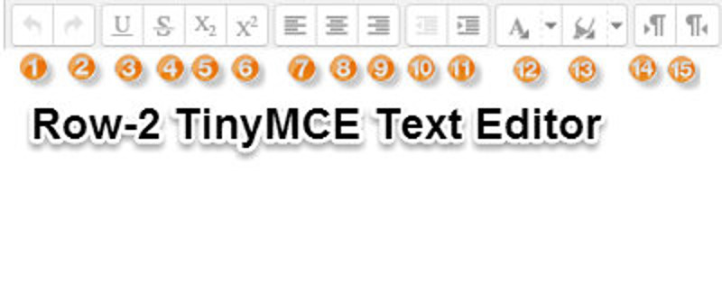
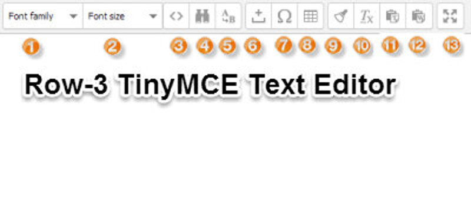
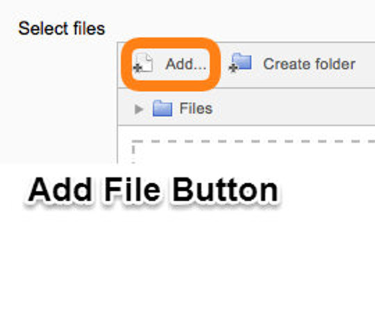
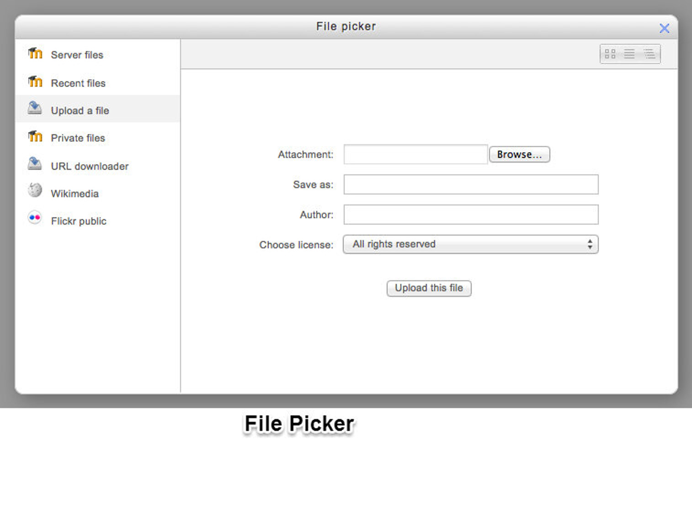
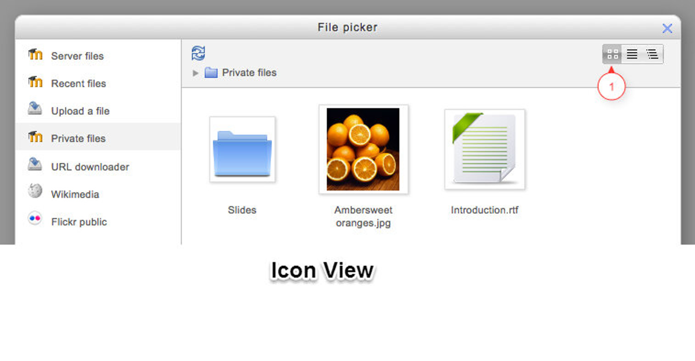
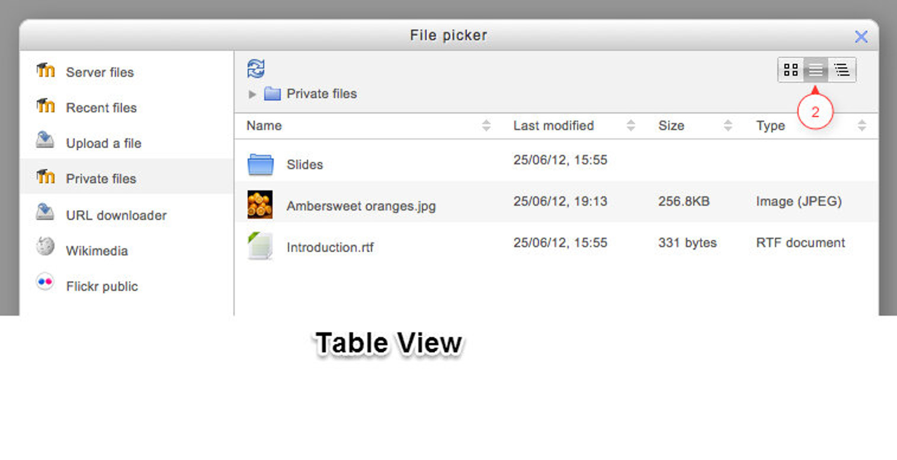
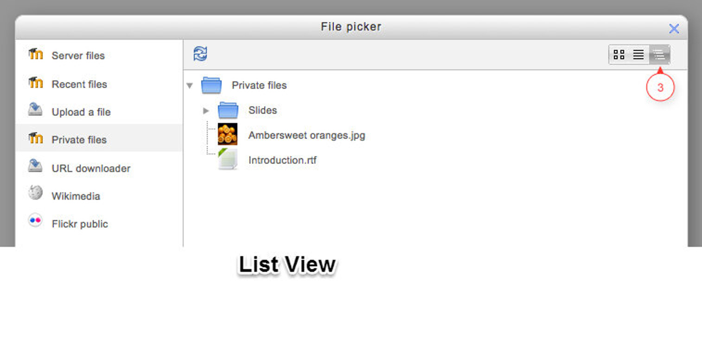

## Moodle Text Editors
The text editor (sometimes referred to as the 'HTML editor') has many icons to assist the user in entering content. Many of these icons and functions should be familiar to anyone who uses a word processor. 

Some examples of where you will see the text editor include: Editing Section headings, description of an activity, writing an answer to a quiz question or editing the content of many blocks.

The default text editor in Moodle is the Atto editor, built specifically for Moodle. There is also a version of the TinyMCE editor and a plain text editor.
Text editors can be enabled, disabled or a different one set to default from Administration > Site administration > Plugins > Text editors > Manage editors. The order of priority may also be specified here.

An individual user can select an editor in their profile from Administration > My Profile settings > Edit profile.

So, let’s start getting familiarized with the Moodle’s text editors one by one starting with Atto.

### Atto HTML editor
Atto is a JavaScript text editor built specifically for Moodle. Atto is the default text editor in Moodle from 2.7 onwards.

Atto is implemented as a standard Moodle text editor plugin. Most of the code is written in JavaScript as a standard Moodle YUI module.

 

Description Row-1 Atto Text Editor:
	 

|**1.** Expand|**2.** Style|**3.** Bold|**4.** Italic|
|**5.** Bulleted List|**6.** Numbered List|**7.** Add link|**8.** Unlink|
|**9.** Add image|**10.** Add media|**11.** Manage Embedded files||
 

 

Description Row-2 Atto Text Editor:

|**1.** Underline|**2.** Strikethrough|**3.** Subscript|**4.** Superscript|
|**5.** Align left|**6.** Align center|**7.** Align right|**8.** Increase indent|
|**9.** Decrease indent|**10.** Equation editor|**11.** Special character|**12.** Table|
|**13.** Clear formatting|**14.** Undo/redo|**15.** Undo/redo|**16.** Accessibility checker|
|**17.** Screen reader helper|**18.** HTML/code view|||
  

### Equation editor
If either the MathJax or the TeX notation filters are enabled (in Administration > Site administration > Plugins > Filters > Manage filters) then an equation editor (button 10 in Figure 6-2) button is provided in the toolbar for launching the equation editor. 

You can use the equation editor to insert operators, arrows, symbols and mathematical equations without knowing about using the TeX notations. It will automatically convert the symbols into the TeX notations. It is a huge enhancement for Mathematics teachers who used to struggle initially to learn the TeX notations.

 
T> *Your site administrator may specify which plugins to display and in which order in your editor window.*

### Plugins for Atto
You site administrator can also increase the functionality of your Atto text editor by adding additional plugins from the Moodle plugins community site. You can add plugins to add Chemistry editor, Computer Science Editor, word count and many more.

## TinyMCE Editor
TinyMCE is the default text editor in the earlier Moodle versions prior to Moodle 2.7. It is a nice text editor because of the intuitive text experience and its rich feature set of tools which are very easy to use.

You can select the TinyMCE editor as your default text editor in your profile from Administration > My Profile settings > Edit profile.

The TinyMCE editor first appears with just one row of buttons. Clicking the icon top left will expand it to three rows.

For those who are not familiar with the tool bar, here are the buttons as grouped in their rows. 

T> *Remember that the site administrator can edit or provide additional buttons.*

 

Description Row-1 TinyMCE Text Editor:

|**1.** Expand|**2.** Formatting|**3.** Bold|**4.** Italic|
|**5.** Bulleted list|**6.** Numbered list|**7.** Add link|**8.** Unlink|
|**9.** Stop auto linking|**10.** Add image|**11.** Add emoticon|**12.** Add media|
|**13.** Manage embedded files||||

 

Description Row-2 TinyMCE Text Editor:

|**1.** Undo|**2.** Redo|**3.** Underline|**4.** Strikethrough|
|**5.** Subscript|**6.** Superscript|**7.** Align left|**8.** Align center|
|**9.** Align right|**10.** Decrease indent|**11.** Increase indent|**12.** Text color|
|**13.** Background color|**14.** Left to Right|**15.** Right to Left||

 

Description Row-3 TinyMCE Text Editor:
	 

|**1.** Font family|**2.** Font size|**3.** Edit HTML|**4.** Find|
|**5.** Find/replace|**6.** Insert non-breaking space|**7.** Insert special character|**8.** Insert table|
|**9.** Clean up messy code|**10.** Remove formatting|**11.** Paste as plain text|**12.** Paste from MS Word|
|**13.** Toggle full screen||||

  

### Plugins for TinyMCE 
Similar to Atto Text editor your site administrator can enhance the tools by adding the plugins for TinyMCE editor also. You can also insert files, images, equations, emoticons by using the TinyMCE editor also.

## File Picker
The file picker enables files to be selected and displayed in Moodle - for example, when an editing teacher clicks Add an activity or resource > File, or when a forum participant adds an attachment to a post.

Usually the file is copied into Moodle from wherever you have chosen it from (e.g. a repository or your computer), though for certain repositories, such as the Youtube videos repository, a link is created, and in some situations an alias/shortcut may be created.

An "add" button appears which is clicked on to access the file picker:

 

### Getting files from the file picker
When the file picker screen appears, a number of links are listed down the side. These are links to Repositories which hold files you might want to use. There is also a link Upload a file which you would click on to add a file yourself from your computer.

Which repositories are included depends on which ones have been enabled by the administrator and also the context in which you access the file picker. For example, if you have reached the file picker by clicking on the media icon in the TinyMCE text editor then you might see the Youtube videos repository link.
 

### Viewing your files in the file picker
There are three ways to view files in the File picker, depending on your personal preference:

- View as icons:  This shows the files as easily identifiable thumbnails:

 

- View as table: This shows the files with details such as license, date uploaded, size etc.

 

- View as a list This shows the files in a hierarchical list:

 

## File Repositories 

Repositories in Moodle enable users to upload files, access previously uploaded files and to easily bring content into Moodle from external repositories, such as Flickr or Google Docs. Enabled repositories are available in the File picker. 

T> *Note that you cannot upload files into a repository from Moodle. It is only a single way data transfer i.e. Repository to Moodle.*

### Standard repositories:
 Repositories enabled by default:

- Upload a file - you use this for browsing for and uploading a file from your computer or USB.
- Server files - this give access to files elsewhere on Moodle according to your permissions.
- Recent files - the last 50 files you have uploaded, according to the context.
- Private files - your own personal storage area for files.
- Youtube videos - search for and display Youtube videos
- URL downloader - download files, images from a particular URL
- Wikimedia - search for and display media from Wikimedia

Additional repositories may be enabled by a site administrator:

- Alfresco - link to or copy files from Alfresco into Moodle
- Amazon S3-  The Amazon S3 repository enables users to copy files from Amazon S3 into Moodle.
- Box - bring files in from your Box account
- Dropbox - bring files in from Dropbox
- Embedded files - re-use files embedded into the current text area
- EQUELLA - link to files in an EQUELLA installation
- File system - access files uploaded to a folder on your server (by, e.g. FTP)
- Flickr public - search for and display images from Flickr
- Flickr - search for and display images from your personal Flickr account
- Google Drive - bring files from your Google Drive account
- Legacy course files - use the old system from 1.9 of "course files"
- Merlot.org - bring resources in from Merlot.org
- Oohoo - Capture repository - allows users to record video, sound and take a photo WITHOUT a streaming server.
- Picasa web album - search for and display images from your Picasa account
- PoodLL repository - record audio or video directly into your Moodle HTML areas
- OneDrive bring in files from your Microsoft OneDrive (formerly known as Skydrive)
- WebDAV -bring in files using webdav

## Summary
The usual way to edit or create text that is part of the visual content of a course is using the Text editor. In this chapter we’ve familiarized with the text editors: Atto and TinyMCE available in Moodle along with the file picker and file repositories.

In the next chapter, we will get conversant with the communication tools available in Moodle like Messaging, Chat and Forums.
