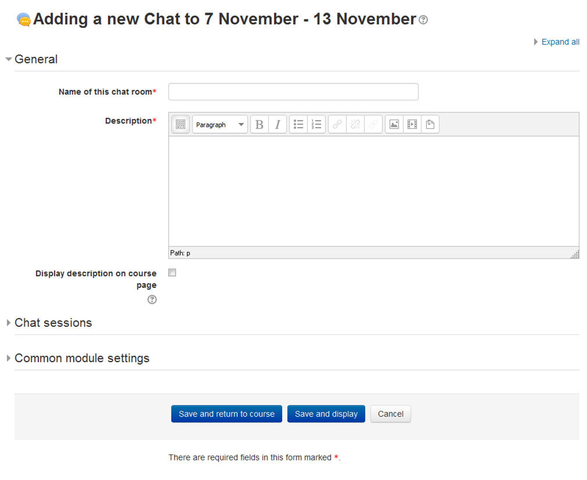
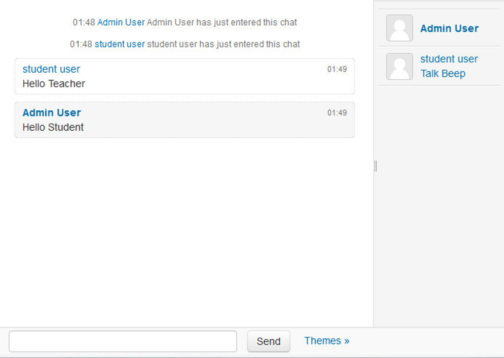
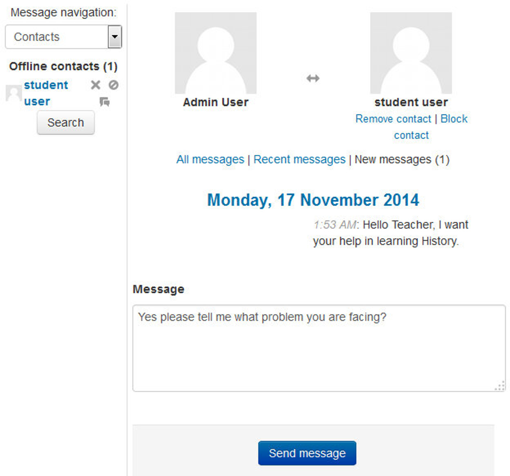
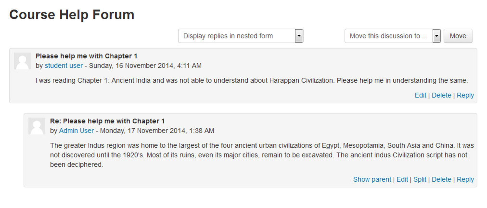
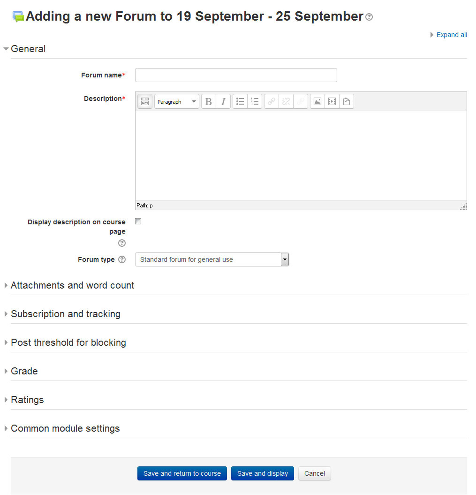
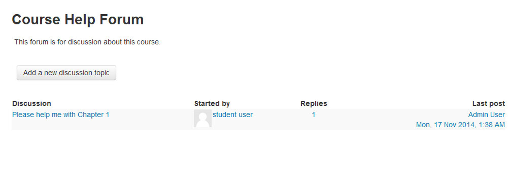
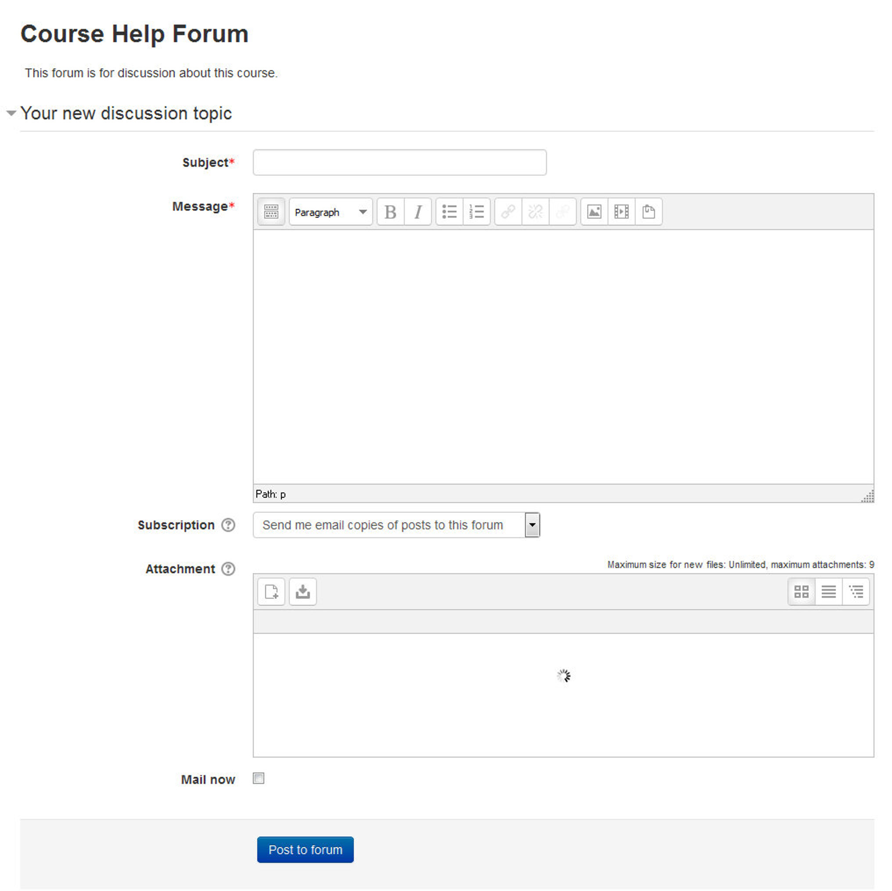
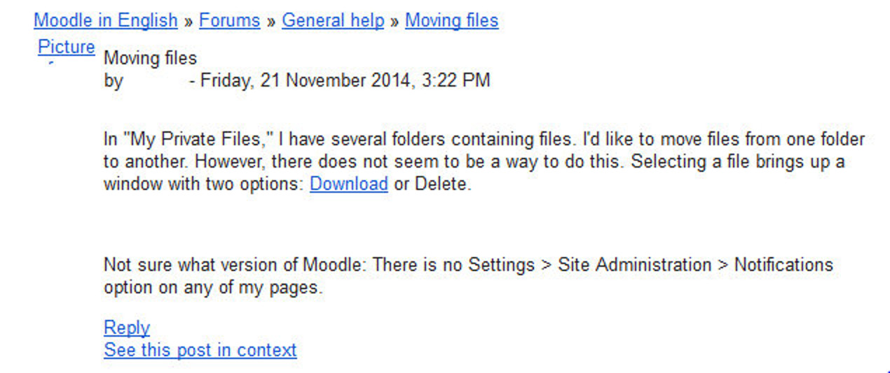
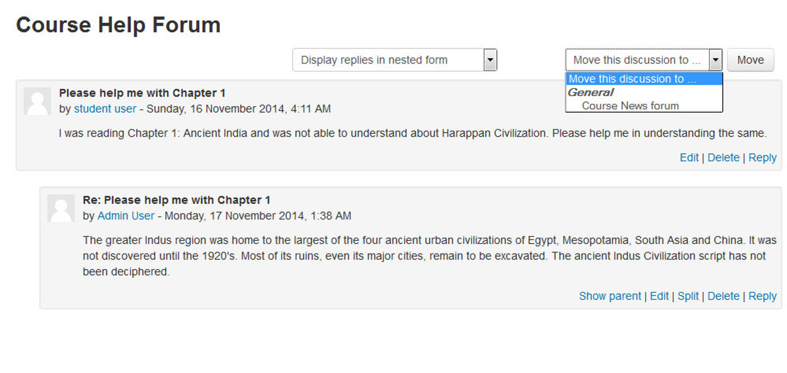

Moodle provides good communication tools which helps you to create an interaction with your students in different ways. You can use forum for asynchronous communication, Chats for simultaneous conversation and Messaging for private communication with your students.

So, let’s start with Chat:

## Chat  
The chat activity module enables participants to have text-based, real-time synchronous discussions. This is a useful way to get a different understanding of each other and the topic being discussed – the mode of using a chat room is quite different from the asynchronous forums. The Chat module contains a number of features for managing and reviewing chat discussions.

The chat may be a one-time activity or it may be repeated at the same time each day or each week. Chat sessions are saved and can be made available for everyone to view or restricted to users with the capability to view chat session logs.
Chats are especially useful when the group chatting is not able to meet face-to-face, such as:

- Regular meetings of students participating in online courses to enable them to share experiences with others in the same course but in a different location.
- A student temporarily unable to attend in person chatting with their teacher to catch up with work
- Students out on work experience getting together to discuss their experiences with each other and their teacher.
- Younger children using chat at home in the evenings as a controlled (monitored) introduction to the world of social networking
- A question and answer session with an invited speaker in a different location
- Sessions to help students prepare for tests where the teacher, or other students, would pose sample questions.

### Why use chat?

Chat has an advantage over a Forum in that it takes place in Real Time. It is especially beneficial when the group chatting is not able to meet face to face. Examples might be: 

- Regular meetings of staff on large or split campuses to discuss student or curriculum issues;
- Regular meetings of students doing online courses to enable them to share experiences with others on the same course but potentially in a different city (or country),
- A teacher working with his students even though he is out of school
- A student temporarily unable to attend in person chatting with their tutor to catch up with work.
- Students out on work experience getting together to discuss their experiences with each other and their tutor
- Younger children using chat at home in the evenings as a controlled(monitored) introduction to the world of social networking.

  
### Why NOT use chat?

- Unless a tutor/moderator is permanently present in the chatroom -or unless the chat is hidden and revealed at certain times, it is difficult to control what is said once a chat has started.
- Younger students particularly may find it difficult to stay on task and be prone to adding non-useful comments or "beeping" others for the sake of it. 
- In some situations, a forum might be preferred as it allows for reflection before posting and gives a period of time where the post might be edited. 

### Creating Chat
To create a chat in your course:

- Turn on the editing mode by clicking the Turn editing Mode button.
- In the section you wish to add your chat, click the "Add an activity or resource" link (or, if not present, the "Add an activity" drop down menu) and choose Chat.
- In the "Name of this chat room" field whatever you type here will form the link learners click on to enter the chat so it is helpful to give it a name that suggests its purpose - for example "Student council discussion" or "Field trip planning meeting".
- In the description box - type the description of the chat. Include precise instructions for students regarding the subject of the chat. Click the icon on the left to expand the toolbar, and drag the bottom right of the text box out to expand it. 
- In the "Chat sessions" section which is collapsed by default, you will find options for:
	- Next chat time:
		- The day and hour of the next chat session. This will appear in the calendar so students know the schedule but it doesn't stop them accessing the chatroom at any other time.
		- If you don't want them in the chatroom at other times, then hide it (with the eye icon) or use Conditional activities to restrict access.
		- If you don't wish to schedule chat times then ignore this and choose from the next settings.

		T> *For courses involving users across different time zones, it is useful to know that the time you set here will be adjusted to match the time zone of the user viewing it.*

	- Repeat/publish sessions:  There are four options for scheduling future chat sessions:
		- Don't publish any chat times- there are no set times and students are welcome to chat at any time.
		- No repeats - publish the specified time only- only the Next chat time will be published. This could be used to schedule special events or meetings or simply to help learners identify a common time in which they can expect to find other learners in the chat room.
		- At the same time every day- Daily chats are useful for scheduling daily office hours or work sessions with learners.
		- At the same time every week -This setting will schedule a chat for the same day and time every week, which could be useful for instance for meeting and reviewing key ideas and questions related to the week’s content/assessment.

	

	- Save past chat sessions: 
		- Choose from the dropdown how many days to save - or save everything by selecting Never delete messages
		- If you have any concerns about discussions that might take place in your chat room, you may want to keep transcripts to check the suitability of what is discussed. If your learners are using the chatroom to collaborate on a group project you won't want to delete the messages until the project is complete.
		- Everyone can view past sessions:  Decide here whether or not allow everyone to view past chat sessions. (Teachers can always view past sessions)
	- In the "Common Module Settings" section:
		- You can show/hide the chat activity from the visible drop down menu.
		- Provide an ID number for grading purpose.
		- The group mode setting has 3 options:
			- No groups - There are no sub groups, everyone is part of one big community
			- Separate groups - Each group member can only see their own group, others are invisible
			- Visible groups - Each group member works in their own group, but can also see other groups
		- A grouping is a collection of groups within a course. If a grouping is selected, students assigned to groups within the grouping will be able to work together.
- Click "Save and display" to show up the Chat activity.

### Using Chats

- Entering the chat:  As you click the chat link on the course page you see two or three options:
	- Click here to enter the chat now - this takes you to the chat using the chosen site default chat method - for example Ajax.
	- Use more accessible interface - this gives a simpler chat room without frames and JavaScript.
	- View past sessions - if this has been enabled and the user is allowed to view past chat sessions, this takes them to a list of past sessions with links to the chat.
	- Joining in a chat session:
	- In normal view, the screen is in two parts with the participants on the right, the messages on the left and a box at the bottom into which users type their message and press "Send" to make their contribution.
	- Users can change the appearance of the messages by clicking on "Themes" next to the "Send" button. Bubbles appears thus:
	- The chat module contains some features to make chatting a little nicer:
		- Smilies - Any smiley faces (emoticons) that you can type elsewhere in Moodle can also be typed in here and they will be displayed correctly.
		- Links - Internet addresses will be turned into links automatically.
		- Emoting - You can start a line with /me to emote. For example, if your name is Kim and you type /me laughs! Then everyone will see "Kim laughs!"
		- Beeps - You can send a sound to other people by hitting the "beep" link next to their name. A useful shortcut to beep all the people in the chat at once is to type "beep all".
		- HTML - If you know some HTML code, you can use it in your text to do things like insert images, play sounds or create different colored and sized text.

 
    
	

### Chat Reports
To view previous chats (if you have permission) click on the 'View past chat sessions' link. Teachers can also access past chat sessions from the Chat administration in the Settings block.

- This will bring up a listing of each chat session under the current chat topic. The listings include the time the chat started and ended, which users participated, and how many messages each user sent.
- In order for students to see past sessions, the teacher or an administrator must setup the chat to allow everyone to view past chat sessions. 

### Effective Chat Practices
While the chat module may not be very feature-rich at this point, it can still be an effective learning tool.

The key to a successful chat is good moderation. The nature of the chat room makes it difficult to track different conversations. If everyone in the class is talking at the same time, the conversation will go by too quickly. It’s important to set some ground rules to make the chat useful for everyone. Try to keep everyone on the same track of the conversation. If the conversation starts to get out of control, gently try to bring people back to the main flow.

### Creative Chat Practices

#### Online office hours
Many students may not be able to come to your office hours, particularly working students, who have arranged their schedules to make it to class. The chat room is an easy way to allow your students to contact you during a scheduled time to ask a quick question about an assignment or a lecture.

#### Group chats

If you’ve set up student groups, each group can have its own chat. Set up a chat room and set the group mode to separate or visible groups. Each group can then use its chatroom for communication between group members.

#### Last-minute exam preparation
You could set up a chat room a week or even a night before an examination for students to discuss any study questions. Students who are working at the last minute will appreciate the opportunity to ask each other questions about the material.

## Messaging 
 "Messaging" refers both to automatic alerts from Moodle about new forum posts, assignment submission notifications etc., and also to conversations using the instant messaging feature. 

Message alerts:

- Users can receive message alerts from Moodle in a number of ways and for a number of reasons: users may for instance receive instant messages via the Messages block; students may be messaged by their course tutor via the People block; teachers might receive automatic notifications of assignment submissions and admins might receive notification of problems with the site.
- How these messages and others are received can be set by each user from the Messaging link in their profile. Check boxes allow the user to select how they wish to be notified of incoming messages. 

### Instant messaging
If enabled for the site, users in Moodle have the option to send each other message. Messages can be sent from the following places:

- as admin in Bulk user actions
- as a teacher from the People block
- as any logged in user from the Messages block or Online Users block
- as any logged in user by clicking on the profile of another user (if admin has allowed profiles to be viewed)
 

### Sending messages
To send a message to an individual:

- From the Messages block or from your profile
	- Click on the blue link Messages in the Messages block or click the Messages link from Navigation > My profile and then type a name into the Search people and messages box. To narrow the search down further, click the blue Advanced link to search for a person "only in my courses" or with keywords in messages
	- Type the message in the box and click the Send a message button.
 

- From the Online users block:
	- Click the name of one of the people currently online and click the Send message link in their profile.
	- Type the message in the box and then click on the Send a message button.
- To read and reply to a message:
	- If the Messages block shows you have a message, click the envelope icon (with the number of messages)
	- Type your reply into the box and then click on the Send a message button.
	- If you receive a popup notification of a message, click Go to message to read and reply to it.

### To send a message to selected course participants

- Click on the Participants link in the People block on the course page.
- Select participants from the list or use the "Select all" button at the bottom of the list.
- Choose "Add/send message" from the "With selected users..." drop-down menu.
- Type the message then click the "Preview" button.
- Assuming you are satisfied with the message, click the "Send" button.

### Managing contacts
People may be added to your list of contacts (or blocked from contacting you) by clicking the Add contact (or Block contact) icon under their name in the Messages window.

By default the contact list is empty. In order to send a message or to create a shortcut to the person you are sending, search for them in the search box.

### Message history
A record of messages sent to/from a person may be obtained by clicking the "History" icon by their name or by clicking Recent messages/All messages when they are displayed on the page.

### Effective Messaging Practices
Messaging aids private communication with students. It is a useful alternative to email because you can track all correspondence in one place and avoid clogging your email inbox.

### Creative Messaging Practices

#### Tutorial support
Students frequently find the messaging system a useful way of sending private questions to their tutors. There are times when a student doesn’t want to ask a question in a public forum. Messaging provides students with a private communication channel. Tutors can also use the messaging system to send messages to one or more of their students. If the students for each tutor are in a group, the tutor can use the Groups filter on the participants list to find all of his students and send them a private message.

#### Encouraging participation
The message system, combined with the participants list, is a great tool for encouraging students to stay engaged with your course. On the participants list you can easily filter students based on how long they have been inactive. At the top of the page, one of the options is to select students who have been inactive for any length of time from a day to five months. In a normal class of 10–15 weeks, if once a week you send a message to students who have been inactive for a week, you can remind them to participate in the course. This will keep them more engaged and improve their performance and retention.

## Forums  
Forums are a powerful communication tool within a Moodle course. Think of them as online message boards where you and your students can post messages to each other while easily keeping track of individual conversations. Forums are the primary tool for online discussion and are the central organizing feature in the social course format. You’ve already posted your first message to a forum while editing the Site News forum back in Chapter 3. When you posted your news item, you were posting to a special forum used in every course for announcements and news.
Forums allow you and your students to communicate with each other at any time, from anywhere with an Internet connection. Students don’t have to be logged in at the same time you are to communicate with you or their classmates. Figure 6-5 demonstrates how conversations are tracked through time, and readers can review the history of a conversation simply by reading the page. The technical term for this type of communication is asynchronous, meaning “not at the same time.” Asynchronous communications are contrasted with synchronous forms such as chat rooms, instant messaging, or face-to-face conversations.

Because forums are asynchronous, students can take their time composing replies. They can draft and rewrite until they are happy with the results instead of feeling under pressure to respond immediately. A lot of research indicates that more students are willing to participate in an asynchronous forum than are willing to speak up in class. For students whose primary language is not that of the course, people with communicative disabilities, and the just plain shy, forums offer a chance to take as much time as they need to formulate a reasonable reply. Other students, who might be afraid of embarrassing themselves by making a mistake when they speak up in class, can double check their responses before they send them in. The asynchronous nature of the forums creates many opportunities for you not only to replicate the conversations you have in class, but also to create entirely new activities that are difficult in a classroom setting.

 

Before we start creating a forum, it is important to make sure we’re using the same vocabulary. It might be useful to think of the forum module as a party. Each forum is a room at the party: there’s a living room, a kitchen, and a dining room. In each room, there are groups of people having discussions. Each discussion has a thread with everyone replying to each other about the topic. Without people having discussions, a forum is an empty, quiet space. Each forum can contain one or more discussions, which are comprised of one or more posts and replies.

Moodle forums also allow subscriptions. When a user subscribes to a forum, all new posts are automatically sent to the email address stored in the user’s profile. This makes it easy to keep track of what’s happening in the forums without constantly logging in.

Participants can subscribe to a forum to receive notifications of new forum posts. A teacher can set the subscription mode to optional, forced or auto, or prevent subscription completely. If required, students can be blocked from posting more than a given number of posts in a given time period; this can prevent individuals from dominating discussions.

Forum posts can be rated by teachers or students (peer evaluation). Ratings can be aggregated to form a final grade which is recorded in the gradebook.
Forums have many uses, such as

- A social space for students to get to know each other
- For course announcements (using a news forum with forced subscription)
- For discussing course content or reading materials
- For continuing online an issue raised previously in a face-to-face session
- For teacher-only discussions (using a hidden forum)
- A help center where tutors and students can give advice
- A one-on-one support area for private student-teacher communications (using a forum with separate groups and with one student per group)
- For extension activities, for example ‘brain teasers’ for students to ponder and suggest solutions.

### Creating a Forum
Creating a forum is relatively easy. The key to success is choosing the right options for the type of forum you want to create. In addition to the news forum, Moodle has five basic forum types:

- **A single simple discussion** - A single discussion topic which everyone can reply to (cannot be used with separate groups).  Students will see the text you have placed in the Forum introduction setting as the first post of the discussion. Below you will find the replies that have been posted. 
- **Each person posts one discussion** - Each student can post exactly one new discussion topic, which everyone can then reply to.  The view will be basically the same as in the previous case, the only difference being the 'Add a new discussion' option. Viewing a forum page, the student will see the text you have written at the 'Forum introduction' space while creating the forum, and, if there are any, the discussions that have been started.
- **Q and A forum** - Students must first post their perspectives before viewing other students' posts.  The Q & A forum is best used when you have a particular question that you wish to have answered. In a Q and A forum, teachers post the question and students respond with possible answers. By default a Q and A forum requires students to post once before viewing other students' postings.
- **Standard forum displayed in a blog-like format** - An open forum where anyone can start a new discussion at any time, and in which discussion topics are displayed on one page with "Discuss this topic" links.  In the upper right corner of the home forum screen (above the introduction), the student may see the options the teacher has set for subscriptions to the forum, and the 'Jump to' field, with which you can 'jump' to any part of the course. 
- **Standard forum for general use** - An open forum where anyone can start a new discussion at any time.  In this forum type, students will see the introduction text in a separate space above the discussion field, in which you will see the information such as the title of the discussion (which means the forum's title), its author, the number of replies and the date of the last post.

To add a forum to your class:

- Click the "Turn Editing Mode" button to enter into the editing mode.
- Click "Add an activity or resource" link and choose Forum from the Menu.
- This will take you to the forum settings page titled "Adding a new forum".
- In the general section enter a Short name and in the description field provide instructions for your students so that they are clear about what they have to do.

 

- If you want to display the description on the course page then check the Display description on course page checkbox.
- Choose the forum type you want to use as specified in the section above.
- In the attachments and word count section you  can specify the maximum attachment size, no of attachments and whether to show the word count:
	- Choose Maximum attachment size for each forum post in Maximum attachment size field. Please note that you can’t exceed the site upload limit set by your administrator.
	- Select the maximum number of attachments which can be attached in the forum post.
	- Display Word count specifies whether the word count of each post should be displayed or not.
- In the subscription and tracking section:
	- Subscription Mode: When a participant is subscribed to a forum it means they will receive forum post notifications. There are 4 subscription mode options:
		- Optional subscription - Participants can choose whether to be subscribed
		- Forced subscription - Everyone is subscribed and cannot unsubscribe
		- Auto subscription - Everyone is subscribed initially but can choose to unsubscribe at any time
		- Subscription disabled - Subscriptions are not allowed
	- Read Tracking: If enabled, participants can track read and unread posts in the forum and in discussions. There are three options:
		- Optional - Participants can choose whether to turn tracking on or off via a link in the administration block. Forum tracking must also be enabled in the user's profile settings.
		- Forced - Tracking is always on, regardless of user setting. Available depending on administrative setting.
		- Off - Read and unread posts are not tracked.
- In the Post threshold for blocking Section:  
	- Time period for blocking: Students can be blocked from posting more than a given number of posts in a given time period.
	- Post threshold for blocking:  This setting specifies the maximum number of posts which a user can post in the given time period above.
	- Post threshold for warning:  Students can be warned as they approach the maximum number of posts allowed in a given period. This setting specifies after how many posts they are warned.
- In the Grade section - Choose the category in which this forum will appear if ratings are enabled.
- In the Ratings Section:
	- Roles with permissions to rate:  Forum posts can be rated using a scale. By default, only teachers can rate forum posts, though students can be given permission to do so if desired (see Forum permissions below). This is a useful tool for giving students participation grades. Any ratings given in the forum are recorded in the gradebook.
	- Aggregate type: The aggregate type defines how ratings are combined to form the final grade in the gradebook. There are five options to choose from:
		- Average of ratings - The mean of all ratings
		- Count of ratings - The number of rated items becomes the final grade. Note that the total cannot exceed the maximum grade for the activity.
		- Maximum - The highest rating becomes the final grade
		- Minimum - The smallest rating becomes the final grade
		- Sum - All ratings are added together. Note that the total cannot exceed the maximum grade for the activity. 
		T> *If "No ratings" is selected, then the activity will not appear in the gradebook.*

	- Scale:  Select the type of grading used for this activity.
		- If "scale" is chosen, you can then choose the scale from the "scale" dropdown.
		- If using "point" grading, you can then enter the maximum grade available for this activity.
	- Restrict ratings to items with dates in this range:  The teacher can allow only posts within a certain date range to be rated. This is useful if the teacher wants to keep students focused on the most recent content and maintain a specific pace within the forum or course.
- In the Common Module section: 
	- You can Show/hide the activity from the Visible drop down menu.
	- You can also set an ID number which provides a way of identifying the activity for grade calculation purposes.
	- Group Mode: The group mode setting has three options:
		- No groups
		- Separate groups - each group can only see their own group; others are invisible
		- Visible groups - each group works in their own group, but can also see other groups
	- Grouping:  A grouping is a collection of groups within a course. If a grouping is selected, students assigned to groups within the grouping will be able to work together.

	If the group mode is set to separate groups:

	- Teachers are given the option of adding a new discussion topic for all participants or for a selected group. If a teacher adds a new discussion topic for a selected group, then only group members can reply to it. If a teacher adds a new discussion topic for all participants, then students can't reply to it. (This is to ensure that groups are kept separate.)
	- Students can only start discussions for their own group.
	- Students can only reply to discussions started by other group members or discussions for their own group started by a teacher.

	

	If the group mode is set to visible groups:

	- Teachers are given the option of adding a new discussion topic for all participants or for a selected group. If a teacher adds a new discussion topic for a selected group, then only group members can reply to it.
	- Students can only start discussions for their own group.
	- Students can only reply to discussions started by other group members or teachers.

	Teachers, and other users with the capability moodle/site:accessallgroups set to allow, can view and post in all forum discussions, regardless of the group mode setting.

 

T> *Single simple discussions cannot be set to separate groups.* 

- Click the “Save changes and return to course” button. The forum name will now be a link in the course section where you added it. If you want to go back to change any of the options, you can click on the gear icon (edit settings) to return to the editing forum page.

### Using Forums
If you click on the forum name on the course page, you’ll see the main forum page, as shown in Figure 7-7.

 

### Searching Forums

All of the forums within a course are searchable as well as browsable. Performing a forum search can find useful information easily. All forums within the course are searched simultaneously.

The Search Forums block on your course page enables you to quickly search for a particular word within a forum post. If you obtain more than one page of results, you may wish to try an advanced search.

An advanced search enables you to refine your search in any/all of the following ways:

- These words can appear anywhere in the post  - One or more words you type in here will be found in all the places in the post they appear.
- This exact phrase must appear in the post - The phrase you enter must appear exactly as you enter it.
- These words should NOT be included - Identifying words you don’t want can help narrow down the resulting list of messages.
- These words should appear as whole words - The search engine will return posts that contain your words as part of a larger word. For example, if you search for “cat,” posts with the word “catalog” will be returned. Selecting whole words will look for a space before and after the words you have entered.
- Posts must be newer/older than this - This narrows down the number of posts according to time limits.
- Choose which forums to search - This enables searching within one forum only.
- These words should be in the subject - If you know the subject line of the posts you want, you can limit your searches by the subject line.
- This name should match the author - If you only want posts from certain authors, enter their names here.

### Managing Forums
Once you’ve created forums for your students, you will need to manage them during your course. As we discussed earlier, forums are great tools for getting people who don’t usually talk in class to participate. If you make your discussions an important part of your class, you can really get people talking.

Of course, a lot of people talking in a forum mean there’s more to manage. Forums can quickly sprout and spread like an unruly weed, unless you do some management and pruning.

 

#### Managing expectations 
The first key to managing a forum is managing student expectations. In your syllabus, let students know how often you intend to respond to questions and posts. Let them know if you will be checking in once a day or once a week. If you don’t set expectations, some students will expect you to be on call 24 hours a day.

#### Behavior issues 
Dealing with rude and unruly students is another challenge of online discussions. Some students may say things in an online discussion they would never say in person. Rude or hurtful remarks can shut down a discussion or completely divert the thread of the conversation.

To avoid these situations, make your expectations for student conduct clear in your syllabus and elsewhere in the site. The use of rating scales can also moderate students’ behavior if their grade depends on getting good ratings from you or their peers. Of course, if the situation gets out of control, your ultimate recourse is to simply delete the students’ posts from the forum and then deal with it as you would any other disciplinary issue.

### Archiving forums
When forum threads get very long, you may want to archive them and start up the conversation again with a good summary. Discussions can be archived one by one or by backing up the complete forum with user data, then restoring it.

To archive a discussion:

- Create a forum named “Archive forum” somewhere in your course (the first or last course section is a good idea) with permissions such that the students should be able to see posts which had been made without being able to reply any more.
- In Administration > Forum administration > Permissions click the Prevent icon (X) for the student role for the capabilities 'Start new discussions' and 'Reply to posts'.
- Go to the forum containing the discussions you want to archive.
- Enter the discussion by clicking on the discussion name. At the top-right corner of the screen, you’ll see a drop-down menu labeled “Move this discussion to”
- Select “Archive forum” from the list.
- You’ll now see the discussion in the archive forum. Click the Forums link in the navigation bar and select the original forum from the list.
- Post a summary of the archived discussion in the original forum to restart the discussion.

Using an archive forum allows you to keep the discussions manageable, while retaining all of the detail of the original. It’s also an easy way to move good discussions from class to class or semester to semester.

 

Managing discussions is also easier with some help. A number of studies have reported the benefits of assigning groups of students to moderate duties for discussions around given topics. If a group of students knows they are responsible for being able to discuss an issue intelligently with their classmates, they are much more likely to be sure they’ve done the reading and really understand the topic. They can be responsible for moving the conversation along, answering basic questions, and archiving and summarizing a discussion.

To create student moderator groups, assign a small team of students to each forum or discussion. Be sure to enable ratings for everyone, in order to allow the student group to use ratings.

#### Quarantining a forum post
If any participant in your course has made an inappropriate post, then in that case rather than deleting it, you can "quarantine" it by sending it to a hidden forum and then alerting your superior and the child's guardians. To do this you first need to create a forum "Hidden forum for Offensive Posts" (for example) and hide it with its eye. 

- Find the offensive post and click 'split' (between 'edit' and 'delete')
- This will take you to a second page where you will be asked to verify the split. Confirm it by pressing the 'split' button near the top of the page.
- The post(s) will now be split. You should see the post/discussion individually on a separate page. In the right-hand corner will be a dropdown bar and a button that says 'move.'
- Choose 'Hidden Forum for Offensive Posts' in the dropdown and click 'move.'

T> *Make sure you inform the child why their post has been quarantined, as well as your superior and the child's guardians.*

### Forum Capabilities
Forum capabilities are more fine-grained than any other module, giving you the ability to create a wide range of roles:

- Add news: This allows a user to start discussions in a news forum. This applies to news forums only. This capability is allowed for the default roles of manager, teacher and non-editing teacher
- Add question: This allows a user to add a question to a Q & A forum. This capability is allowed for the default roles of manager, teacher and non-editing teacher.
- Allow force subscribe: This allows a user to be subscribed automatically to forums where subscription is automatic or forced. This capability is allowed for the default roles of teacher, non-editing teacher and student. It is not set for the role of manager.
- Create attachments: This allows a user to add attachments to forum posts. This capability is allowed for the default roles of manager, teacher, non-editing teacher and student.
- Delete any posts (anytime): This allows a user to delete any forum post (at any time). This capability is allowed for the default roles of manager, teacher and non-editing teacher.
- Delete own posts (within deadline): This allows a user to delete their own forum posts within a certain time, usually 30 minutes by default (which can be configured by Site Administrator in Site Policies).
- Edit any post: This allows a user to edit any forum post at any time. This capability is allowed for the default roles of manager, teacher and non-editing teacher.
- Export whole discussion: This allows a user to export a forum discussion to any portfolio enabled for the site. This capability is allowed for the default roles of manager, teacher and non-editing teacher.
- Export own post: This allows a user to export their own forum posts to any portfolio enabled for the site. This capability is allowed for the default roles of manager, teacher, non-editing teacher and student.
- Export post: This allows a user to export any forum post to a portfolio. This capability is allowed for the default roles of manager, teacher and non-editing teacher.
- Manage subscriptions: This allows a user to manage forum subscriptions. This capability is allowed for the default roles of manager, teacher and non-editing teacher.
- Move discussions:  This allows a user to move discussions to another forum. This capability is allowed for the default manager, teacher and non-editing teacher roles
- Exempt from post threshold:  This allows a user to post in a forum without ever being blocked i.e. it exempts them from the post threshold for blocking (as set in Settings > Forum administration > Edit settings).  This capability is not set for the default role of student and is allowed for the roles of manager, teacher and non-editing teacher.
- Rate posts: This allows a user to rate forum posts for forums which allow posts to be rated. This capability is allowed for default roles of manager, teacher and non-editing teacher and is not set for the default student role.
- Reply to news: This allows a user to reply to posts in a news forum only. This capability is allowed for default roles of manager, teacher and non-editing teacher.
- Reply to posts: This allows a user to reply to forum posts but not applicable for news forums. This capability is allowed for default roles of manager, teacher, non-editing teacher and student.
- Split discussions: This allows a user to split forum discussions. This capability is allowed for default roles of manager, teacher and non-editing teacher.
- Start new discussions: This allows a user to start forum discussions. This capability is allowed for the default roles of manager, teacher, non-editing teacher and student.
- View all raw ratings given by individuals: This allows a user to view all ratings given to forum posts. This capability is allowed for the default roles of manager, teacher and non-editing teacher.
- View total ratings that anyone received: This allows a user to view total ratings given to forum posts. This capability is allowed for the default roles of manager, teacher and non-editing teacher.
- View discussions:  This allows a user to view forum discussions.  This capability is allowed for the default roles of manager, teacher, non-editing teacher, student and guest.
- View hidden timed posts: This allows a user to create timed posts i.e. set a display start and end date for a new forum discussion. It also allows a user to view timed posts while they are hidden. This capability is allowed for default manager, teacher and non-editing teacher roles and is not set for the default student role.
- Always see Q and A posts: This allows a user to view Q & A forum posts without first posting.      This capability is allowed for the default roles of manager, teacher and non-editing teacher.
- View the total rating you received: This allows a user to view their own ratings for forum posts. This capability is allowed for the default roles of manager, teacher, non-editing teacher and student.
- View subscribers: This allows a user to view the list of subscribers to a forum. This capability is allowed for the default roles of manager, teacher and non-editing teacher.

### Effective Forum Practices
Forums are an important tool in your Moodle toolbox. They are the primary method for students to communicate with you and each other. Social constructivism is all about discussion and negotiated meaning.

Getting students to participate in online forums can be a challenge. If you simply create a forum and expect students to communicate online, you will be sadly disappointed. Many times instructors create a forum, give some vague instructions, and then complain that the students aren’t spontaneously communicating with each other.

#### Starting the discussion
For many students and instructors, starting the discussion is the hardest part. Once people start talking, at least a few will probably continue the discussion. As you start your class, it would be useful to have some icebreakers to help students get to know one another and to get used to discussing issues online.

The most effective icebreakers have a strong prompt to get people started. Ask specific questions like, “If you could speak to any person, living or dead, who would it be and what three questions would you ask them?” or, “What is your favorite comfort food and why?” You could also prompt people to tell stories about themselves. For example, you could ask students to tell a story starting with “On my last trip the funniest thing I saw or did was...” or “My favorite story about an animal is....” Whatever you use, make it concrete, compelling, and open-ended.

#### Encouraging participation
The primary key to student participation in online forums is tight integration with your course goals. Your forums should give students a chance to practice a skill, to collaborate on a project, or to act as resources for each other. Of course, it is important to distinguish between the types of forums and the reasons for using them in your class.

Let’s take an example to help make this clearer. Suppose you have a weekly reading you want students to discuss online before meeting face-to-face. There are two possibilities for this forum. If you want students to use the forum as a practice exercise, you’ll want to create a place where students can practice applying the new ideas they encountered in the reading. So you may want to make each week a discussion of a case study. If you want the forum to be a resource, you may want each student to post a question about the reading. You can then use the questions as a basis for discussion in class.

The final strategy for encouraging participation is to engage with the forums yourself. If your class meets face-to-face, bring up important postings and discussions in class. By merging the online environment with the face-to-face environment, you show your students that you value their participation. One of the best examples of merging online discussions with a course happened in a management course of 400+ students. The instructor assigned groups of students to small discussion groups. She and her teaching assistants randomly read a subset of the discussions each week for assessment. The instructor would also bring the best questions and discussions to class, frequently devoting half of her lecture to talking about what was happening online.

### Grading forums
Of course, being clear about the goal of the forum is only one step. As we discussed earlier, your goals for the class may be very different from your students’ goals. You may want them to engage with the material because of its intrinsic value. Most students, however, are overworked, concerned about their grades, and doing only what is required in a large majority of their classes.

To help encourage alignment between your goals and your students’ goals, you will need to have a grading strategy for student participation. Moodle has some great tools to help you create and manage graded forums. To be successful, you must clearly define your grading criteria. You will need to grade on quality, not just quantity. A student logging in to say “I agree” once a day is not adding to the discussion. Someone who posts a thoughtful reply once a week is adding more to the course. Of course, you will need to balance between grading for quality and allowing a discussion where everyone is trying to be cleverer to get a grade.

Many students need scaffolding to be able to participate effectively in an academic discussion. Help your students understand the difference between social forums and academic forums. Do you want them to support their argument with citations? Do you want them to acknowledge the other person’s point of view and then offer a critique? Do they need to support their own arguments with facts, figures, or appeals to a higher authority?

Once you have established expectations, you can begin to score according to the quality of their interactions. It is good practice to give students some credit just for participating, but full points can only be achieved with a high-quality answer.

### Creative Forum Uses
There are many creative uses of forums, so we can only present a few of the most
common here. Moodle forums are so flexible, there’s really no limit to the types of activities you can develop to take advantage of the technology.

#### Peer assessment
Forums are an often-overlooked tool for peer assessment. Andy Diament, from West
Cornwall in the UK, has used forums for peer assessment. His students were learning database design by developing a project over multiple weeks. Each week they would work in pairs to complete a lesson on a new topic. They would then use their new skills to complete a little more of their project and upload it to the forums for review. Each pair had their work critiqued and the best work of the week was used as a starting point for the next section of the project. Not only did the students learn from the peer review process, but they were able to develop their own project using the best work of the class.

#### Q & A forums for problem solving
John Rodgers, from Ontario, Canada, uses the Q & A forum type to good effect in
teaching mathematics. The Q & A forum allows a single question post that the students must answer before they can see other responses. A lesson starts with the instructor asking the students to solve a math problem, identify and correct a misconception, decode the meaning of symbols from context, or engage in some other sort of exercise. The students usually spend 20–40 minutes working together in small groups to formulate a response. After the students post their answers, the Q & A forum allows them to see how others in the class have solved the problem. When that is complete, the students usually are given a series of questions to answer (using the quiz module) to see if their approach to solving the problem is robust enough. John reports, “Students are more engaged both in terms of depth (the problems force them to generate a deep understanding) and breadth within the class (the bottom of the class now engages the content at a far higher level). The time I can spend as an instructor providing quality mentoring has increased by an order of magnitude and the use of time has dramatically improved.” 

This is a great example not only of using the forums but of using the power of technology to shift the role of the instructor from delivering information to mentoring students.

#### Interviews
Bringing outside experts into your class can be difficult. You have to coordinate schedules, tear them away from their busy lives, and then hope your students are prepared enough to ask interesting questions. You can eliminate many of these problems by using the forums for communication between students and experts. The easiest strategy is to invite the expert into your forums as a regular participant. Simply give her an account and enroll her in your class. She can then participate in the forum and elsewhere in the course.

However, some people will be reluctant to participate in such an open-ended discussion. As an alternative strategy, create a forum in which students can submit questions for an interview with an expert. They can then vote on the best questions. You select the top 10 questions and send them via email to the interviewee. Your expert can then respond, via email, when it is convenient for her. If you post her responses to a new forum, your students can respond to her answers and even prepare a second round of questions, if your expert is up for it.

#### Debates
While many instructors frequently hope some level of debate will spontaneously break out between students around controversial issues or new concepts, it’s sometimes difficult to get the ball rolling. Try assigning your students to groups on different sides of an issue. Each post must be a reasoned argument for their side of the issue, supported by evidence. They can be graded on how well they reason and support their argument.

#### Role-playing and storytelling
Tisha Bender, in her book Discussion-Based Online Teaching, discusses the advantages of using asynchronous discussions for role-playing and storytelling. In one course, she has students adopt a character from a story or novel and then play out a scene in character using the forum. The rest of the class watches the new drama unfold in front of them. Students have time to think about their responses and refine their contributions to better reflect the voice of the character rather than their own voices. Students are also less reluctant to fully respond as the character in an online forum, as they avoid the embarrassment of a face-to-face encounter.

####Frequently asked questions
How many times do you answer the same question from three different students? Frequently, many students have the same questions about assignments, difficult concepts, or grades. If everyone is meeting face-to-face, you can answer the question out loud, but other students may not be listening to the answer. A fully online environment is harder to manage when the questions from students arrive via email. Many teachers of fully online courses complain about the constant barrage of repetitious questions.

We recommend you create a forum in which students can ask questions about the administration of the course, and separate forums for questions about the subject matter. Have them consult the forums and the responses before sending you yet another email about the date of the final exam.

#### Reading study groups
A strategy to encourage students to do their assigned reading is to create reading study group forums. This strategy works well with groups of three to five students who are collectively responsible for discussing a reading before class. Each student asks one question about the reading, and the group must answer all the questions before the start of the class session. This encourages students not only to read the assignment but to think more deeply about it through the question-and-answer process.

#### Social forum
Although the majority of your forums will focus on the course material, it’s important for your students to have an informal way to get to know each other, especially if the course is completely online. A social forum gives people a place to talk without worrying about being graded or having to appear really smart. It’s a good idea to start your social forum with some fun questions. Ask everyone to post an introduction telling the class where they are from; what they hope to get out of the class; and their favorite food, favorite movie, or something interesting. The more interesting the introductory post, the more likely people will respond to it and get a real discussion going.

## Summary
Moodle  provides  various  channels  of  communication  for  you  and  your  students. Forums are an asynchronous, public method for sharing ideas. Chats are a great way to have simultaneous conversations online with a group of people. Messaging provides a private channel for you to communicate directly with your students. Communication is key to success for any class, and it’s even more important in an online environment.

