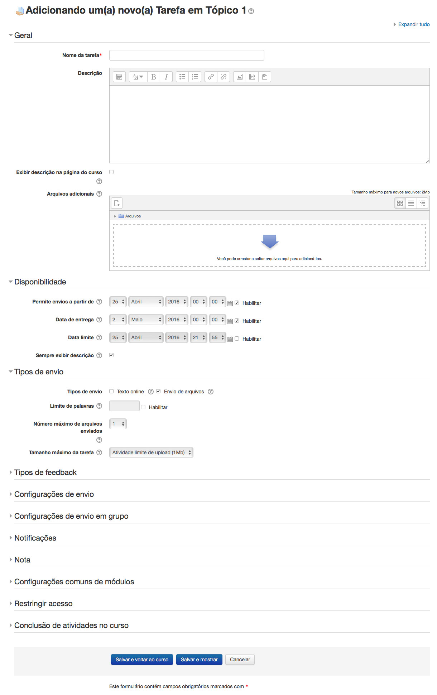
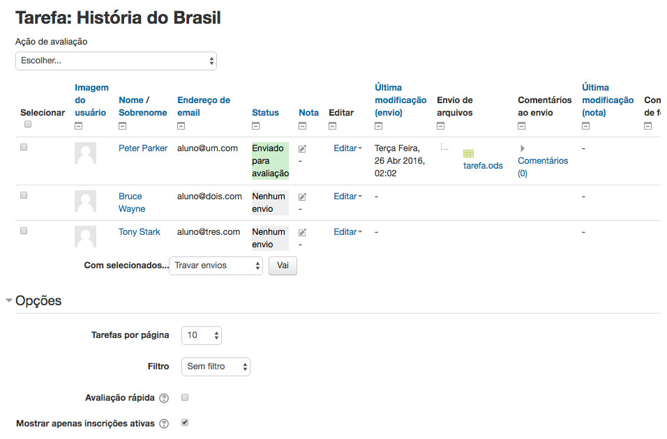
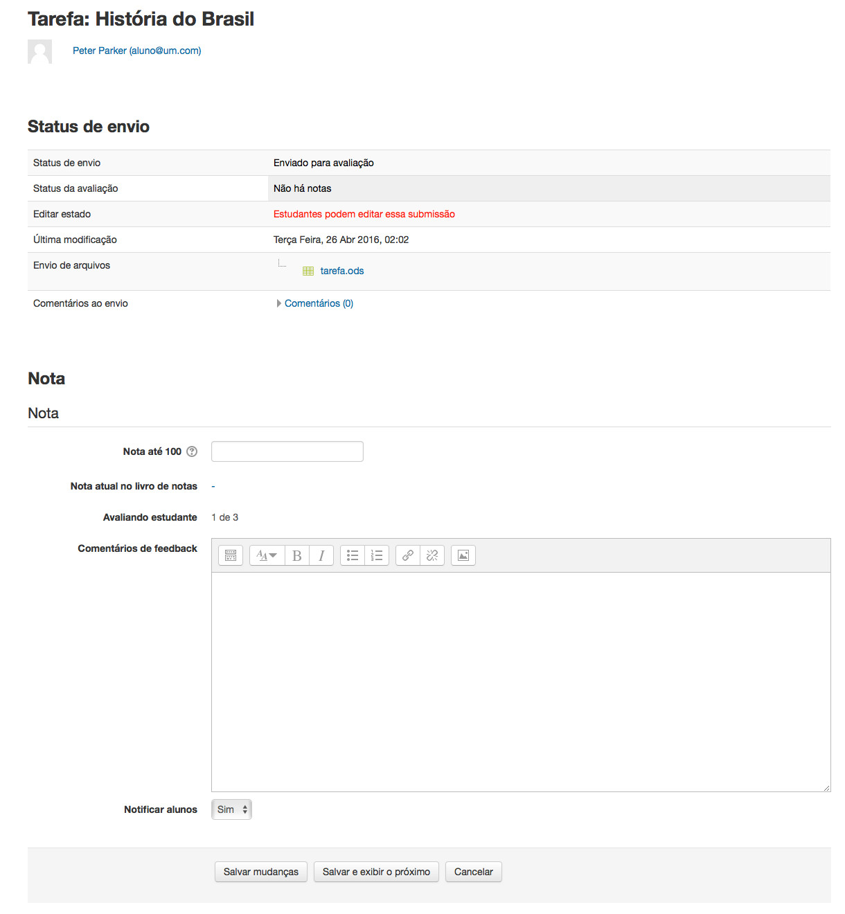

Tarefas são um simples e agradável método de coletar trabalho do estudante. Elas são simples e flexíveis para atividades que você quer dar nota mas que não se enquadram em nenhum dos outros tipos de ferramentas.

O módulo tarefa permite professores coletar trabalho dos estudantes, revisá-los e fornecer comentários, incluindo notas. Os trabalhos enviados pelos estudantes são visíveis apenas pelo professor e não podem ser vistos por outros estudantes a não ser que uma atividade em grupo seja selecionada.

O módulo tarefa dá a você uma maneira fácil de permitir aos estudantes enviar conteúdo digital para avaliação. Você pode pedir para enviar redações, planilhas, apresentações, páginas web, fotografias, pequenos áudios ou video clipes. Qualquer coisa que pode ser armazenada em seus discos rígidos pode ser enviado em resposta a uma tarefa.

Tarefas não necessariamente devem consistir em enviar arquivos. Você pode criar tarefas offline para lembrar os estudantes das tarefas do mundo real que eles precisam completar. Alternativamente, você pode pedir para os estudantes introduzirem suas respostas diretamente na própria tarefa.

Tarefas são uma ferramenta útil que você pode usar de forma criativa para coletar respostas mais autênticas dos seus estudantes do que é possível com o quiz.
Uma tarefa possui uma data 'Permite envios a partir de' onde nenhum estudante pode enviar qualquer coisa até essa data, e uma data de entrega, após a qual os professores podem escolher não aceitar mais envios.

Professores podem escolher ser notificados toda vez que um estudante enviar uma tarefa, ou somente para envios atrasados. Professores podem escolher dar feedback aos estudantes em forma de texto ou envio de arquivos.

## Tipos de Tarefas:
As opções padrão de envio de tarefa disponíveis são:

- Envio de arquivos (estudantes enviam um arquivo para avaliação)
- Texto online (estudantes podem digitar suas respostas diretamente no Moodle)
- Comentários ao envio
- Tarefa Offline

## Adicionando uma atividade Tarefa
Para criar uma tarefa:

- Para adicionar uma nova atividade Tarefa no seu curso, primeiro clique no botão Habilitar Edição.
- Dentro do bloco de Tópico ou Semana desejado clique em Adicionar atividade ou recurso. Na caixa de diálogo Adicionar atividade ou recurso que aparece, selecione Tarefa e clique em adicionar.

As opções de configuração a seguir estão disponíveis ao criar ou editar/atualizar qualquer atividade Tarefa. Somente Geral, Disponibilidade e Tipos de envio estão abertos por padrão; os outros estão encolhidos. Para expandir tudo, clique no link "Expandir tudo" no topo direito.

- Na seção Geral: A seção geral permite você dar a sua tarefa um nome e descrição.
	- Nome da tarefa: Dê um nome a sua Tarefa (ex. “Relatório sobre o conteúdo do Tópico 1”). O título inserido aqui será o nome que os estudantes verão na área de conteúdo do curso. Estudantes clicarão no neste nome para visualizar os detalhes da tarefa e, se aplicável, enviar seu trabalho.
	- Descrição: Forneça instruções claras para seus estudantes sobre o que eles tem de fazer. Clique no ícone a esquerda para expandir a barra de ferramentas e arraste o canto inferior direito da caixa de texto para expandi-la. Você também pode fornecer informações sobre recursos relacionados a tarefa, como um vídeo clipe, uma imagem, ou um link para uma página da internet.
	- Exibir descrição na página do curso: Habilitando isto irá exibir a descrição na página do curso abaixo do link da tarefa.

- Na seção Disponibilidade:
	- Permite envios a partir de: Se habilitado, estudantes não serão capazes de enviar antes dessa data. Se desabilitado, estudantes serão capazes de começar a enviar imediatamente.
	- Data de entrega: Isto é a data de conclusão da tarefa. Envios ainda serão permitidos após essa data, mas qualquer tarefa enviada após essa data será marcada como atrasada. Para prevenir envios após uma certa data configure a Data limite.
	- Data limite: Se configurada, a tarefa não aceitará envios após essa data  sem uma extensão.
	- Sempre exibir descrição: Se desabilitada, a Descrição da Tarefa acima somente será visível aos estudantes a partir da data "Permite envios a partir de".

- Na seção Tipos de envio:
	- Tipos de envio: Aqui você pode decidir como você deseja que seus estudantes enviem seus trabalhos para você. Existem quatro tipos de envios de tarefa como mencionado na seção acima:
		- Texto online: Estudantes podem digitar suas respostas diretamente no Moodle usando o editor de texto. É possível configurar um limite de palavras em uma tarefa de texto online. Estudantes recebem um aviso se tentarem exceder o limite de palavras.
		- Envio de arquivos: Estudantes podem enviar  e editar um ou mais arquivos de qualquer tipo que o professor possa abrir. Se o estudante enviar um arquivo pdf, o professor pode fazer anotações nele usando um browser, e ao salvá-lo, o arquivo com anotações estará disponível para o estudante.
		- Comentários ao envio: Se o Administrador do Site habilitá-lo, somente estudantes serão capazes de enviar uma mensagem para seu professor quando enviarem suas tarefas.
		- Atividade offline - Se você simplesmente desmarcar as três opções acima, então isso resultará em uma Tarefa offline.

	> *Note que se Comentários ao envio for habilitado pelo Administrador do Site, então estudantes serão capazes de adicionar uma nota para seu professor ao enviarem o trabalho. Se Avaliação anônima estiver habilitada, comentários dos estudantes são exibidos como "Participante 01 etc." para evitar revelar identidades. Esses comentários irnao aparecer na tabela de notas na coluna de comentários de envios.*

	- Limite de palavras: Se Texto online estiver habilitado, este é o número máximo de palavras que cada estudante estará autorizado a enviar.
	- Número máximo de arquivos enviados: Aqui você pode decidir o número máximo de arquivos que pode ser enviado por cada estudante. (Pode ser útil exibir o número na descrição da Tarefa)
	- Tamanho máximo da tarefa: Esta configuração especifíca o tamanho máximo por arquivo de cada um dos arquivos que o estudante pode enviar como parte da sua tarefa. Este tamanho máximo de envio só pode ser igual ou menor que o limite do curso (que por sua vez só pode ser igual ou menor que o limite do site). O tamanho máximo por cada arquivo é exibido para os estudantes no ponto onde eles enviam os arquivos.
- Na seção Tipos de feedback:
	- Comentários de feedback: Definindo para sim significa que professores podem deixar comentários de feedback para cada envio. Isso habilita a coluna Comentários de Feedback  na tabela de notas.
	- Planilha de notas offline: Se definido como sim, você terá um link para download da lista de notas em uma planilha. Então você será capaz de inserir as notas e comentários de feedback offline. Quando o professor completar a digitação das notas e comentários ele pode enviar a planilha, confirmar as alterações e as notas e comentários serão transferidos para o livro de notas do Moodle.
	- Arquivos de feedback:  Se habilitado, você será capaz de enviar arquivos com feedback quando avaliar tarefas. Esses arquivos podem, mas não são limitados a avaliar envios de estudantes, documentos com comentários ou feedback de áudio.
	- Enviando múltiplos arquivos de feedback: Também é possível enviar vários arquivos de feedback como um zip, através da caixa de seleção acima do quadro de notas:
		- Baixe as tarefas dos estudantes usando a opção "Fazer download de todas as tarefas enviadas" da mesma caixa de seleção;
		- Extraia a pasta offline e adicione seus comentários ao envio do estudante. Mantenha os mesmos nomes.
		- Selecione os envios dos estudantes e compacte os arquivos em uma nova pasta zip. Importante: Não basta alterar os arquivos dentro da pasta original e recompactá-los. Isso não vai funcionar. O nome da pasta não importa, desde que os arquivos de feedback tenham o mesmo nome como antes.
		- Envie a nova posta compactada.
		- Você será apresentado a uma tela de confirmação exibindos seus arquivos de feedback.
	- Comentário na linha: Se habilitado, os textos submetidos serão copiados para o campo de comentários de feedback durante a avaliação, ficando mais fácil de se fazer comentários na linha (usando cores diferentes, por exemplo) ou editando o texto original.
- Na seção Configurações de envio:
	- Exigir que os alunos cliquem no botão enviar: Se habilitado, estudantes terão que clicar no botão "Enviar" para declarar seu envio como final. Isto possibilita aos estudantes manter uma versão de rascunho no sistema. Se esta configuração for alterada de "Não" para "Sim" depois que os estudantes já tiverem enviado suas tarefas, este envios serão considerados como finais.
	- Exigir aceite da declaração de não plágio ao enviar:  Um administrador pode definir uma "declaração de envio", ex., uma declaração onde os estudantes prometem que o trabalho é seu e cada um deve aceitar antes de enviar o trabalho. Se o administrador der aos professores a opção de usarem a declaração de envio ou não, então isto estará habilitado na tela de configurações da tarefa. Quando esta configuração está habilitada, estudantes precisam marcar um botão antes de enviarem sua tarefa.
	- Tentativas reabertas: Esta configuração permite aos professores decidir como os envios são reabertos. Isto determina como as tentativas de envio dos estudantes são reabertas. As opções disponíveis são:
		- Nunca - O envio do estudante não pode ser reaberto.
		- Manualmente - O envio do estudante pode ser reaberto por um professor
		- Automaticamente até passar - O envio do estudante é automaticamente reaberto até o estudante obter a nota para passar, este valor é definido no livro de notas (Categorias e seção itens) para esta tarefa.
	- Máximo de tentativas:  Se o estudante está autorizado a reenviar, esta configuração irá determinar quantas vezes ele pode reenviar antes dele não ser mais autorizado a enviar. Depois de esgotado este número de tentativas feitas pelo estudante o envio não poderá ser reaberto.
- Na seção de Configurações de envio em grupo:
	- Envio em grupos de estudantes: Sa esta opção estiver habilitada, os estudantes serão capazes de colaborar em uma tarefa. Isso pode envolver, por exemplo, trabalharem na área do mesmo texto online, ou um estudante enviar um MS PowerPoint  que outro estudante baixa, melhora e reenvia para a área comum da atividade. Uma tarefa em grupo será compartilhada entre os membros do grupo e todos os membros do grupo visualizarão as mudanças de cada envio. Durante a avaliação, o professor pode escolher dar uma nota e feedback igual para todos os estudantes do grupo ou dar notas e feedbacks individuais para cada membro.
	- Exigir que todos os membros do grupo enviem: Se habilitado, todos os membros do grupo devem clicar no botão de envio desta tarefa antes que ela seja considerada enviada. Se desabilitada, o envio do grupo será considerado enviado assim que qualquer membro do grupo clicar no botão de envio.
	- Agrupamento para grupos de estudantes: Se um agrupamento particular é selecionado aqui, então o livro de notas exibirá qualquer outro grupo e estudantes sem grupo no "grupo padrão", enquanto nomeia o(s) grupo(s) que estão no grupamento selecionado. Se "nenhum" for selecionado, então o livro de notas irá exibir os nomes de todos os grupos e e colocar os estudandes sem grupo no "grupo padrão".
- Na seção notificações:
	- Notificar avaliador a respeito de novos envios: Se habilitado, você receberá uma mensagem sempre quem um estudante enviar uma tarefa antecipada, dentro do prazo ou atrasada.
	- Notificar avaliadores sobre submissões atrasadas: Se habilitado, você receberá uma mensagem sempre que um estudante enviar uma tarefa atrasada.
	- Opção padrão para "Notificar estudantes": Esta configuração define o valor padrão para caixa de seleção "Notificar os alunos" no formulário de notas.
- Na seção Nota:
	- Nota:
		- Selecione Pontos ou Escala na caixa de seleção. Se você não dará uma nota por esta tarefa, escolha Nenhum.
		- Então selecione seus pontos ou escolha escala.
	- Método de avaliação: Escolha o método avançado de avaliação que deve ser utilizado para cálculo de notas no contexto atual. Existem 3 opções:
		- Método simples de avaliação (insira a nota ou escala)
		- Guia de avaliação
		- Rubrica

	> *Para desabilitar o método avançado de avaliação e voltar para o mecanismo de notas padrão, escolha 'Método simples de avaliação'*

	- Categoria de notas: Esta configuração controla a categoria na qual esta atividade será colocada no livro de notas. Qualquer Categoria de Notas customizada que for criada no seu site ou curso será listada aqui e estará disponível para seleção. Selecione a Categoria de Nota exigida para adicionar essa tarefa como um item de Nota da Categoria.
	- Avaliação anônima: Se esta configuração for habilitada, então você não verá os nomes dos estudantes que enviaram suas terefas. Ao invés disso, você verá um número randômico gerado por estudante. No entanto, após avaliar a tarefa, você é capaz de ver quem enviou o quê clicando em "Revelar identidades dos estudantes" nas configurações da Tarefa.
	- Usar fluxo de avaliação: Quando configurado para sim, você será capaz de especificar o estágio em que eles se encontram no processo de avaliação de tarefas individuais. Uma vantagem de usar o fluxo de avaliação é que as notas podem ser escondidas dos estudantes até eles estejam com status 'Liberado'. A lista atual de estágios é:
		- Não avaliada (o avaliador ainda não iniciou)
		- Em avaliação (o avaliador iniciou mas não terminou)
		- Avaliação concluída (o avaliador finalizou mas pode precisar voltar para verificar/corrigir)
		- Em revisão (a avaliação está agora com o professor resposável para verificação de qualidade)
		- Pronto para publicação (o professor responsável está satisfeito com a avaliação mas espera antes de dar acesso a avaliação para os estudantes)
		- Publicado (o estudante pode acessar a nota/feedback)
	- Usar alocação de avaliadores: Se habilitado (depende da habilitação de "Usar fluxo de avaliação"), é possível atribuir avaliadores para avaliar ou rever o trabalho de estudantes específicos. Os colegas podem monitorar o progresso o progresso através dos estágios do fluxo de avaliação.
- Em Configurações comuns de módulos: Configurações comuns de módulos são as mesmas mencionadas nas atividades anteriores. Então, desta vez, você deve escolhê-los como um exercício.
- Clique no botnao "Salvar e voltar ao curso" para disponibilizar sua tarefa.

Sua tarefa aparecerá na página do seu curso. Ela também será adicionada ao calendário do curso e aparecerá no bloco Próximos Eventos para lembrar os estudantes quando encerra o prazo de entrega.

> *Para ver como sua tarefa aparece para seus estudantes, selecione Estudante em "Mudar papel para" no bloco administração na página do curso. O link "Retomar ao meu papel normal" restaura seu status de professor.*

## Permissões da Tarefa
O módulo tarefa possui apenas quatro permissões
The assignment module has only four capabilities:

- Exportar envios - Permite ao usuário exportar seus próprios envios de tarefa. Esta permissão é liberada para os perfils padrão de gerente, professor, moderador e estudante.
- Avaliar tarefa - Permite ao usuário visualizar envios, adicionar comentários e notas as tarefas. Esta permissão é liberada para os perfis padrão de gerente, professor e moderador.
- Enviar tarefa - Permite ao usuário enviar uma tarefa. Esta permissão é liberada por padrão apenas para o perfil estudante.
- Visualizar tarefa - Permite ao usuário visualizar a tarefa.  Esta permissão é liberada para os perfils padrão de gerente, professor, moderador, estudante e visitante.

### Gerenciar Tarefas Enviadas
Para visualizar as tarefas enviadas pelos estudantes, clique no nome da tarefa na página do  seu curso. Você verá o nome da tarefa e detalhes e em uma tabela abaixo com os detalhes de participantes, número de tarefas enviadas e tarefas que precisam de avaliação. Abaixo da tabela existe um link "Ver/Avaliar todos os envios" que exibe todas as tarefas que foram enviadas. Clique nesse link.

A página de Tarefas enviadas, como mostrada na Figura 9-2, exbie uma tabela de avaliação contendo colunas de informação sobre o estudante, o status do seu envio, um link para avaliar seu envio, um link para comentários e arquivos de feedback. A lista pode ser ordenada clicando em um cabeçalho em particular.

Por padrão, 10 envios são exibidos por página, embora isto possa ser alterado na parte inferior da página.

### Avaliação de Tarefas Enviadas

Na página da tabela de avaliação, você pode avaliar as tarefas enviadas de todos os estudantes.

#### Filtrando envios
A caixa de seleção acessada na seção 'Opções' permite a você filtar os envios. Você pode, por exemplo, rapidamente visualizar quais estudantes ainda não enviaram as tarefas.

#### Avaliação rápida

Em opções (desça até o final da página) você pode determinar suas preferências para o número de tarefas que você quer exibir por página. É também nessa seção que você pode habilitar a avaliação rápida.

A avaliação rápida permite que você digite as notas e comentários de feedback (se habilitado nas configurações da Tarefa) diretamente no quadro de notas. A avaliação rápida não é compatível com métodos avançados de avaliação e não é recomendada quando há vários avaliadores, pois há risco de sobreposição de avaliações.

Para avaliar envios rapidamente:

- Você pode digitar as notas e comentários de feedback usando a avaliação rápida. É possível agora digitar notas no formato decimal.
- Digite as notas
- Desça até o final da tabela de notas e clique em "Salvar as alterações de avaliação rápida"
- Uma página de confirmação será exibida.

> *Você não será capaz de retornar um arquivo de feedback para seus estudantes.*

Estudantes pode visualizar suas notas e comentáriosde duas maneiras. Primeiro, eles clicam no link da tarefa novamente. Eles verão suas notas e comentários abaixo do bloco de envio. Alternativamente, eles podem clicar no link de Notas no bloco de Administração do curso. Eles vão ver a nota da tarefa, e em seguinda, podem clicar no nome da tarefa para ver o feedback escrito.

## Práticas de avaliação eficazes

Os dois tipos básicos de tarefa, offline e envio de arquivos, são tão genéricos que você pode achar que é difícil usá-los efetivamente no início. Pode ser útil pensar neles como dois módulos separados compartilhando uma interface comum.

Tarefas offline são úteis para gravas notas de atividades do mundo real. Você pode usar esta ferramenta para gravar pontuações ou feedback para apresentações de estudantes, participação na sala, performance, esculturas, ou qualquer outra performance não digital. Você pode criar uma escala para dar um feedback não numérico se você não quer dar uma pontuação numérica para uma performance criativa.

Envio de arquivos são provavelmente o que a maioria das pessoas esperam quando eles pensam sobre tarefas. Lembre, você pode usar esses tipos de tarefa para qualquer tipo de conteúdo digital.

A maioria dos avaliadores usam tarefas para recolher redações ou outras de tarefas de processamento de texto. Você pode também usar para coletar outros tipos de trabalhos dos estudantes.

Estudantes podem enviar slides do PowerPoint antes de uma apresentação. Você pode atribuir um cenário oque-se usando uma planilha e pedir para os estudantes enviarem. Estudantes podem tirar uma fotografia digital de uma escultura ou um projeto mecanico e enviar para avaliação.

Contanto que o arquivo seja menor que o tamanho máximo permitido, você pode criar tarefas para qualquer tipo de conteúdo digital. Considere os tipos de produtos de trabalho que você quer que seus estudantes produzam durante o curso. Quantos deles poderiam ser arquivos digitais para serem enviados usando uma tarefa?

## Práticas Criativas de Tarefas

A tabela 9-1 mostra qual tipo de tarefa pode ser usado para cada propósito.

|S. No.|Você quer...|Você escolhe...|
|:------|:----------|:------------------------------------------------------------------------------------------------------------------------------------------------------------------------------------------------------------------------------------------------------------------------------------------------------|
|1|Permitir que estudantes digitem pequenas ou grandes respostas diretamente online.|Configure Texto Online para Sim. Isso funciona bem para crianças jovens que irão gerir apenas uma sentença ou duas e funciona tão bem para estudantes de ensino superior que escrevem mais.|
| ||**Vantagem** - rápido para o estudante começar; não precisa usar um programa de processamento de text e não precisa enviar o arquivo.|
| ||**Desvantagem** - pontenciais preocupações que a internet vai cair, o trabalho que os estudantes digitaram e ainda não salvaram pode ser perdido. Se o contador de palavras for grande, configurar Texto Online para Não e Envio de Arquivo para Sim pode ser uma opção melhor.|
| |||
|2|Permitir que estudantes enviem o trabalho e você baixar e abri-lo em um programa específico|Configure Envio de Arquivo para SIM, configure o número de arquivos que você vai permitir usando a configuração "Número máximo de arquivos enviados" e o o tamanho dos arquivos usando a configuração "Tamanho máximo da tarefa".|
| ||**Vantagem** - melhor do que estudantes enviando trabalho por email, já que o todos os trabalhos são coletados em um único espaço no seu curso. Avaliadores podem comentar diretamente no trabalho do estudante.|
| ||**Vantagem** - com "Tentativas reabertas" habilitada, professores podem visualizar o progresso através de vários rascunhos do trabalho do estudante|
| ||**Desvantagem** - tarefas devem ser baixadas para serem visualizadas (também podem ser baixadas em lote) e o professor precisa do programa apropriado para abri-lás.|
| |||
|3|Permitir aos estudantes enviarem arquivos de um projeto em momentos diferentes|Configure Envio de Arquivo para Sim, e use "Número máximo de arquivos enviados" para configurar o número máximo de arquivos separados que podem ser enviados.|
| ||**Vantagem** - todos os arquivos do projeto estão em uma única área da tarefa para avaliação e eles recebem uma única nota.|
| ||**Desvantagem** - todos os arquivos do projeto estão em uma área para avaliação - então eles só podem ter uma única nota!|
| |||
|4|Permitir que os estudantes respondam com um arquivo de vídeo, áudio ou imagem|Configure uma atividade permitindo envio de Texto Online e oriente os estudantes a usar ícone de mídia para adicionar arquivos de vídeo, som ou imagem.|
| |||
|5|Dar nota aos estudantes por trabalhos feitos no mundo real|Desmarque os tipos de envio enquanto configura a tarefa. Estudantes não serão obrigados a fazer nada, mas você pode usar a tarefa para dar nota pelo trabalho feito por eles fora do Moodle.|
| |||
|6|Visualizar, comentar e enviar de volta as tarefas dos estudantes|Configure uma tarefa permintindo o Envio de arquivos|
| ||**Vantagem**: útil para professores que gostam de usar a opção de "comentários" em programas de processamento de texto, por exemplo.|
| ||**Desvantagem**: se o estudante enviar outros tipos de arquivos, você precisa baixar o envio do estudante, comentar e então re-enviar o arquivo.|
| |||
|7|Permitir que estudantes possam enviar um comentário ou nota juntamente com o trabalho|Nas configurações, configure "Comentários ao envio" para Sim.|
| |||
|8|Permitir aos estudantes reformular e decidir quando enviar o trabalho|Nas configurações, marque "Exigir que os alunos cliquem no botão enviar" como Sim. Estudantes podem então controlar quando seu trabalho em rascunho será enviado ao professor.|
| |||
|9|Permitir aos estudantes criar um trabalho contínuo, ou uma tarefa interativa|Nas configurações, , marque "Exigir que os alunos cliquem no botão enviar" como Não. Estudantes podem continuar a fazer modificações em sua tarefa e em nenhum momento eles clicam em "Enviar". Se o trabalho for avaliado em algum momento, é recomendado configurar para sim a opção "Prevenir envios atrasados", para garantir que não sejam feitas mudanças depois da data de entrega, *ou* todos os envios devem ser bloqueados quando a avaliação for iniciada, para garantir que o trabalho não seja alterado durante a avaliação.|
| ||**Vantagem**: o trabalho permanece em um único lugar e é constantemente melhorado, avaliado (se necessário) e melhorado novamente.|
| ||**Desvantagem**: não existe um registro/histórico de tentativas anteriores. A tarefa de Texto Online não replica a visualização do trabalho ou blog quando cada nova entrada é adicional à anterior.|
| |||
|10|Permitir aos estudantes enviarem trabalho em grupo|Nas configurações, marque "Envio em grupos de estudantes" para Sim. Se você fizer apenas isto, quando apenas um estudante enviar um arquivo, a terefa será marcada como enviada, mesmo se os outros não tenham contribuído. Se você quer garantir que todos tenham uma entrada, marque "Exigir que os alunos cliquem no botão enviar" para Sim e então altere "Exigir que todos os membros do grupo enviem" para Sim. A atividade só será classificada como enviada quando cada membro tiver contribuído, e uma vez que um estudante tenha enviado, os nomes dos membros restantes serão exibidos para o grupo para ver quem ainda precisa adicionar sua entrada.|
| |||
|11|Avaliar trabalho de estudantes anonimamente|Nas configurações, escolha "Avaliação anônima". Quando os estudantes envias as tarefas, seus nome serão substituídos por um número randomico de participante, dessa forma você não saberá quem é quem.|
| |||
|12|Ler e avaliar tarefas dos estudantes offline|Nas configurações, habilite "Planilha de notas offline". Quando os estudantes enviarem as tarefas, clique em "Ver/Avaliar todos os envios" e você pode baixar as tarefas através do link "Baixar planilha d enotas". Você pode então editar as notas e reenviar a planilha de notas. Você pode também enviar arquivos de múltiplos feedbacks em um arquivo zip através desse menu de opções.|

## Sumário

Tarefas são uma maneira fácil de reunir e acompanhar as atividades do estudante.

Estudantes podem enviar qualquer tipo de arquivo eletrônico para preencher os requerimentos. Ao invés de coletar pesadas pilhas de papel, você pode deixar o Moodle acompanhou quem enviou a tarefa e quando.

As opções de feedback fornece a você uma maneira fácil de enviar notas e/ou comentários de volta para os estudantes sobre seus trabalhos.The feedback options provide you with an easy way to send grades and/or comments back to the students about their work.
